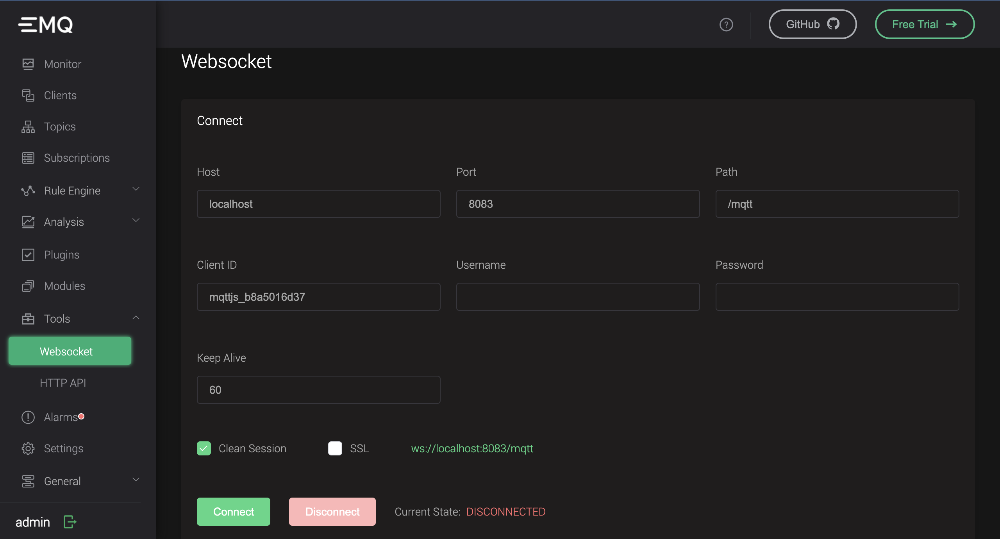
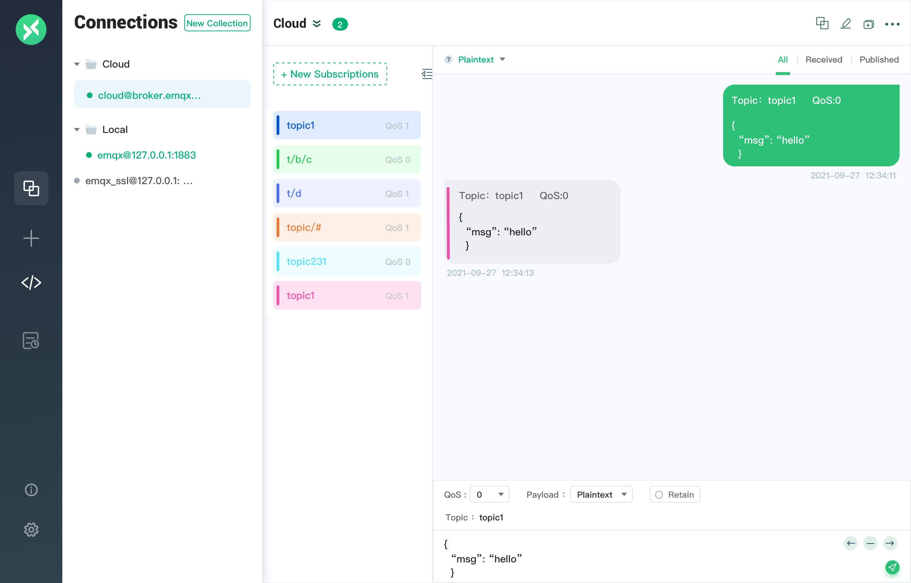

# Getting Started

Starting from download and installation, this document is to guide you to quickly get a EMQX node up and running.

## Select EMQX Edition

EMQX as a software is released in different editions.

- [Community](https://www.emqx.com/en/try?product=broker)
- [Enterprise](https://www.emqx.com/en/try?product=enterprise)
- [Edge](https://github.com/emqx/emqx/releases)

EMQ as a company offers a fully managed MQTT cloud service [EMQX Cloud](https://www.emqx.com/en/try?product=cloud)
which runs EMQX Enterprise edition.
You can customize the deployment to suit your business development plans the best and get started quickly.

:::: tabs type:card

::: tab EMQX Community Edition
The world's most scalable distributed MQTT broker with a high-performance real-time message processing engine, powering event streaming for IoT devices at a massive scale.

- Fully open-sourced under APL 2.0
- MQTT 3.1.1 and MQTT 5.0 spec
- Highly available, masterless clustering
- High concurrency with low latency
- Extensible gateways and plugins
- Data integration by calling HTTP APIs

[Download](https://www.emqx.com/en/try?product=broker)
:::

::: tab EMQX Cloud
Connecting your IoT devices to everything with reliable, real-time IoT data transport, processing, and integration. Accelerating your IoT application development without the burden of self-managing the infrastructure.

- Fully managed MQTT 5.0 service
- Powerful SQL-based rule engine
- Integration with various databases
- Highly available, fault-tolerant
- Run anywhere, pay as you go

[Get Started Free](https://www.emqx.com/en/try?product=cloud)
:::

::: tab EMQX Enterprise Edition
The world’s leading **Cloud-Native IoT Messaging Platform** with an all-in-one
distributed MQTT broker and SQL-based IoT rule engine, powering high-performance,
reliable data transport, processing, and integration for business-critical IoT solutions.

- Support for multiple IoT protocols
- Powerful SQL-based rule engine
- Rich data persistence and bridging choices
- Management & monitoring center
- Global technical support team

[Try Free](https://www.emqx.com/en/try?product=enterprise)
:::

::::

## Install EMQX

### Start EMQX Cloud

EMQX Cloud is the first fully managed MQTT 5.0 public cloud service in the world.
With the support of EMQX Cloud, you can create an EMQX cluster on the cloud and use
all the features of EMQX Enterprise.

This allows you to spend more time on business connections and less time for EMQX operation,
maintenance, and management.

- [Create and login EMQX cloud account](https://docs.emqx.com/en/cloud/latest/quick_start/introduction.html)
- [Create a free trial deployment](https://docs.emqx.com/en/cloud/latest/quick_start/create_free_trial.html)

### Running EMQX in containers

Learn more about the docker image on [Docker Hub](https://hub.docker.com/r/emqx/emqx).
Container deployment is the quickest way to start experimenting with EMQX

1. Get the Docker image

```bash
docker pull emqx/emqx:latest
```

1. Start Docker container

```bash
docker run -d --name emqx -p 1883:1883 -p 8081:8081 -p 8083:8083 -p 8084:8084 -p 8883:8883 -p 18083:18083 emqx/emqx:latest
```

For more information about Docker installation and building a cluster quickly with Docker Compose,
please refer to [Running with Docker (including a simple docker-compose cluster)](./install.md#install-emq-x-in-docker-contain-a-simple-docker-compose-cluster).

### Running EMQX in Kubernetes

For Kubernetes, EMQ offers [EMQX Kubernetes Operator](https://www.emqx.com/en/emqx-kubernetes-operator).

EMQX Kubernetes Operator is an application orchestration tool based on Kubernetes native API,
which is used for automatic deployment and lifecycle management of EMQX clusters.
You can refer to the [documentation](https://docs.emqx.com/en/emqx-operator/latest/getting-started/getting-started.html)
to learn how to deploy EMQX using the Operator.

### Deploy EMQX with Terraform

Deploy all infrastructure including EMQX Enterprise clusters on the mainstream public cloud with
one click through Terraform.

The fastest way to deploy EMQX Enterprise clusters on the public cloud

- [Deploy on AWS](https://github.com/emqx/tf-aws)
- [Deploy on Alibaba Cloud](https://github.com/emqx/tf-alicloud)

For more information about Terraform installation and deployment, please refer to
[EMQX Terraform](https://www.emqx.com/en/emqx-terraform)

### Run in a VM or on bare metal

EMQX Enterprise can be deployed directly to bare metal servers or virtual machines.
A minimum of 2 cores and 4GB RAM can run the EMQX Enterprise.

EMQX has prebuilt packages downloadable for Enterprise Linux(RedHat, CentOS, Rockylinux)
as well as Debian, Ubuntu, and MacOS.

- [CentOS installation](./install.md#centos)
- [Ubuntu, Debian installation](./install.md#ubuntu-debian)
- [MacOS, Windows, Linux ZIP installation](./install.md#zip-linux-macos-windows)

For other platforms which are not in the prebuilt list,
you may [build the runnables from source code](./install.md#source-code-compilation-and-installation) or
simply [contact EMQ](https://www.emqx.com/en/contact) for support.

## Start EMQX

After the installation, you can start EMQX through the command of systemctl or emqx.
For more startup methods and precautions, please refer to [Starting EMQX](./start.md).

After EMQX is started successfully, you can visit [http://localhost:18083/](http://localhost:18083/)
(replace localhost with your actual IP address) through a browser to access [EMQX Dashboard](./dashboard.md)
management console for device connection and related indicator monitoring and management.

### Start EMQX in the background

```bash
emqx start
```

After the startup is successful, you can use the `emqx ping` command to check the running status of the node.
If pong is returned, it means the running status is OK:

```bash
emqx ping
```

### Start EMQX using systemctl

```bash
sudo systemctl start emqx
```

Check if the service is working properly:

```bash
sudo systemctl status emqx
```

### Start EMQX using ZIP installation package

Switch to the EMQX decompression directory and execute the following command to start EMQX:

```bash
./bin/emqx start
```

In development mode, you can use the console command to start EMQX on the console and view
the startup and runtime logs printed to the console.

```bash
./bin/emqx console
```

## Quick verification using an MQTT client

After startup, you can quickly verify if EMQX is working by any MQTT client.
You can use the following client tools or client libraries to access EMQX

### Dashboard Websocket tool

EMQX dashboard comes with a builtin, websocket based MQTT client.

Open Dashboard and enter the page of **Tools -> Websocket**,
where you can use the MQTT over Websokcet client to quickly access EMQX.

The Websocket page provides you with a simple but effective WebSocket client tool,
which can be used for publishing, subscribing, and inspecting the messages.



### MQTTX desktop client tool

MQTTX is an elegant cross-platform MQTT 5.0 open source desktop client tool that
supports running on macOS, Linux, and Windows.

MQTTX has many features, provides a concise graphical interface and operation logic,
supports MQTT/MQTT over Websocket access and one-way/two-way SSL authentication,
and supports Payload format conversion, simulation of test data with a custom script,
automatic subscription of $SYS topic, viewing Traffic statistics and so on.

For download and use, please refer to the [MQTT X website](https://mqttx.app).



## EMQX client library

For developers, we have compiled a list of popular MQTT clients for your reference.

### MQTT Client libraries

- [MQTT C client library](../development/c.md)
- [MQTT Java client library](../development/java.md)
- [MQTT Go client library](../development/go.md)
- [MQTT Erlang client library](../development/erlang.md)
- [MQTT JavaScript client library](../development/javascript.md)
- [MQTT Python client library](../development/python.md)

### Client example code

For MQTT client library example code, we try to cover as many mainstream programming languages
and platforms as possible, including

- [Android](https://github.com/emqx/MQTT-Client-Examples/tree/master/mqtt-client-Android)
- [Csharp-MqttNet](https://github.com/emqx/MQTT-Client-Examples/tree/master/mqtt-client-Csharp-MqttNet)
- [ESP32](https://github.com/emqx/MQTT-Client-Examples/tree/master/mqtt-client-ESP32)
- [ESP8266](https://github.com/emqx/MQTT-Client-Examples/tree/master/mqtt-client-ESP8266)
- [Electron](https://github.com/emqx/MQTT-Client-Examples/tree/master/mqtt-client-Electron)
- [Flutter](https://github.com/emqx/MQTT-Client-Examples/tree/master/mqtt-client-Flutter)
- [Go](https://github.com/emqx/MQTT-Client-Examples/tree/master/mqtt-client-Go)
- [Java](https://github.com/emqx/MQTT-Client-Examples/tree/master/mqtt-client-Java)
- [PHP](https://github.com/emqx/MQTT-Client-Examples/tree/master/mqtt-client-PHP)
- [Qt](https://github.com/emqx/MQTT-Client-Examples/tree/master/mqtt-client-Qt)
- [SpringBoot](https://github.com/emqx/MQTT-Client-Examples/tree/master/mqtt-client-SpringBoot)
- [Vue.js](https://github.com/emqx/MQTT-Client-Examples/tree/master/mqtt-client-Vue.js)
- [swift](https://github.com/emqx/MQTT-Client-Examples/tree/master/mqtt-client-swift)
- [wechat-miniprogram](https://github.com/emqx/MQTT-Client-Examples/tree/master/mqtt-client-wechat-miniprogram)

For a more detailed list, please refer to [MQTT-Client-Examples](https://github.com/emqx/MQTT-Client-Examples)

## Advanced operation

After completing the installation, startup, and access test,
you can now continue to read the following documents for a proper in-production setup.

### Authentication

Authentication is an important part of most applications,
and enabling authentication can effectively fence off malicious client connections.

Authorization rules, or Access Control List (ACL) can be configured to ensure only
legit clients are permitted to publish or subscribe to certain topics.

- [Authentication Introduction](../advanced/auth.md): Select a built-in plugin, to integrate
  with internal or external database, JWT or HTTP service as the authentication data source.
- [Authorization / ACL](../advanced/acl.md): Select a built-in plugin, to integrate with
  internal or external database, or HTTP service as the ACL data source.

### Rule Engine

The built-in SQL based rule-engine can extract, filter, enrich, and convert messages between
devices and data platofrms in real-time, and forward the data to Webhooks or other MQTT Brokers
without having to implement MQTT clients to do the job.

EMQX enterprise eidtion can also integrate with Kafka,
various SQL / NoSQL / time-series databases and enterprise systems, such as SAP.

- [Rule Engine](../rule/rule-engine.md): The concept and basic usage of rule engine.
- [Create Rule](../rule/rule-create.md): How to create a rule.
- [Example](../rule/rule-example.md#send data to-web-service): Tutorial on using various data
  sources for rule engine.

### HTTP API

HTTP API is a frequently used function in IoT platform development and EMQX operation and
maintenance. HTTP API can realize integration with external systems, such as querying and
managing client information, broker subscription, publishing messages and creating rules.

- [HTTP API](../advanced/http-api.md): include HTTP API access point and access
  authentication method.
- [Basic Information](../advanced/http-api.md#endpoint-brokers): Get basic information such as
  EMQX version and running status.
- [Node](../advanced/http-api.md#endpoint-nodes): Get the information of EMQX node.
- [Client](../advanced/http-api.md#endpoint-clients): View online client information and support
  kicking out the client.
- [Subscription Information](../advanced/http-api.md#endpoint-subscriptions): View the
  subscription topic list and subscription relationship.
- [Routes](../advanced/http-api.md#endpoint-routes): View subscribed topics.
- [Message Publishing](../advanced/http-api.md#endpoint-publish): Call EMQX through HTTP to
  publish MQTT messages, with a reliable way for applications to communicate with clients.
- [Topic Subscription](../advanced/http-api.md#endpoint-subscribe): Dynamically manage the client
  subscription list, without the need for the client to actively initiate
  subscription/unsubscription.
- [Plugins](../advanced/http-api.md#endpoint-plugins): Status management of plugins with
  start and stop operations.

### Operation, maintenance and deployment

It contains official usage guidelines and best practices.

- [Device Management](../tutorial/device-management.md)
- [System Tuning](../tutorial/tune.md)
- [Production Deployment](../tutorial/deploy.md)
- [Prometheus Monitoring and alert](../tutorial/prometheus.md)
- [Benchmark](../tutorial/benchmark.md)

### FAQ

In [FAQ (Frequently Asked Questions)](../faq/faq.md), we regularly collect and sort out the
common problems and frequently encountered errors of EMQX users, such as topic number limit,
external resource connection errors, startup failure reasons, etc.

In addition, you can visit [EMQ Q&A Community](https://askemq.com/) to put forward and answer
questions about the use of EMQX and EMQ-related products, and exchange experience of IoT-related
technologies with EMQX users.
