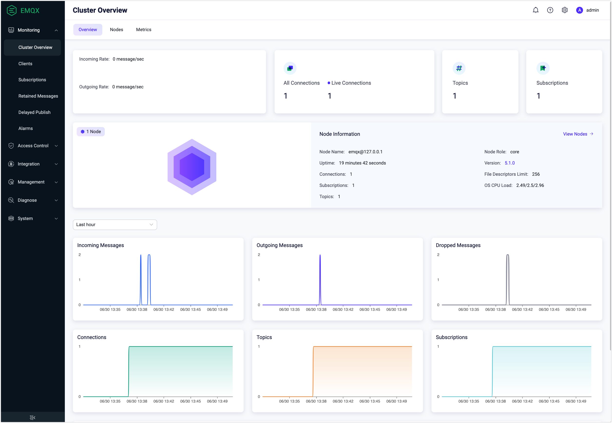

# Get Started with EMQX Enterprise

EMQX is the world’s most scalable and reliable MQTT messaging platform that can help you to connect, move, and process your business data reliably in real-time. With this all-in-one MQTT platform, you can easily build your Internet of Things (IoT) applications with significant business impacts.

This chapter gives you a tour of how to download and install EMQX and how to test the connecting and messaging services with our built-in WebSocket tool.

::: tip
Besides the deployment methods introduced in this quickstart guide, you are also welcome to try our [EMQX Cloud](https://www.emqx.com/en/cloud), a fully managed MQTT service for IoT. You only need to [register for an account](https://www.emqx.com/en/signup?continue=https://www.emqx.com/en/cloud) before you can start your MQTT services and connect your IoT devices to any cloud with zero need for infrastructure maintenance.
:::

## Install EMQX

EMQX can be run with [Docker](../deploy/install-docker.md), installed with [EMQX Kubernetes Operator](https://www.emqx.com/en/emqx-kubernetes-operator), or installed on a computer or virtual machine (VM) via a download package. If you choose to install EMQX with a download package, the following operating systems are currently supported:

- RedHat
- CentOS
- RockyLinux
- AmazonLinux
- Ubuntu
- Debian
- macOS
- Linux

For other platforms not listed above, you can try to [build and install with source code](../deploy/install-source.md) (for EMQX Open Source edition) or simply [contact EMQ](https://www.emqx.com/en/contact) for support.

<!-- TODO @wivwiv Update K8s link when EMQX Terraform 5.0 document ready -->

In addition, you can also deploy EMQX with one click through [EMQX Terraform](https://www.emqx.com/en/emqx-terraform) on the cloud, for example, [Alibaba Cloud](https://github.com/emqx/tf-alicloud) and [AWS](https://github.com/emqx/tf-aws).

<!-- TODO @wivwiv Update Terraform link when EMQX Terraform 5.0 document ready -->

### Install EMQX Using Docker

Container deployment is the quickest way to start exploring EMQX. This quick start guide shows you how to install and run EMQX through Docker. 

:::: tabs type:card

::: tab EMQX Open Source

1. To download and start the latest version of EMQX, enter the command below.

   Ensure [Docker](https://www.docker.com/) is installed and running before you execute this command.

   ```bash
   docker run -d --name emqx -p 1883:1883 -p 8083:8083 -p 8084:8084 -p 8883:8883 -p 18083:18083 emqx/emqx:latest
   ```
   
2. Start your web browser and enter `http://localhost:18083/` ( `localhost` can be substituted with your IP address) in the address bar to access the  [EMQX Dashboard](../dashboard/introduction.md), from where you can connect to your clients or check the running status.

   Default user name and password:

   `admin`

   `public`

   <!--后续补上 dashboard的截图-->

:::

::: tab EMQX Enterprise

1. To download and start the latest version of EMQX, enter the command below.

   Ensure [Docker](https://www.docker.com/) is installed and running before you execute this command.

   ```bash
   docker run -d --name emqx -p 1883:1883 -p 8083:8083 -p 8084:8084 -p 8883:8883 -p 18083:18083 emqx/emqx-enterprise:latest
   ```


2. Start your web browser and enter `http://localhost:18083/` ( `localhost` can be substituted with your IP address) in the address bar to access the  [EMQX Dashboard](../dashboard/introduction.md), from where you can connect to your clients or check the running status.

   Default user name and password:

   `admin`

   `public`

:::

::::

### Install EMQX Using Installation Package

You can also install EMQX using installation packages on a computer or VM and easily adjust the configurations or run performance tuning. The instructions below use macOS13 amd64 as an example to illustrate the installation steps.

::: tip

Considering all the runtime dependencies, it is recommended to use installation packages for testing and hot upgrades, and **NOT** recommended in a production environment.

:::

:::: tabs type:card

::: tab EMQX Open Source

1. Go to the [macOS tab of the official download site](https://www.emqx.com/en/downloads-and-install/broker?os=macOS).

2. Select the latest version `@CE_VERSION@` and select `macOS 13 amd64 / zip` from **Package Type**.

2. Click the link below to download and install the package. You can also refer to the command instructions on the page.

5. To run EMQX, enter:

   ```bash
   ./emqx/bin/emqx foreground
   ```

   This will start EMQX in an interactive shell. Closing the shell will stop EMQX.
   Alternatively (but not recommended), you can also start EMQX in the background with the following command:

   ```bash
   ./emqx/bin/emqx start
   ```

6. Start your web browser and enter `http://localhost:18083/` ( `localhost` can be substituted with your IP address) in the address bar to access the [EMQX Dashboard](../dashboard/introduction.md), from where you can connect to your clients or check the running status.

   The default user name and password are `admin` & `public`. You will be prompted to change the default password once logged in.

7. To stop EMQX, enter:

   ```bash
   ./emqx/bin/emqx stop
   ```

To uninstall EMQX after your testing, simply delete the EMQX folder.

:::

::: tab EMQX Enterprise

1. Go to the [macOS tab of the official download site](https://www.emqx.com/en/downloads-and-install/enterprise?os=macOS).

2. Select the latest version `@EE_VERSION@` and select `macOS 13 amd64 / zip` from **Package Type**.

3. Click the link below to download and install the package. You can also refer to the command instructions on the page.

5. To run EMQX, enter:

   ```bash
   ./emqx/bin/emqx foreground
   ```
   This will start EMQX in an interactive shell. Closing the shell will stop EMQX.
   Alternatively (but not recommended), you can also start EMQX in the background with the following command:

   ```bash
   ./emqx/bin/emqx start
   ```

6. Start your web browser and enter `http://localhost:18083/` ( `localhost` can be substituted with your IP address) in the address bar to access the [EMQX Dashboard](../dashboard/introduction.md), from where you can connect to your clients or check the running status.

   The default user name and password are `admin` & `public`. You will be prompted to change the default password once logged in.

7. To stop EMQX, enter:

   ```bash
   ./emqx/bin/emqx stop
   ```

To uninstall EMQX after your testing, simply delete the EMQX folder.

:::

::::


## Use MQTTX to Verify Connection

Now that you have successfully started EMQX, you can continue to test the connection and message services with MQTTX.

[MQTTX](https://mqttx.app) is an elegant cross-platform MQTT 5.0 desktop client, running on macOS, Linux, and Windows. By utilizing a chat style of user interface, MQTTX allows users to quickly create connections and save multiple clients, which facilitates users to quickly test the MQTT/MQTTS connection, as well as the subscription and publication of MQTT messages.

This section introduces how to verify the connection with [MQTTX Web](https://mqttx.app/web), the browser-based MQTT 5.0 WebSocket client tool, with zero need to download or install any application.

::: tip Prerequisites
The broker address and the port information should be prepared before testing the connection:

- **EMQX address**: The IP address of your server, in general.
- **Port**: Click **Management** -> **Listeners** from the left navigation menu in the Dashboard to get the port number.
:::

### Create a Connection

1. Click [MQTTX Web](http://mqtt-client.emqx.com/#/recent_connections) to visit the browser-based MQTTX.

2. Configure and establish the MQTT connection. Click the **+ New Connection** button to enter the configure page:

   - **Name**: Input a connection name, for example, `MQTTX_Test`.

   - **Host**

     - Select the protocol type via the drop-down list, for example, select `ws://` if the WebSockets protocol is adopted; MQTTX Web only supports Websockets protocol, to test the SSL/TLS connection, download [MQTTX desktop client](https://mqttx.app/);
     - Fill in the EMQX address, for example, **emqx@127.0.0.1**;

   - **Port**: for example, `8083` is for the WebSockets protocol;

     Keep the default setting for the other fields or set it as your business needs. For a detailed explanation of different fields, see [MQTT User Manual - Connect](https://mqttx.app/docs/get-started).


3. Click the **Connect** button at the top right corner of the page.

4. Test the publish/receive of messages: Click the send icon in the bottom right corner of the chat area, then the messages successfully sent will appear in the chat window above.

### Publish and Subscribe to Topics

After the connection is successfully established, you can continue to subscribe to different topics and publish messages.

1. Click **+ New Subscription**. MQTTX Web has already filled in some fields, according to the setting, you will subscribe to topic `testtopic/#`  with QoS level of 0. You can repeat this step to subscribe to different topics, and MQTTX Web will differentiate topics with colors.

2. In the right corner of the chat area at the bottom, click the send icon to test the message publishing/receiving. The messages successfully sent will appear in the chat window. 


If you want to continue the testing, such as one-way/two-way SSL authentication, and simulate test data with customized scripts, you can continue to explore with [MQTTX](https://mqttx.app).

### View Metrics on Dashboard

On the Cluster Overview page in the EMQX Dashboard, you can check metrics such as **Connections**, **Topics**, **Subscriptions**, **Incoming Messages**, **Outgoing messages**, and **Dropped Messages**.



## Next Steps

So far, you have completed the installation, startup, and access test of EMQX, you can continue to try out more advanced capabilities of EMQX, such as [authentication and authorization](../access-control/authn/authn.md) and integration with [Rule Engine](../data-integration/rules.md).

## Frequently Asked Questions

You can visit the [EMQ Q&A Community](https://askemq.com/) to participate in discussions, ask and answer questions about the usage of EMQX and other EMQ-related products, and exchange experiences with other EMQX users in IoT-related technologies. Additionally, feel free to [contact us](https://www.emqx.com/en/contact) at any time for professional technical support.

