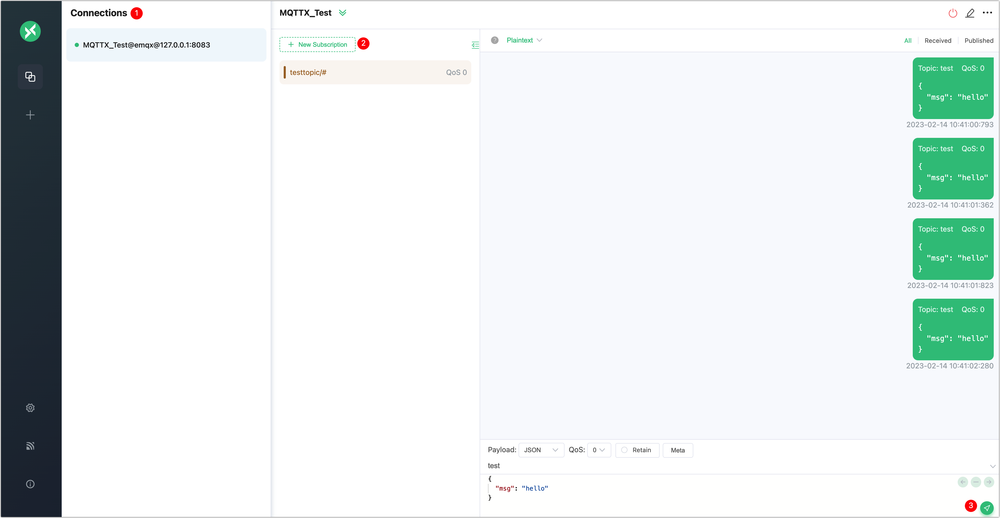
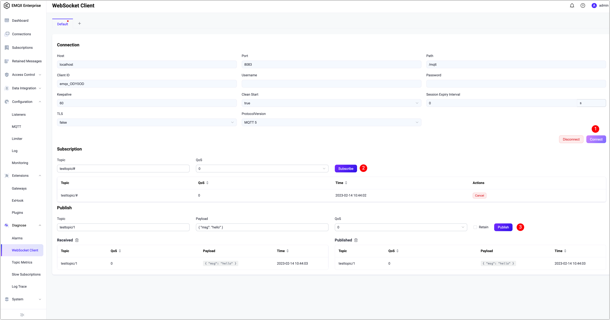

# Getting Started

EMQX is the world’s most scalable and reliable MQTT messaging platform that can help you to connect, move and process your business data reliably in real-time. With this all-in-one MQTT platform, you can easily build your Internet of Things (IoT) applications with significant business impacts. 

This chapter will give you a tour of how to download and install EMQX and how to test the connecting and messaging services with our built-in WebSocket tool.

::: tip
Besides the deployment methods introduced in this quickstart guide, you are also welcome to try our [EMQX Cloud](https://www.emqx.com/en/cloud), a fully managed MQTT service for IoT. You will only need to [register for an account](https://www.emqx.com/en/signup?continue=https://www.emqx.com/en/cloud) before you can start your MQTT services and connect your IoT devices to any cloud with zero need for infrastructure maintenance. 
:::



## Select your EMQX edition

EMQX is available in open source and Enterprise editions, you may click the link below to download the edition as your business needs. 

- [Open source edition](https://www.emqx.com/en/try?product=broker)
- [Enterprise edition](https://www.emqx.com/en/try?product=enterprise)

:::: tabs type:card

::: tab EMQX open source edition
The world's most scalable distributed MQTT broker with a high-performance real-time message processing engine, powering event streaming for IoT devices at a massive scale.

- Fully open-sourced under APL 2.0
- Support MQTT 3.1.0, MQTT 3.1.1 and MQTT 5.0, support MQTT-SN
- Highly available, masterless clustering
- High concurrency with low latency
- Extensible gateways and plugins
- Data integration by calling HTTP APIs

[Download](https://www.emqx.com/en/try?product=broker)
:::

::: tab EMQX Enterprise edition
The world’s leading **Cloud-Native IoT Messaging Platform** with an all-in-one
distributed MQTT broker and SQL-based IoT rule engine. It combines high performance with reliable data transport, processing, and integration for business-critical IoT solutions.

- Support for multiple IoT protocols
- Powerful SQL-based data integrations
- Rich data persistence and bridging choices
- Management & monitoring center
- Global technical support team

[Try Free](https://www.emqx.com/en/try?product=enterprise)
:::

::::



## Install EMQX

EMQX can be run with [Docker](../deploy/install-docker.md), installed with [EMQX Kubernetes Operator](https://www.emqx.com/en/emqx-kubernetes-operator), or installed on a computer or virtual machine (VM) via a download package. If you choose to install EMQX with a download package, the following operating systems are currently supported: 



- RedHat
- CentOS
- RockyLinux
- AmazonLinux
- Ubuntu
- Debian
- macOS
- Linux
- Windows





- RedHat
- CentOS
- RockyLinux
- AmazonLinux
- Ubuntu
- Debian
- macOS
- Linux




For other platforms not listed above, you can try to [build and install with  source code](../deploy/install-source.md) or simply [contact EMQ](https://www.emqx.com/en/contact) for support.



For other platforms not listed above, you can try to simply [contact EMQ](https://www.emqx.com/en/contact) for support.



<!-- TODO @wivwiv Update K8s link when EMQX Terraform 5.0 document ready -->

In addition, you can also deploy EMQX with one-click through [EMQX Terraform](https://www.emqx.com/en/emqx-terraform) on the cloud, for example, [Alibaba Cloud](https://github.com/emqx/tf-alicloud) and [AWS](https://github.com/emqx/tf-aws).

<!-- TODO @wivwiv Update Terraform link when EMQX Terraform 5.0 document ready -->

### Install EMQX with Docker/installation package

In this quick start guide, we will show you the easiest ways to start or run EMQX, that is, with Docker or with the installation package. 

:::: tabs type:card

::: tab Run EMQX with Docker

Container deployment is the quickest way to start exploring EMQX. In this section, we will show you how to run EMQX with Docker. 

1. To download and start the latest version of EMQX, enter:

   

   ```bash
   docker run -d --name emqx -p 1883:1883 -p 8083:8083 -p 8084:8084 -p 		8883:8883 -p 18083:18083 emqx/emqx:latest
   ```

   

   

   ```bash
   docker run -d --name emqx -p 1883:1883 -p 8083:8083 -p 8084:8084 -p    8883:8883 -p 18083:18083 emqx/emqx-enterprise:latest
   ```

   

   Ensure [Docker](https://www.docker.com/) is installed and running before you execute this command.


2. Start your web browser and enter `http://localhost:18083/` ( `localhost` can be substituted with your IP address) in the address bar to access the  [EMQX Dashboard](../dashboard/introduction.md), from where you can connect to your clients or check the running status. 

   Default user name and password:
   
   `admin`
   
   `public`
   
   <!--后续补上 dashboard的截图-->

:::

::: tab Install EMQX with zip/tar.gz files



You can also install EMQX with zip/tar.gz files on a computer or VM, so you can easily adjust the configurations or run performance tuning. In this section, we will use [macOS](https://www.emqx.io/downloads?os=macOS) (macOS11 amd64) as an example to illustrate the operating steps. 

Note: Considering all the runtime dependencies, it is recommended to use zip/tar.gz files for testing and hot upgrades, and **NOT** recommended in a production environment. 


1. To download the zip file, enter:

   ```
   wget https://www.emqx.com/en/downloads/broker/5.0.14/emqx-5.0.14-macos11-amd64.zip
   ```

2. To install EMQX, enter:

   ```
   mkdir -p emqx && unzip emqx-5.0.14-macos11-amd64.zip -d emqx
   ```





You can also install EMQX with zip/tar.gz files on a computer or VM, so you can easily adjust the configurations or run performance tuning. In this section, we will use [macOS](https://www.emqx.com/en/try?product=enterprise) (macOS11 amd64) as an example to illustrate the operating steps. 

Note: Considering all the runtime dependencies, it is recommended to use zip/tar.gz files for testing and hot upgrades, and **NOT** recommended in a production environment. 


1. To download the zip file, enter:

   ```
   wget https://www.emqx.com/en/downloads/enterprise/5.0.0/emqx-enterprise-5.0.0-macos11-amd64.zip
   ```

2. To install EMQX, enter:

   ```
   mkdir -p emqx && unzip emqx-enterprise-5.0.0-macos11-amd64.zip -d emqx
   ```




3. To run EMQX, enter:

   ```
   ./emqx/bin/emqx start
   ```

4. Start your web browser and enter `http://localhost:18083/` ( `localhost` can be substituted with your IP address) in the address bar to access the  [EMQX Dashboard](../dashboard/introduction.md), from where you can connect to your clients or check the running status. 

   Default user name and password:
   
   `admin`
   
   `public`
   
5. To stop EMQX, enter:
   
   ```
   ./emqx/bin/emqx stop
   ```

To uninstall EMQX after your testing, you only need to delete the EMQX folders. 

:::

::::

Now that we have successfully started EMQX, we can continue to test the connection and message services with the built-in Dashboard WebSocket tool. 

## Verify the connection

:::: tabs type:card

::: tab Use MQTT X Web to verify

[MQTT X](https://mqttx.app/zh) is an elegant cross-platform MQTT 5.0 desktop client, running on macOS, Linux, and Windows. By utilizing a chat style of user interface, MQTT X allows users to quickly create connections and save multiple clients, which facilitates users to quickly test the MQTT/MQTTS connection, as well as the subscription and publication of MQTT messages.

Besides you can also start with [MQTT X Web](https://mqttx.app/zh/web), the browser-based MQTT 5.0 WebSocket client tool, with zero need to download or install any application. This section will introduce how to verity the connection to EMQX with MQTT X Web.  

:::tip Prerequisites

The broker address and the port information should be prepared before testing the connection with MQTT X Web,  below is how to acquire the information on EMQX Dashboard: 

- Broker address: **Node Name** in the **Node Data** section of the **Overview** tab
- Port: Click **Configuration** -> **Listeners** on the left navigation menu to get the port number. 

:::

1. Click [MQTT X Web](http://www.emqx.io/online-mqtt-client#/recent_connections) to visit the browser-based MQTT X.

2. Configure and establish the MQTT connection. Click the + New Connection button to enter the configure page: 

   - **Name**: Input a connection name, for example, **MQTTX_Test**;

   - **Host**

     - Select the protocol type via the drop-down list, for example, select **ws://** if the WebSockets protocol is adopted; to test the SSL/TLS connection, select **wss://**;
     - Fill in the EMQX address, for example, **emqx@127.0.0.1**; 

   - **Port**: for example, **8083** for the WebSockets protocol; 

     Keep the default setting for the other fields or set it as your business needs. For a detailed explanation of different fields, see [*MQTT User Manual - Connect*](https://mqttx.app/docs/get-started). 

   Then click the **Connect** button at the top right corner of the page. 

3. Subscribe to topics. After the connection is successfully established, you can continue to subscribe to different topics. Click **+ New Subscription**. MQTT X Web has already filled in some fields, according to the setting, you will subscribe to topic `testtopic/#`  with QoS level of 0. You can repeat this step to subscribe to different topics, and MQTT X Web will differentiate topics with colors. 

4. Test the publish/receive of messages: Click the send icon in the bottom right corner of the chat area, then the messages successfully sent will appear in the chat window above. 



If you'd like to continue the testing, such as one-way/two-way SSL authentication and simulate test data with customized scripts, you can continue to explore with [MQTT X](https://mqttx.app). 

:::

::: tab Use Dashboard WebSocket to verify the connection

EMQX supports standard MQTT protocols, including MQTT over WebSocket. After startup, you can directly connect your MQTT clients to EMQX.  This section will illustrate how to use the Dashboard WebSocket tool to connect EMQX to verify the messaging services. 

In the **Dashboard** page, click **Diagnose** -> **WebSocket Client** on the left navigation bar to access the **WebSocket Client** page. Then you can connect the client with EMQX, subscribe to certain topics, and verify the messaging services. 

1. Connect the client with EMQX. Click the **Connect** button on the right side of the screen, and you will be prompted that the connection is successfully established. 

2. Subscribe to topics:  Click the **Subscribe** button in the middle of the screen to subscribe to all messages under topic `testtopic/#` with QoS 0. You can continue to subscribe to more topics and test other QoS levels.

3. Test the messaging services: Click the **Publish** button at the bottom of the screen, and a new message will appear in both the **Received** and **Published** dialog box, indicating the connection is successfully established. 

   

   :::

   ::::

Then you can click **Dashboard** in the left navigation tree to return to the **Dashboard** page and check metrics such as **Connections**, **Topics**, **Subscriptions**, **Incoming Messages**, **Outgoing messages**, and **Dropped Messages**. 


## Advanced operation

So far, you have completed the installation, startup, and access test of EMQX, you can continue to try out more advanced capabilities of EMQX, such as [authentication and authorization](../access-control/authn/authn.md) and integration with [different data systems](../data-integration/introduction.md).

## Contact us

If you have any questions on the use of EMQX or EMQ products, you are warmly welcome to [contact us](https://www.emqx.com/zh/contact) for professional support. 
