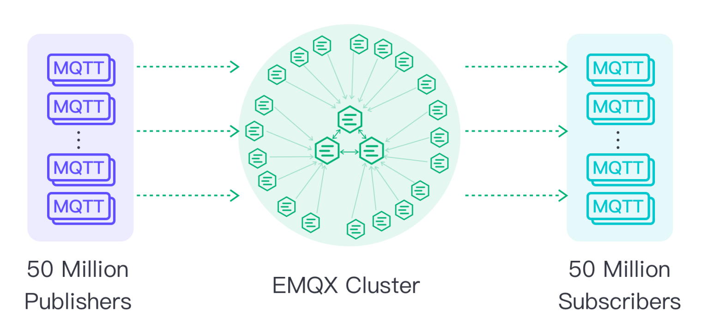
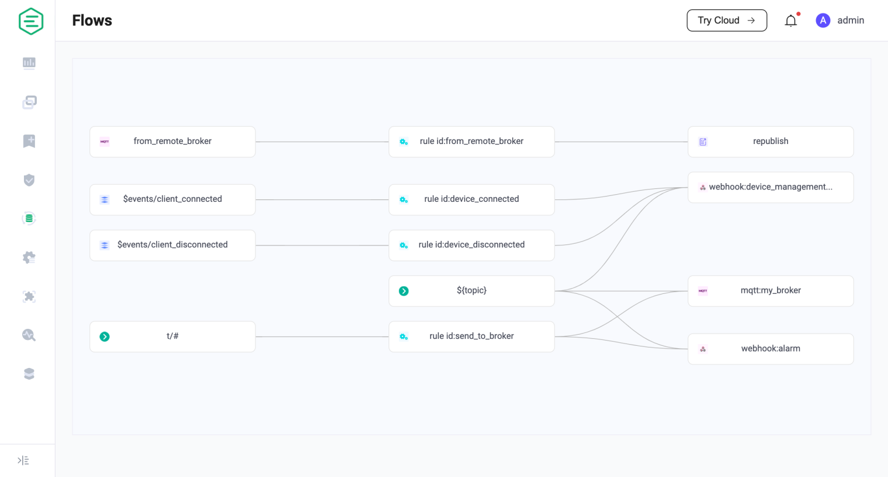
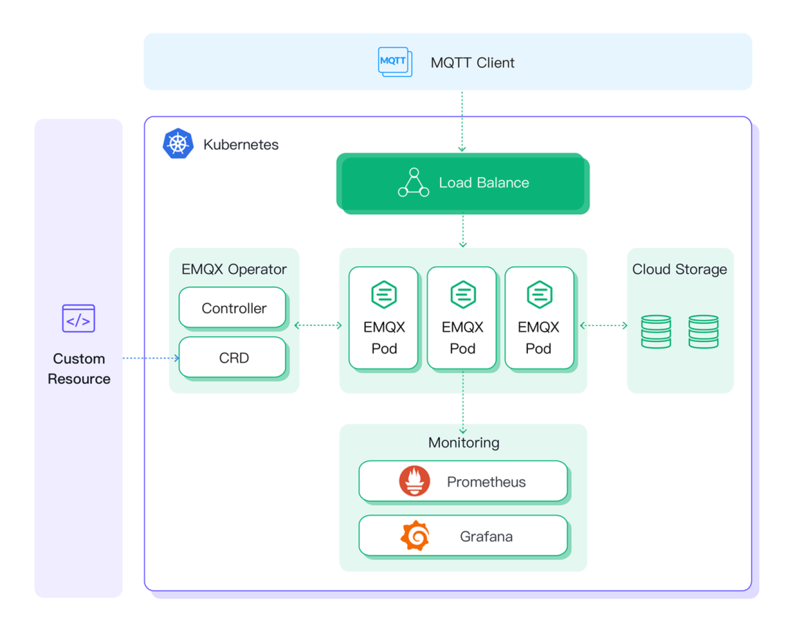

# New Features

EMQX 5.0 is a considerable advancement of MQTT technology. As verified by the [test scenarios](https://www.emqx.com/en/blog/reaching-100m-mqtt-connections-with-emqx-5-0), EMQX 5.0 supports up to 100 million concurrent device connections, a critically important milestone for IoT designers. It also comes with plenty of exciting new features and substantial performance improvements, including a more robust rule engine, enhanced security management, Mria database extension, and much more to enhance the scalability of IoT applications.

## Significant improvements in scalability and reliability

The latest version adopts a new Mria extension for Erlang’s [Mnesia database](https://github.com/erlang/otp/pull/5926), increasing horizontal scalability by defining two different node types: core and replicant nodes. This new architecture allows EMQX 5.0 to better adapt to increasing demand in IoT networks. 

The latest performance testing shows it can easily support 100M connections with a single cluster—a 10-fold increase over previous versions—making it the world’s most scalable open-source MQTT broker.

## The world’s first implementation of MQTT over QUIC

QUIC is an underlying transfer protocol for the next-generation HTTP/3 protocol used by modern web browsers. QUIC benefits IoT transmission scenarios by reducing connection overhead and latency compared to TCP, increasing overall throughput, and increasing stability for mobile connections.

With support for QUIC, EMQ hopes to maintain EMQX’s ability to provide the most advanced and competitive MQTT servers for the next generation of internet connectivity.

## New IoT data integration: Flow Editor & bidirectional data bridging

EMQX is designed for high-performance, real-time data processing and IoT applications integration. EMQX 5.0 is deeply refactored and optimized to make data integration easier and more flexible.
EMQX 5.0 integrates Webhook and data storage/bridging plugins to manage northbound and southbound data flow in a unified interface. Users can also process southbound messages from the cloud to edge devices based on the same rule processing functions.
Also, EMQX 5.0 provides data integration visualization capabilities (Flows). Through the Dashboard, users can see how the rules engine processes IoT data and how data flows to external data services or devices.
Subsequent versions will also support drag-and-drop orchestration of rules and data bridges (Flow Editor) on the Dashboard to connect IoT hardware data flows together through a visual interface.

## Flexible authentication/authorization: Ensure IoT data security with zero development efforts

EMQX 5.0 has offered a built-in client authentication/authorization feature, which greatly simplifies the configuration and authentication/authorization workflow. With EMQX 5.0, users only need to do some simple configuration work before integrating with various data sources for user authentication and ensuring data security under various scenarios. Enhanced security and improved development efficiency are achieved with zero coding efforts. 

**New features: **

- Support using Dashboard for configuration, commissioning and management;
- Support adjusting the running order of the authenticators and authorization checkers;
- Achieve complete observability for authentication/authorization with statistics on execution speed and number of times;
- Support authentication configuration on a listener-level, to provide more flexible access capabilities.

## User-friendly EMQX Dashboard with better observability

In EMQX 5.0, we have redesigned the EMQX Dashboard with a new UI design style, enhancing the visual experience and supporting more powerful and user-friendly features. Users can manage client connections, authenticate/authorize various subscribe/publish requests, and integrate with different data systems via data bridges and rule engine with our brand-new EMQX Dashboard. 

**New features: **

- New UI/UX design: Great enhancement of real-time observability;
- Optimized menu structure: Fast and direct access to contents
- Data monitoring and management: Important data at a glance
- Visualized access control: Out-of-the-box authentication/authorization management;
- Powerful data integration capabilities: Using Flow Editor in a visualized way and supporting two-way data bridging;
- Configuration updates during runtime: Hot update that takes effect immediately;
- Custom extension capabilities: Built-in gateways, plugins and Hooks;
- More comprehensive diagnosis tools: Timely problem identifying and debugging

## EMQX Operator  - Welcome to the cloud-native EMQX 5.0

Horizontal expansion and elastic clusters are features that a cloud-native application must support. 

[EMQX Kubernetes Operator](https://www.emqx.com/en/emqx-kubernetes-operator) lets you take full advantage of the Replicant node of EMQX 5.0. You can deploy a stateless EMQX node with Kubernetes Deployment and then build the EMQX cluster that supports large-scale MQTT connections and message throughput.

EMQX Kubernetes Operator is a low-cost, standard and reusable deployment and managing tool. With EMQX Kubernetes Operator, users can efficiently manage their clusters, for example, capacity expansion, upgrade, commissioning and debugging, and monitoring.

## New gateway framework: better support to multiple IoT protocols

EMQX 5.0 presents a new extended gateway framework with reconstructed underlying architecture for multi-protocol access and a unified configuration format and management interface. Meanwhile, we standardize the implementation of various gateways with more clearly-defined gateway functions.

In EMQX 5.0, we use a unified framework to support the standard operations of different gateways:

- **Unified user interface: ** The framework provides a unified configuration file, HTTP API and command line interface. For example, in EMQX 4.x,  the listener parameters exposed by different protocol plugins are different, in EMQX 5.0, the naming is unified.
- **Unified statistic and monitoring indicators:** EMQX 5.0 provides the gateway/client-level statistic indicators, for example, number of bytes sent and received, messages, etc.
- **Independent connection and session management:** Different from EMQX 4.x, gateway clients are also managed under the MQTT client list, EMQX 5.0 has created an independent gateway page for each gateway, and one Client ID can be reused across gateways.
- **Independent client authentication: **Different from EMQX 4.x, where the gateway authentication is also  managed under the MQTT client, EMQX 5.0 supports configuring a unique authentication mechanism for each gateway.
- **Easy to expand with clear specifications:** The framework provides a set of standard concepts and interfaces to make it easier to customize the gateways.

The new gateway framework further improves EMQX's usability by unifying access and managing multiple protocols. Now clients implementing third-party protocols can also leverage the advantages of EMQX, such as data integration, safe and reliable authentication/authorization, billion-level horizontal expansion capabilities, etc. 

## **More feature updates**

**More Intuitive User Experience: **

Ease-of-use improvements will be the most apparent change to users of EMQX 5.0. We redesigned the EMQX Dashboard according to users behavior. The concise and easy-to-read HOCON configuration file format, the OpenAPI 3.0 compliant REST API documents, more detailed monitoring metrics, log tracking, and slow subscription diagnostic tools will also bring developers a better experience.

**Improved operability and observability**

You can view the operating data in the last 7 days via EMQX Dashboard, or integrate other monitoring systems with one click, such as Prometheus, Grafana, and Datadog/StatsD. EMQX5.0 also offers features like slow subscription, log trace, structured logs, and logs in JSON format, to help users with diagnosis and troubleshooting in the production environment.

**Flexible expansion and customization**

EMQX 5.0 introduces a new plugin architecture, with which users can compile, distribute, and install their extension plugins in the form of independent plugin packages to customize and extend the usage of EMQX.
