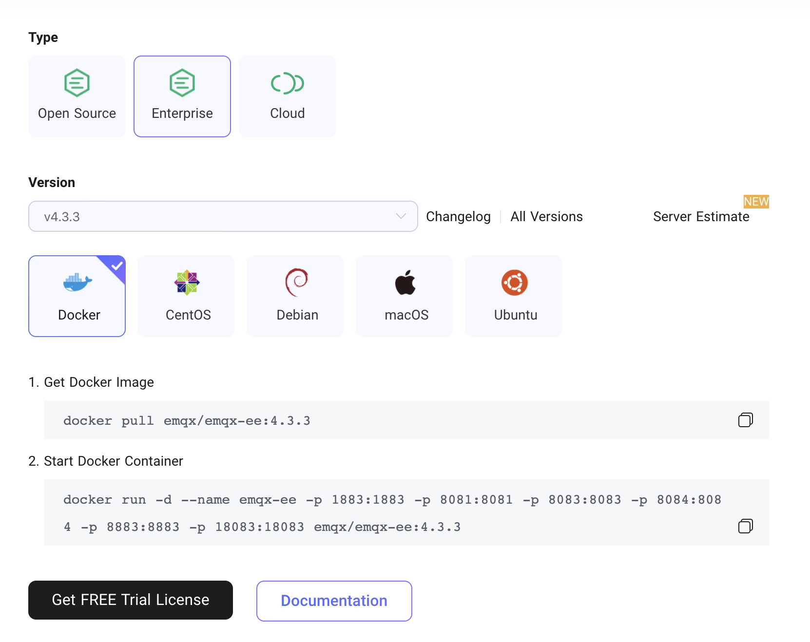

# Start EMQ X

Start EMQ X broker in the background

```bash
$ emqx start
EMQ X Broker v4.0.0 is started successfully!
```

systemctl start

```bash
$ sudo systemctl start emqx
EMQ X Broker v4.0.0 is started successfully!
```

service start

```bash
$ sudo service emqx start
EMQ X Broker v4.0.0 is started successfully!
```

::: tip
If you are using EMQ X Enterprise, you need to import a license to use it. For the import steps, see **Start EMQ X Enterprise** below.

EMQ X Broker installed via ZIP archive does not support systemctl and service startup.

:::


## Check the status of EMQ X Broker

EMQ X Broker starts normally:

```bash
$ emqx_ctl status
Node 'emqx@127.0.0.1' is started
emqx 4.0.0 is running
```

EMQ X Broker failed to start normally:

```bash
$ emqx_ctl status
Node 'emqx@127.0.0.1' not responding to pings。
```

You can check the log file from [`logs`](./directory.md) and confirm whether it belongs to [Common Error](../faq/error.md#).



After 4.2-rc.1, EMQ X has added [telemetry](../advanced/telemetry.md), Please learn more before starting.

## Start EMQ X Enterprise
EMQ X Enterprise needs a license file to start normally. EMQ X can skip this step.




## Request a trial license

EMQ X Enterprise requires a license file to start normally. EMQ X Broker can skip this step.

1. Visit the [EMQ X Enterprise download page](https://www.emqx.com/en/downloads?product=enterprise), click **[Get FREE Trial License](https://www.emqx.com/en/apply-licenses/emqx)**.

    

2. Apply for a trial license file, then download the license file.

    

3. Replace the license file (`etc/emqx.lic`) in the default certificate directory. You can also choose to change the read path of the certificate file, modify `license.file` in the `etc/emqx.conf` file, and make sure that the license file is in the updated read path and EMQ X Enterprise has read permission. Then, start EMQ X Enterprise. EMQ X Enterprise is started in the same way as EMQ X Broker, which can be seen below.

4. If the running EMQ X Enterprise needs to update the license file, you can use the `emqx_ctl license reload [path of the license file]` command to directly update the license file without restarting EMQ X Enterprise. It should be noted that the certificate loaded by the `emqx_ctl license reload` command will only take effect during this run of EMQ X Enterprise. If you need to permanently update the license certificate path, you still need to replace the old certificate or modify the configuration file, which can be seen from the previous step.


::: danger
The certificate loaded by the `emqx_ctl license reload` command will only take effect during this runtime of EMQ X Enterprise. If you need to permanently update the path of the License certificate, you still need to replace the old certificate or modify the configuration file.
:::
