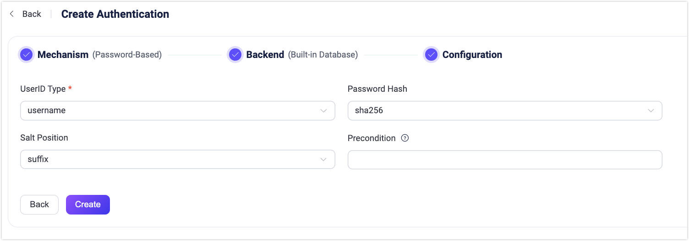

# Use Built-in Database

You can use the built-in database of EMQX as a low-cost and out-of-the-box option for password authentication. After enabling, EMQX will save the client credentials in its built-in database (based on Mnesia) and manage data via REST API and Dashboard. This page introduces how to use the EMQX Dashboard and configuration items to configure the authentication using the built-in database.

::: tip

Knowledge about [basic EMQX authentication concepts](./authn.md)

:::

## Configure with Dashboard

You can use EMQX Dashboard to set the built-in database for password authentication.

1. In the EMQX Dashboard, click **Access Control** -> **Authentication** from the left navigation menu.
2. On the **Authentication** page, click **Create** in the top right corner.
3. Click to select **Password-Based** as **Mechanism**, and **Built-in Database** as **Backend** to go to the **Configuration** tab, as shown below.



4. Follow the instructions below to configure the authentication backend:

   - **UserID Type**: Specify the fields for client ID authentication; Options:  `username`, `clientid`（corresponding to the `Username` or `Client Identifier` fields in the `CONNECT` message sent by the MQTT client).
   - **Password Hash**: Select the password hashing algorithm applied to plain-text passwords before results are stored in the database. Available options are `plain`, `md5`, `sha`, `sha256`, `sha512`, `bcrypt`, and `pbkdf2`. Additional configurations depend on the selected algorithm:
     - For `md5`, `sha`, `sha256` or `sha512`:
       - **Salt Position**: Determines how salt (random data) is mixed with the password. Options are `suffix`, `prefix`, or `disable`.  You can keep the default value unless you migrate user credentials from external storage into the EMQX built-in database.
       - Resulting hash is represented as a string of hexadecimal characters, and compared case-insensitively with the stored credential.
     - For `plain`:
       - **Salt Position**: should be `disable`.
     - For `bcrypt`:
       - **Salt Rounds**: Defines the number of times the hash function is applied, expressed as _2<sup>Salt Rounds</sup>_, also known as the "cost factor". The default value is `10`, with a permissible range of `5` to `10`. A higher value is recommended for enhanced security. Note: Increasing the cost factor by 1 doubles the necessary time for authentication.
     - For `pbkdf2`:
       - **Pseudorandom Function**: Selects the hash function that generates the key, such as `sha256`.
       - **Iteration Count**: Sets the number of times the hash function is executed. The default is `4096`.
       - **Derived Key Length** (optional): Specifies the length in bytes of the generated key. If left blank, the length will default to that determined by the selected pseudorandom function.
       - Resulting hash is represented as a string of hexadecimal characters, and compared case-insensitively with the stored credential.

   - **Precondition**: A [Variform expression](../../configuration/configuration.md#variform-expressions) used to control whether this Built-in Database authenticator should be applied to a client connection. The expression is evaluated against attributes from the client (such as `username`, `clientid`, `listener`, etc.). The authenticator will only be invoked if the expression evaluates to the string `"true"`. Otherwise, it will be skipped. For more information about the precondition, see [Authenticator Preconditions](./authn.md#authenticator-preconditions).

5. After you finish the settings, click **Create**.

## Configure with Configuration Items

You can also configure the authentication through configuration items. <!--For detailed steps, see [authn-builtin_db:authentication](../../configuration/configuration-manual.html#authn-builtin_db:authentication).-->

Example:

```hcl
{
   backend = "built_in_database"
   mechanism = "password_based"
   password_hash_algorithm {
      name = "sha256",
      salt_position = "suffix"
   }
   user_id_type = "username"
   bootstrap_file = "${EMQX_ETC_DIR}/auth-built-in-db-bootstrap.csv"
   bootstrap_type = "plain"
}
```

## Bootstrap Users from a File

The `password_based:built_in_database` authenticator supports loading users from a local file when the authenticator is created.

This mechanism is intended for initializing (seeding) users during deployment, such as:

- Creating default administrator accounts
- Preloading predefined client credentials
- Preparing initial data during first-time setup
- Predefining an initial administrative account (by setting `is_superuser = true`)

Bootstrap runs only once during authenticator creation. It is not intended for ongoing user management or large-scale runtime migration. For bulk import after EMQX is running, use [Import Users](./user_management.md#import-users).

### Bootstrap Configuration

```hocon
bootstrap_file = "${EMQX_ETC_DIR}/auth-built-in-db-bootstrap.csv"
bootstrap_type = "plain"  # or "hash"
```

#### `bootstrap_file`

- Default: `${EMQX_ETC_DIR}/auth-built-in-db-bootstrap.csv`
- Specifies the local file used to load initial users.

File format is determined by extension:

- `.csv`: Header-based CSV
- `.json`: JSON array of objects

The default file shipped with EMQX uses a CSV header:

```txt
user_id,password,is_superuser
```

#### `bootstrap_type`

- Values: `plain` or `hash`
- Default: `plain`

Determines how password data in the file is interpreted.

### File Format Requirements

`bootstrap_type = plain` requires fields:

- `user_id`
- `password`
- `is_superuser` (optional, defaults to `false`)

EMQX hashes `password` using the configured `password_hash_algorithm` before storing it.

`bootstrap_type = hash` requires fields:

- `user_id`
- `password_hash`
- `salt` (optional, defaults to empty string)
- `is_superuser` (optional, defaults to `false`)

EMQX stores `password_hash` directly without rehashing.

### Runtime Behavior

During authenticator creation:

1. EMQX reads the bootstrap file.
2. Parses users from CSV or JSON.
3. Inserts users into the built-in database.

Important notes:

- Existing users are not overridden (`override = false`).
- `is_superuser` is treated as `true` only if:
  - JSON boolean `true`, or
  - String `"true"` in CSV/JSON.
  - All other values are interpreted as `false`.
- File read or parsing errors generate warning logs only.
- Authenticator creation still succeeds even if the file contains errors.

## Migrate from External Storage to EMQX Built-in Database

To migrate user credentials from an external system (such as MySQL, LDAP, or another MQTT broker) to the EMQX built-in database, you can use the Import Users API to batch upload users.

Unlike bootstrap, importing users is performed after EMQX is running and is intended for operational data migration. For operating details, see [Import Users](./user_management.md#import-users).
