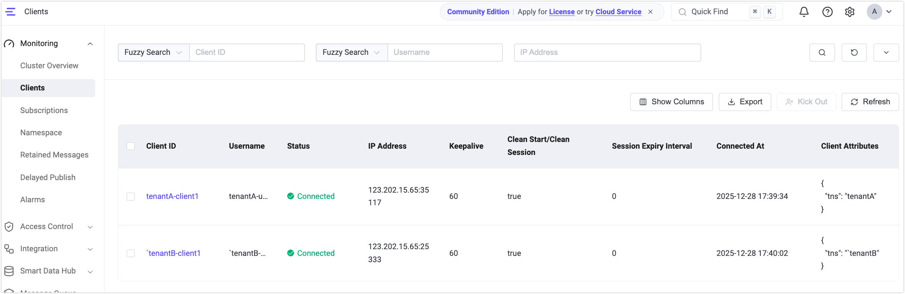

# Quick Start: Experience Namespaces

This section guides you through using the [MQTTX client](https://mqttx.app) to connect to EMQX and quickly experience the core capabilities of the namespace feature: tenant identification, client and topic isolation, and ACL isolation.

## Enable a Namespace Source (Generate the `tns` Attribute)

By configuring a namespace source, EMQX can identify the namespace from client connection information and automatically create the corresponding namespace when the client connects.

### Enable via Configuration File

Add the following configuration to `base.hocon` to extract the namespace identifier from the username:

```
mqtt.client_attrs_init = [
  { expression = "nth(1, tokens(username, '-'))", set_as_attr = tns }
]
```

**Example**

If a client connects with the username `tenantA-user1`, EMQX extracts `tenantA` as the namespace identifier.

### Enable via Dashboard

You can also configure the namespace source in the Dashboard:

1. Navigate to **Management** -> **Namespace** -> **Settings**.

2. Under **When to Resolve Namespace**, keep the default **Before Authentication**.

3. In **Take Namespace From**, enter the expression:

   ```
   nth(1, tokens(username, '-'))
   ```

4. Click **Confirm** to save the configuration.


### Verify Automatic Namespace Creation

1. Use MQTTX to create an MQTT client connection simulating tenant `tenantA`:

   - **Username**: `tenantA-user1`
   - Connect to EMQX.

2. On the **Namespace** page, disable **View Explicitly Created Namespaces Only**.

3. Verify that the namespace `tenantA` is automatically created.

4. In the **Actions** column, click **Clients** to view clients connected to this namespace.

   

## Configure and Verify Namespace Isolation

### Enable Client ID and Topic Isolation

To isolate client IDs and topics across different namespaces, you need to enable the relevant options in the global namespace settings.

#### Enable via Configuration File

Add the following configuration to `base.hocon`:

```hocon
mqtt.clientid_override = "concat([client_attrs.tns, '-', clientid])"
mqtt.namespace_as_mountpoint = true
```

These settings will:

- Automatically add a namespace prefix to client IDs, preventing client ID conflicts across namespaces.
- Automatically add a `{namespace}/` prefix to topics internally in the broker, enabling namespace-level topic isolation.

#### Enable via Dashboard

1. In the Dashboard, navigate to **Management** -> **Namespace** -> **Settings**.
2. Enable the following options:
   - **Client ID Isolation**, with default value as `concat([client_attrs.tns, '-', clientid])`.
   - **Namespace as Mountpoint**
3. Click **Confirm** to save the settings.

### Verify Client and Topic Isolation

1. Use MQTTX to create two MQTT client connections to simulate two tenants: `tenantA` and `tenantB`.

   **Client A (Tenant: tenantA)**:

   | Parameter | Value           |
   | --------- | --------------- |
   | Client ID | `client1`       |
   | Username  | `tenantA-user1` |
   | Subscribe | `test/topic`    |

   **Client B (Tenant: tenantB)**:

   | Parameter | Value           |
   | --------- | --------------- |
   | Client ID | `client1`       |
   | Username  | `tenantB-user2` |
   | Publish   | `test/topic`    |

2. Use Client B to publish a message. Verify the result in MQTTX and the EMQX Dashboard:

   - Although both clients use the same client ID (`client1`), due to the prefix rule, they connect as `tenantA-client1` and `tenantB-client1`, avoiding conflicts.
   - Even though both clients use the same topic (`test/topic`), Client A will **not receive** messages published by Client B because they are isolated by namespace.

3. Go to the **Monitoring** -> **Clients** page to view:
   - Client A's subscribed topic appears as `tenantA/test/topic`.
   - Client B's published topic appears as `tenantB/test/topic`.




## Enable Mountpoint-Based ACL Checks

By default, to maintain backward compatibility, authorization (ACL) checks do not include the topic prefix (mountpoint). This means that authorization rules are matched against the original topic name (for example, `test/topic`) rather than the namespaced topic (for example, `tenantA/test/topic`).

Starting from EMQX 6.1, you can enable authorization checks that include the topic prefix to enforce namespace-level ACL isolation.

### Enable via Configuration File

Add the following configuration to `base.hocon`:

```hocon
authorization.include_mountpoint = true
```

### Enable via Dashboard

1. In the Dashboard, navigate to **Management** -> **Namespace** -> **Settings**, or **Access Control** -> **Client Authorization** -> **Settings**.
2. Enable **Mount Prefix for Authorization**.
3. Save the settings.

::: tip Note

When `authorization.include_mountpoint = true` is enabled, all authorization rules must include the topic prefix in their topic matching patterns.

For example, if a client connects through a listener with the topic prefix `tenantA/` and wants to subscribe to `test/topic`, the corresponding authorization rule must be configured as `tenantA/test/topic`.

:::
