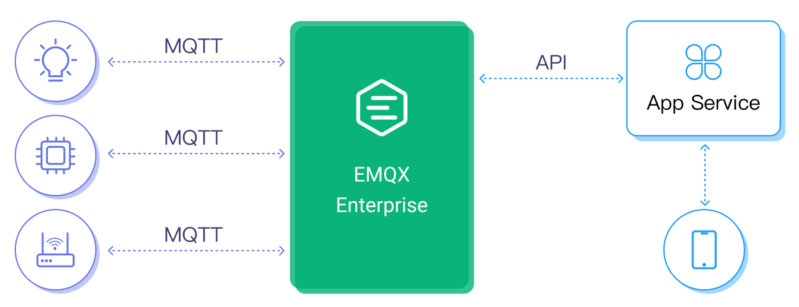
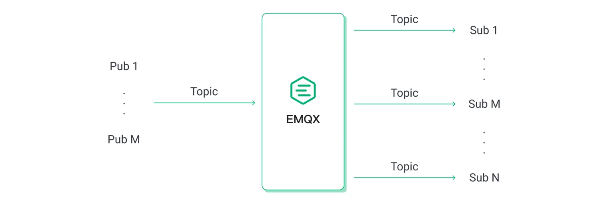
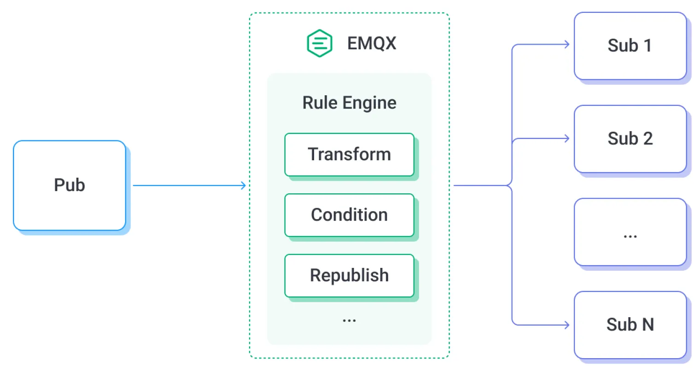
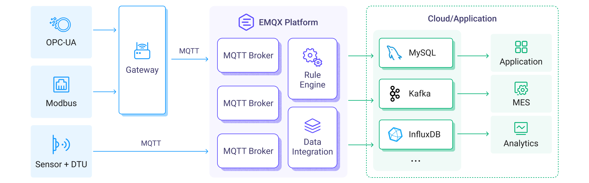
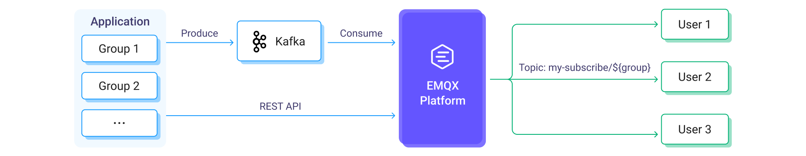
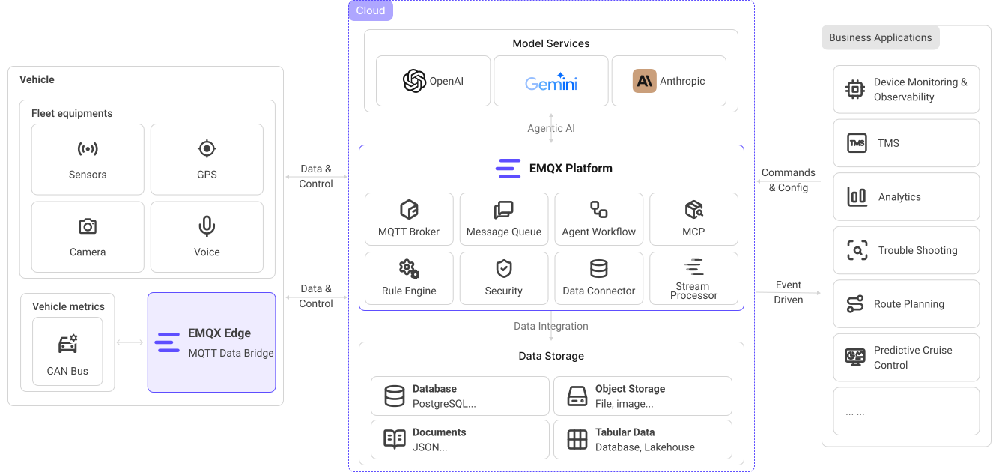
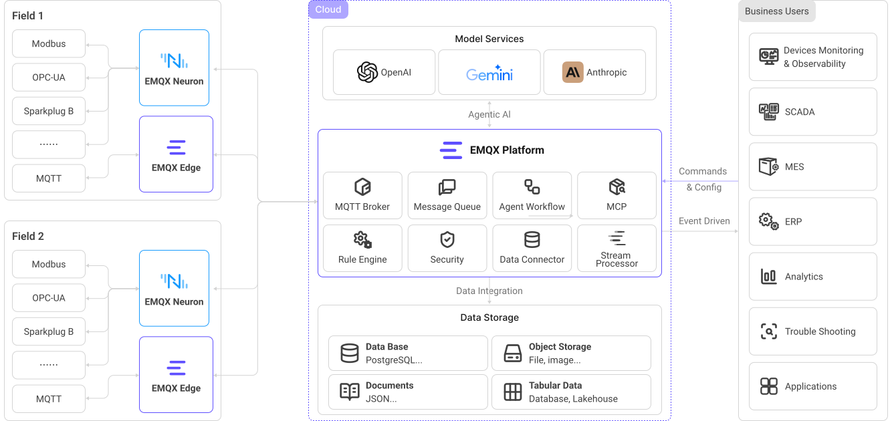

# EMQX Overview
EMQX is a large-scale distributed MQTT messaging platform that offers "unlimited connections, seamless integration, and anywhere deployment." As a high-performance, scalable MQTT message server, EMQX Enterprise provides reliable real-time message transmission and device connectivity solutions for IoT applications. EMQX has accumulated more than 20,000 corporate users from more than 50 countries, connecting more than 100 million IoT devices worldwide, serving enterprises' digital, real-time, and intelligent transformation.

As a commercial self-hosted MQTT messaging platform, [EMQX Enterprise](https://www.emqx.com/en/products/emqx) supports up to 100 million concurrent MQTT connections per cluster. A single server can handle and process millions of MQTT messages per second, all while maintaining millisecond-level latency. With its robust built-in rule engine and data integration capabilities, EMQX Enterprise can perform real-time data processing, transformation, and routing for massive IoT data. It seamlessly integrates IoT data with various backend databases and analytics tools, enabling enterprises to rapidly build IoT platforms and applications with leading competitiveness.

## Key Benefits

- [**Massive Scale**](https://www.emqx.com/en/blog/how-emqx-5-0-achieves-100-million-mqtt-connections): A single node stably supports 1.5M MQTT device connections, and the cluster can scale horizontally to handle up to 100M concurrent MQTT connections.
- [**Business-Critical Reliability**](./develop/cluster/mria-introduction.md): Ensure no data loss with built-in RocksDB data persistence.
- [**Data Security**](./guides/security-guide.md): End-to-end data encryption and fine-grained access control to protect your data.
- [**Multiple protocols support**](https://www.emqx.com/en/blog/iot-protocols-mqtt-coap-lwm2m): MQTT, QUIC, CoAP, Stomp, LwM2M, and more
- [**Fully MQTT 5.0**](https://www.emqx.com/en/blog/introduction-to-mqtt-5): EMQX is **fully** compliant with both **MQTT 5.0 and 3.x** standards, providing better scalability, security, and reliability.
- [**High Performance**](https://www.emqx.com/en/blog/mqtt-performance-benchmark-testing-emqx-single-node-supports-2m-message-throughput): Ingest and process millions of MQTT messages efficiently per second per node.
- [**Low Latency**](https://www.emqx.com/en/blog/mqtt-performance-benchmark-testing-emqx-single-node-message-latency-response-time): Guarantee sub-millisecond latency in message delivery with the soft real-time runtime.
- [**Complete Observability**](./guides/dashboard/introduction.md): Monitoring, alerting, and advanced end-to-end analysis with real-time MQTT tracing.
- [**Cloud-Native & K8s**](./get-started/deploy/kubernetes/kubernetes.md): Can be easily deployed on-premises or in public clouds using **Kubernetes Operator**.

## Main Components

EMQX Enterprise consists of multiple components that together build a powerful and scalable MQTT messaging platform. Here are the core components of EMQX Enterprise:

### Device Connectivity

EMQX Enterprise is 100% compatible with MQTT 5.0 and 3.x specifications, and its exceptional scalability allows it to easily handle a massive number of MQTT device client [connections](https://www.emqx.com/en/blog/reaching-100m-mqtt-connections-with-emqx-5-0). At the same time, it provides support for other open-standard protocols, including HTTP, QUIC, and LwM2M/CoAP, enabling connectivity for a wide range of IoT devices and scenarios. EMQX Enterprise also extends its capabilities to include features such as file transfer and delayed publishing, enriching its use cases.

#### MQTT over QUIC

EMQX Enterprise pioneeringly introduces the [MQTT over QUIC](./develop/mqtt-over-quic/introduction.md) protocol, allowing IoT clients to establish connections with EMQX via QUIC for communication. Devices using QUIC can improve connection and message throughput performance while reducing message latency. This is particularly beneficial in scenarios such as the Internet of Vehicles (IoV), which commonly face weak network conditions, frequent link changes, and unstable network environments. MQTT over QUIC meets the requirements for real-time and efficient message transmission in such scenarios.

#### Multi-Protocol Gateways

[Multi-protocol gateways](./develop/gateway/gateway.md) enable EMQX Enterprise to support device connections using different communication protocols other than MQTT. These gateways listen to device connection requests, identify the communication protocols used by devices, and then parse the messages, commands, and data sent by devices according to the respective protocol specifications. The gateways convert this data into MQTT message formats for further message processing.

### Message Routing

EMQX Enterprise provides a highly reliable message transmission mechanism through its support for the [publish/subscribe](./get-started/messaging/introduction.md) pattern. This ensures that messages are reliably delivered to the intended devices or applications. With QoS mechanisms and session retention capability, data can be quickly and reliably delivered even in unstable network environments, ensuring business continuity and stability.

### Distributed Clustering

EMQX Enterprise offers native [clustering](./develop/cluster/introduction.md) capabilities, enabling seamless and elastic scaling, while avoiding single points of failure. With extreme optimization, a single node can process and distribute millions of MQTT messages per second with [low latency](https://www.emqx.com/en/blog/mqtt-performance-benchmark-testing-emqx-single-node-message-latency-response-time). Through cluster horizontal scaling, it supports up to 100 million concurrent MQTT connections, making it crucial for large-scale IoT deployments in areas such as the IoV, industrial automation, and smart homes.

### Access Control and Data Security

Through [TLS/SSL encryption](./guides/network/overview.md) and [authentication](./guides/access-control/authn/authn.md)/[authorization](./guides/access-control/authz/authz.md) mechanism EMQX Enterprise ensures the confidentiality and integrity of device data transmission.

EMQX Enterprise includes multiple client authentication mechanisms, including username/password, JWT, enhanced authentication, PSK, and X.509 certificates. It provides publish/subscribe authorization mechanisms based on ACLs. Authentication and authorization data can be integrated and managed through external enterprise security systems, such as LDAP, HTTP services, SQL, and NoSQL databases, allowing for flexible and diverse client security protection solutions.

Additionally, the EMQX Enterprise offers [audit logs](./guides/dashboard/audit-log.md), role and permission management, and [single sign-on](./guides/dashboard/sso.md) to meet SOC 2 compliance requirements and GDPR data privacy protection. Its comprehensive security features help enterprises build trusted IoT applications that comply with industry security standards.

### Rule Engine and Data Integration

EMQX Enterprise includes a powerful [rule engine](./develop/data-integration/rules.md) that allows you to configure rules within EMQX to process and route incoming data based on your requirements. You can also use EMQX's Sink feature to integrate EMQX Enterprise with cloud services or databases for transferring IoT data to the cloud for storage and analysis.

#### Real-Time Data Processing

With a built-in SQL-based rule engine, Schema Registry, message codecs, and [Flow Designer](./develop/flow-designer/introduction.md), you can easily create and edit device events and message processing flows. This enables real-time extraction, validation, filtering, and transformation of IoT data.

#### Enterprise Data Integration

Through out-of-the-box Webhooks and Sink/Source, you can seamlessly [integrate](./develop/data-integration/data-bridges.md) IoT data with over 40 cloud services and enterprise systems, including Kafka, AWS RDS, MongoDB, Oracle, SAP, and time-series databases. This empowers enterprises to effectively manage, analyze, and utilize data from IoT devices, supporting various applications and business needs.

### Management and Monitoring Dashboard

EMQX Enterprise provides a graphical management system called the [Dashboard](./guides/dashboard/introduction.md), allowing you to monitor key metrics and operational statuses in real time. It simplifies the management of client connections and feature configurations. The Dashboard also enables diagnostics and debugging of client and cluster anomalies, facilitating end-to-end troubleshooting of MQTT devices online, significantly reducing troubleshooting time. In addition, it supports the integration of observability metrics into external services such as Prometheus, Datadog, and services supporting OpenTelemetry, enhancing operational monitoring capabilities.

## Deployment Modes and Edition Comparison

EMQ provides three deployment options for EMQX: two managed services (EMQX Serverless and EMQX Dedicated) and one self-hosted option (EMQX Enterprise). To help you choose the best deployment option for your requirements, the following table lists a comparison of feature support across different deployment types. For a comparison of supported features in detail, refer to [Feature Comparison](./get-started/feature-comparison.md).

<table>
<thead>
  <tr>
    <th colspan="1">Self-Hosted</th>
    <th colspan="2">MQTT as a Service</th>
  </tr>
</thead>
<tbody>
  <tr>
    <td>EMQX Enterprise</td>
    <td>EMQX Serverless</td>
    <td>EMQX Dedicated</td>
  </tr>
  <tr>
    <td><a href="https://www.emqx.com/en/apply-licenses/emqx">Get a Free Trial License</a></td>
    <td><a href="https://accounts.emqx.com/signup?continue=https%3A%2F%2Fcloud-intl.emqx.com%2Fconsole%2Fdeployments%2F0%3Foper%3Dnew">Get Started Free</a></td>
    <td><a href="https://accounts.emqx.com/signup?continue=https%3A%2F%2Fcloud-intl.emqx.com%2Fconsole%2Fdeployments%2F0%3Foper%3Dnew">Start a Free 14-Day Trial</a></td>
  </tr>
  <tr>
    <td>✔️ Business Source License (BSL) 1.1 ✔️ MQTT over QUIC ✔️ Session persistence in RocksDB ✔️ Data integration with 40+ enterprise systems, including Kafka/Confluent, Timescale, InfluxDB, PostgreSQL, Redis etc. ✔️ Audit log and single sign-on (SSO) ✔️ Role-Based Access Control (RBAC) ✔️ File transfer ✔️ Message codec ✔️ Multi-protocol gateways, with extra support on OCPP, JT/808 and GBT32960 ✔️ 24/7 global technical support  </td>
    <td>✔️ Pay as you go ✔️ Free quota every month ✔️ 1000 maximum connections ✔️ Start deployment in seconds ✔️ Auto scaling ✔️ 8/5 global technical support</td>
    <td>✔️ 14-days free trial ✔️ Hourly billing ✔️ Multi-cloud regions worldwide ✔️ Flexible specifications ✔️ VPC peering, NAT gateway, load balance and more ✔️ Out-of-box integration with over 40+ cloud services ✔️ 24/7 global technical support  </td>
  </tr>
</tbody>
</table>

## Use Cases

EMQX Enterprise is a comprehensive IoT messaging platform that plays a crucial role in different stages of IoT device connectivity and data transmission, providing powerful functionality and flexibility for various business needs.

Based on the publish-subscribe message delivery model, it can achieve flexible message communication with millions of topics and in different modes, meeting the real-time message delivery needs under various scenarios. Through its built-in rule engine and Sink/Source, EMQX Enterprise allows you to send messages to various cloud services, enabling seamless device data integration with enterprise systems. It can easily support use cases such as data processing, storage, analysis, and business command issuance. Here are some typical use cases:

### Bidirectional Communication

EMQX Enterprise supports connections between various devices and application endpoints, providing bidirectional communication between them. For example, in a smart home scenario, a mobile app can retrieve sensor data from various devices and send control commands to the devices when needed. This mode enables flexible one-to-one or one-to-many communication between devices and between devices and applications.

Bidirectional communication in mission-critical applications brings you key benefits as follows:

- **Topic-Based Pub/Sub Messaging**: EMQX's topic-based publish/subscribe model streamlines the data flow to ensure efficient and flexible message routing.
- **Ultra-Low Latency Delivery**: Achieve rapid data transfer with latencies as low as 1 millisecond, ensuring real-time responsiveness.
- **Comprehensive Quality of Service (QoS) Guarantees**: EMQX offers end-to-end multi-level QoS guarantees, providing reliable and flexible message delivery.

Below are more specific using scenarios:

#### Peer-to-Peer Communication

You can build up peer-to-peer communications with EMQX. In the asynchronous Pub/Sub model, the message publisher and subscriber are decoupled from each other, as they can be dynamically added or removed as needed. This decoupling provides flexibility to your applications and message communication.

#### Message Broadcasting to a Large Audience

EMQX excels in scenarios where one-to-many messaging is vital, such as financial market updates. It effectively broadcasts messages to a large number of clients, ensuring timely information dissemination.

#### Data Consolidation from Massive Endpoints

The many-to-one message pattern in EMQX is ideal for consolidating data in large-scale networks, such as factory plats, modern buildings, retail chains, or electricity grids. EMQX can help you transfer and transmit the data from the endpoints in the network to your centralized backend servers on the cloud or on-premise.

#### Traceable Communication with Request-Response Awareness

EMQX supports the MQTT 5.0 feature Request-Response. With this feature, you can now increase communication awareness and traceability in your asynchronous communication architect.

### Flowing Data Transformation

With a built-in powerful SQL-based [rules engine](./develop/data-integration/rules.md), EMQX can extract, filter, enrich, and transform the flowing data in real-time. Processed data can be easily ingested into external HTTP servers and MQTT services. If you are using EMQX Enterprise, you can also ingest data into mainstream databases, data storage, and message queues.

### Data Integration Across Different Networks

In a partitioned, or limited network environment, EMQX can create the data integrations, and provide you with a seamless messaging environment.

### Telemetry Data Upload

EMQX Enterprise supports uploading device data to the cloud and processing and storing data from specified topics in the cloud. For example, in an industrial production scenario, EMQX can process various industrial equipment data from the factory floor in real-time and store it in a database for product quality traceability and production analysis. This mode can be configured visually and leverages rich data processing capabilities for rapid development.

### Large File Upload

EMQX Enterprise provides MQTT protocol [file transfer](./develop/file-transfer/introduction.md) capability, allowing devices to upload large file data and store it locally or in S3 storage. For example, in an IoV scenario, machine learning log files and packaged CAN Bus data can be transmitted to cloud storage to drive updates to intelligent driving algorithm models. This mode combines structured data and file-type data through a unified data channel, reducing application complexity and maintenance costs.

### Cloud-Based Control Command Issuance

EMQX Enterprise allows message issuance through MQTT messages, REST APIs, and Source with, for example, Kafka, enabling data push or remote device control. For example, cloud services can push real-time data based on user watchlists in groups in a financial trading scenario. This mode provides topic mapping, data processing for issuance, and data reach statistics, enabling flexible and reliable data issuance.

## Industry Solutions

EMQX Enterprise provides versatile IoT solutions across industries, delivering reliable real-time connectivity for mission-critical applications. From connected vehicles to smart manufacturing, EMQX powers innovation at scale.

### Automotive & Connected Vehicles

EMQX powers the future of software-defined vehicles (SDVs), connecting 30+ million vehicles across 100+ car models for 5 of the 10 largest automobile companies worldwide. The platform provides the real-time data backbone for mission-critical V2X and telematics applications, with [MQTT over QUIC](./develop/mqtt-over-quic/introduction.md) optimized for unstable network conditions.

- **Connected Cars & SDVs**: Enable remote diagnostics, bidirectional command and control, and over-the-air (OTA) updates across global fleets. [**Learn More →**](https://www.emqx.com/en/solutions/internet-of-vehicles)
- **Fleet Telematics**: Real-time geo-location tracking, usage-based insurance (UBI), and predictive maintenance with ultra-low latency data streams. [**Learn More →**](https://www.emqx.com/en/solutions/fleet-telematics)
- **EV Charging Networks**: Scalable MQTT connectivity for charging station management, smart charging, and vehicle-to-grid (V2G) applications.
- **Automotive Manufacturing**: Unify data from factory floors by connecting robots, PLCs, and sensors for continuous monitoring and quality assurance. [**Learn More →**](https://www.emqx.com/en/solutions/industrial-iot)

SAIC Volkswagen relies on EMQX to power their next-generation IoV platform for over 1.6 million connected vehicles, supporting remote control and real-time data monitoring. [**Read Case Study →**](https://www.emqx.com/en/customers/saic-volkswagen)

### Transportation & Logistics

In an industry where every second counts, EMQX provides real-time fleet visibility, reliable data transmission over unstable networks, and geo-distributed deployment to minimize latency. The platform connects hundreds of thousands of vehicles and devices to a single, unified backbone.

- **Fleet Management**: Track vehicle location, monitor driver behavior, and optimize routes in real time to reduce fuel costs and improve delivery times. [**Learn More →**](https://www.emqx.com/en/solutions/fleet-management)
- **Smart Urban Transport**: Process massive amounts of traffic data for real-time analysis and intelligent transportation systems.
- **V2X Communication**: Enable Vehicle-to-Everything communication for enhanced safety, traffic efficiency, and autonomous driving applications. [**Learn More →**](https://www.emqx.com/en/solutions/software-defined-vehicles)
- **Cold Chain Monitoring**: Monitor temperature and humidity of sensitive cargo in real time to ensure compliance and prevent spoilage.

The Shenzhen Urban Transport Planning Center (SUTPC) uses EMQX to process data from over 1.7 million vehicles, enabling real-time traffic analysis and intelligent transportation systems. [**Read Case Study →**](https://www.emqx.com/en/customers/sutpc)

### Manufacturing & IIoT

EMQX connects all machines, systems, and applications from the factory floor to the cloud, bridging OT and IT with an AI-native data backbone. With support for 100+ industrial protocols, including Modbus, OPC-UA, and Siemens S7, EMQX enables a [Unified Namespace (UNS)](https://www.emqx.com/en/solutions/unified-namespace) architecture with Sparkplug B for true plug-and-play interoperability.

- **Predictive Maintenance**: Use real-time sensor data and AI to predict machine failures, prevent unplanned downtime, and extend equipment life.
- **OEE Optimization**: Boost factory output by tracking Overall Equipment Effectiveness in real time. Manufacturers report up to 25% increase in OEE and 40% reduction in downtime.
- **Quality & Traceability**: Detect quality deviations the moment they occur, monitor production parameters in real-time, and enable full product traceability.
- **Live Performance Monitoring**: Visualize your entire production line with live dashboards using EMQX [metrics and observability](./guides/observability/overview.md) features, with integration to Prometheus and Datadog.

Leading semiconductor fabs use EMQX to unify equipment data, handling 3.5M+ data tags per plant with 100ms collection rates and 100% data integrity for precision manufacturing. [**Learn More →**](https://www.emqx.com/en/solutions/industrial-iot)

### Energy & Utilities

EMQX powers the modern energy grid, connecting 10M+ endpoints with sub-100ms latency for critical grid control and protection applications. The platform bridges legacy OT protocols with modern IT systems using [multi-protocol gateways](./develop/gateway/gateway.md).

**Smart Grid & Renewables**
- **Grid Balancing**: Integrate distributed energy resources (DERs) and respond to supply/demand changes in real time for grid stability.
- **EV Charging Management**: Build scalable EV charging networks with smart charging and vehicle-to-grid (V2G) capabilities.
- **Predictive Asset Maintenance**: Monitor substations, transformers, and renewable assets in real time to predict failures and optimize maintenance.

**Oil & Gas**
- **Remote Asset Monitoring**: Monitor and control remote assets such as wellheads, pumps, and pipelines in real time.
- **Pipeline Leak Detection**: Instantly detect and locate leaks by analyzing real-time pressure and flow data from sensors.

Huabei Oilfield Company uses EMQX to connect over 40,000 data collection points, enabling real-time monitoring and intelligent analysis of their oilfield operations. [**Read Case Study →**](https://www.emqx.com/en/customers/huabei-oilfield-company)

### Healthcare

EMQX enables real-time patient monitoring, medical device integration, and next-generation telehealth solutions with a scalable, [secure data backbone](./guides/security-guide.md). The platform provides HIPAA-ready security features, including [TLS/SSL encryption](./guides/network/overview.md), robust authentication, and fine-grained access control to protect sensitive patient data.

- **Remote Patient Monitoring (RPM)**: Continuously monitor patients' vital signs and health status from their homes, enabling early intervention and reducing hospital readmissions.
- **Medical Device Integration**: Connect and integrate data from infusion pumps, ventilators, and lab equipment for a unified view of patient care.
- **Smart Hospital Automation**: Automate hospital operations from tracking medical assets to optimizing patient flow and environmental conditions.
- **Telehealth & Telemedicine**: Enable real-time communication and data exchange between patients and healthcare providers for remote consultations.

### Financial Services

EMQX powers real-time financial applications with millisecond-level latency, bank-grade security, and 7×24 continuous service. The platform has provided more than five years of stable operation for enterprise-level financial users.

- **Real-Time POS Monitoring**: Connect millions of POS terminals to monitor transaction data and device status in real time, enabling proactive maintenance.
- **Fraud Detection**: Instantly analyze transaction data as it occurs to detect and prevent fraudulent activity before it impacts customers.
- **Modern Payment Systems**: Build reliable, low-latency infrastructure for mobile payments, digital wallets, and real-time clearing and settlement.
- **Market Data Distribution**: Reliably distribute real-time market data such as stock quotes and trades to thousands of clients with minimal latency.

[**Read Case Study →**](https://www.emqx.com/en/customers/emqx-in-finance-and-payment-iot)

### Telecommunications

EMQX provides carrier-grade scalability for 5G IoT services, supporting 100+ million concurrent device connections on a single platform. The platform enables seamless IT/OT/CT integration with multi-protocol support including MQTT, CoAP, and LwM2M.

- **5G IoT Platform**: Reliably connect hundreds of millions of IoT devices over 5G networks, providing a stable foundation for value-added services.
- **Network Monitoring**: Continuously monitor the health and performance of network infrastructure in real time to proactively identify and resolve issues.
- **Smart City Backbone**: Build the data backbone for smart cities, connecting traffic systems, public transportation, utilities, and emergency services.

China Telecom, one of the world's largest telecom providers, uses EMQX to power its national IoT platform CTWing, supporting over 100 million concurrent device connections. [**Read Case Study →**](https://www.emqx.com/en/customers/china-telecom)

### Retail & Consumer IoT

EMQX connects millions of retail devices and consumer IoT endpoints, enabling real-time data movement for omnichannel experiences, smart home automation, and interactive applications.

- **Smart Retail**: Power real-time inventory management, POS monitoring, personalized customer engagement, and dynamic pricing across all store locations. Connect thousands of self-service kiosks, ensuring seamless customer experiences even during peak hours.
- **Smart Home**: Connect millions of smart home devices with a scalable [pub/sub messaging](./get-started/messaging/introduction.md) backbone, enabling home automation, energy monitoring, and integration with platforms like Alexa and Google Assistant.
- **Gaming & Social**: Build responsive online games and social apps with ultra-low latency communication for millions of concurrent users, supporting in-game chat, real-time notifications, and live events.

Signify (formerly Philips Lighting) uses EMQX to power global smart lighting solutions, ensuring reliable real-time control for millions of connected lights. JAGAT, a location-based social app, handles millions of users with EMQX for reliable real-time messaging. [**Read Case Study →**](https://www.emqx.com/en/customers/how-jagat-achieved-seamless-social-interaction-with-emqx)
