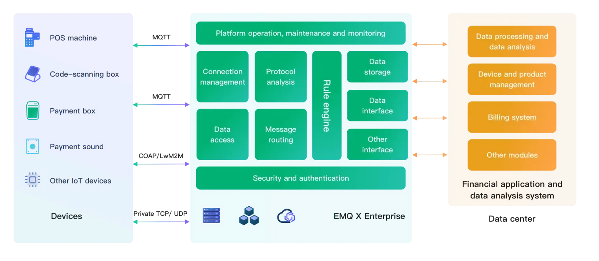


# EMQX Enterprise Overview



# EMQX Overview




EMQX is an [open-source](https://github.com/emqx/emqx), highly scalable, and feature-rich MQTT broker designed for IoT and real-time messaging applications. It supports up to 100 million concurrent IoT device connections per cluster while maintaining a throughput of 1 million messages per second and a millisecond latency.

EMQX supports various protocols, including MQTT (3.1, 3.1.1, and 5.0), HTTP, QUIC, and WebSocket. It also provides secure bi-directional communication with MQTT over TLS/SSL and various authentication mechanisms, ensuring reliable and efficient communication infrastructure for IoT devices and applications.

With a built-in powerful SQL-based [rules engine](https://www.emqx.com/en/solutions/iot-rule-engine), EMQX can extract, filter, enrich, and transform IoT data in real-time. EMQX also ensures high availability and horizontal scalability with a masterless distributed architecture and provides an operations-friendly user experience with excellent observability.

EMQX has been adopted by over 20,000 enterprise users, connecting more than 100 million IoT devices. Over 400 customers, including renowned brands like HPE, VMware, Verifone, SAIC Volkswagen, and Ericsson, trust EMQX for their mission-critical IoT scenarios. 





[EMQX Enterprise](https://www.emqx.com/en/products/emqx) is a large-scale distributed MQTT messaging platform that offers "unlimited connections, seamless integration, and anywhere deployment." As a high-performance, scalable MQTT message server, EMQX Enterprise provides reliable real-time message transmission and device connectivity solutions for IoT applications. With its robust built-in rule engine and data integration capabilities, EMQX Enterprise can perform real-time data processing, transformation, and routing for massive IoT data. It seamlessly integrates IoT data with various backend databases and analytics tools, enabling enterprises to build IoT platforms and applications rapidly with leading competitiveness.



## Key Benefits



[**Massive Scale**](https://www.emqx.com/en/blog/how-emqx-5-0-achieves-100-million-mqtt-connections)

EMQX enables scaling up to **100 million** concurrent MQTT connections in a single cluster, making it one of the most scalable MQTT brokers available.

[**High Performance**](https://www.emqx.com/en/blog/mqtt-performance-benchmark-testing-emqx-single-node-supports-2m-message-throughput)

EMQX is capable of processing and handling **millions** of MQTT messages per second within a single broker.

[**Low Latency**](https://www.emqx.com/en/blog/mqtt-performance-benchmark-testing-emqx-single-node-message-latency-response-time)

EMQX offers almost real-time message delivery, with a sub-millisecond latency guarantee, ensuring that messages are received almost instantly.

[**Fully MQTT 5.0**](https://www.emqx.com/en/blog/introduction-to-mqtt-5)

EMQX is **fully** compliant with both **MQTT 5.0 and 3.x** standards, providing better scalability, security, and reliability.

[**High Availability**](./deploy/cluster/mria-introduction.md)

EMQX enables high availability and horizontal scalability through a masterless distributed architecture, ensuring reliable and scalable performance.

[**Cloud-Native & K8s**](https://www.emqx.com/en/emqx-kubernetes-operator)

EMQX can be easily deployed on-premises or in public clouds using **Kubernetes Operator** and **Terraform**.

<!-- Add a section called Use Cases when optimizing the use case-->





- [**Massive Scale**](https://www.emqx.com/en/blog/how-emqx-5-0-achieves-100-million-mqtt-connections): Scale horizontally to 20+ nodes in a single cluster for 100M MQTT connections.
- [**Business-Critical Reliability**](./deploy/cluster/mria-introduction.md): Ensure no data loss with built-in RocksDB data persistence.
- [**Data Security**](https://www.emqx.com/en/use-cases/mqtt-security): End-to-end data encryption and fine-grained access control to protect your data.
- [**Multiple protocols support**](https://www.emqx.com/en/blog/iot-protocols-mqtt-coap-lwm2m): MQTT, QUIC, CoAP, Stomp, LwM2M, and more
- [**High Performance**](https://www.emqx.com/en/blog/mqtt-performance-benchmark-testing-emqx-single-node-supports-2m-message-throughput): Ingest and process millions of MQTT messages efficiently per second per node.
- [**Low Latency**](https://www.emqx.com/en/blog/mqtt-performance-benchmark-testing-emqx-single-node-message-latency-response-time): Guarantee sub-millisecond latency in message delivery with the soft real-time runtime.
- [**Complete Observability**](./dashboard/introduction.md): Monitoring, alerting, and advanced end-to-end analysis with real-time MQTT tracing.





## Product Comparison

EMQ provides four deployment options for EMQX: two managed services (EMQX Cloud Serverless and EMQX Dedicated Cloud) and two self-hosted options (EMQX Open Source and EMQX Enterprise). To help you choose the best deployment option for your requirements, the following table lists a comparison of feature support across different deployment types. For a comparison of supported features in detail, refer to [Feature Comparison](./getting-started/feature-comparison.md). 

<table>
<thead>
  <tr>
    <th colspan="2">Self Hosted</th>
    <th colspan="2">MQTT as a Service</th>
  </tr>
</thead>
<tbody>
  <tr>
    <td>EMQX Open Source</td>
    <td>EMQX Enterprise</td>
    <td>EMQX Cloud Serverless</td>
    <td>EMQX Dedicated Cloud</td>
  </tr>
  <tr>
    <td><a href="https://www.emqx.com/en/try?product=broker">Open Source Download</a></td>
    <td><a href="https://www.emqx.com/en/apply-licenses/emqx">Get a Free Trial License</a></td>
    <td><a href="https://accounts.emqx.com/signup?continue=https%3A%2F%2Fcloud-intl.emqx.com%2Fconsole%2Fdeployments%2F0%3Foper%3Dnew">Get Started Free</a></td>
    <td><a href="https://accounts.emqx.com/signup?continue=https%3A%2F%2Fcloud-intl.emqx.com%2Fconsole%2Fdeployments%2F0%3Foper%3Dnew">Start a Free 14-Day Trial</a></td>
  </tr>
  <tr>
    <td>✔️ Apache Version 2.0 ✔️ MQTT over QUIC ✔️ Session storage in memory ✔️ Supports Webhook and MQTT data bridge. ✔️ Audit log and single sign-on (SSO) ✔️ Multi-protocol gateways, including MQTT-SN, STOMP and CoAP ✔️ Open source community  </td>
    <td>✔️ Commercial license (Business source license) ✔️ MQTT over QUIC ✔️ Session persistence in RocksDB ✔️ Data integration with 40+ enterprise systems, including Kafka/Confluent, Timescale, InfluxDB, PostgreSQL, Redis etc. ✔️ Audit log and single sign-on (SSO) ✔️ Role-Based Access Control (RBAC) ✔️ File transfer ✔️ Message codec ✔️ Multi-protocol gateways, with extra support on OCPP, JT/808 and GBT32960 ✔️ 24/7 global technical support  </td>
    <td>✔️ Pay as you go ✔️ Free quota every month ✔️ 1000 maximum connections ✔️ Start deployment in seconds ✔️ Auto scaling ✔️ 8/5 global technical support</td>
    <td>✔️ 14-days free trial ✔️ Hourly billing ✔️ Multi-cloud regions worldwide ✔️ Flexible specifications ✔️ VPC peering, NAT gateway, load balance and more ✔️ Out-of-box integration with over 40+ cloud services ✔️ 24/7 global technical support  </td>
  </tr>
</tbody>
</table>
## Use Cases

As an MQTT broker designed for IoT and real-time messaging applications, EMQX is often used to fulfill various business requirements in the following scenarios.

### Reliable and Efficient Pub/Sub Messaging

EMQX supports multiple protocols, including MQTT (3.1, 3.1.1, and 5.0), HTTP, QUIC, and WebSocket. It also provides secure bi-directional communication with MQTT over TLS/SSL and various authentication mechanisms, ensuring reliable and efficient communication infrastructure for IoT devices and applications.

Using EMQX in mission-critical applications brings you key benefits as follows:

- **Topic-Based Pub/Sub Messaging:** EMQX's topic-based publish/subscribe model streamlines the data flow to ensure efficient and flexible message routing.
- **Ultra-Low Latency Delivery:** Achieve rapid data transfer with latencies as low as 1 millisecond, ensuring real-time responsiveness.
- **Comprehensive Quality of Service (QoS) Guarantees:** EMQX offers end-to-end multi-level QoS guarantees, providing reliable and flexible message delivery.

EMQX can help you in various scenarios listed below.

### Peer-to-Peer Communication

You can build up peer-to-peer communications with EMQX. In the asynchronous Pub/Sub model, the message publisher and subscriber are decoupled from each other, as they can be dynamically added or removed as needed. This decoupling provides flexibility to your applications and message communication.

### Message Broadcasting to a Large Audience

EMQX excels in scenarios where one-to-many messaging is vital, such as financial market updates. It effectively broadcasts messages to a large number of clients, ensuring timely information dissemination.

### Data Consolidation from Massive Endpoints

The many-to-one message pattern in EMQX is ideal for consolidating data in large-scale networks, such as factory plats, modern buildings, retail chains, or electricity grids. EMQX can help you transfer and transmit the data from the endpoints in the network to your centralized backend servers on the cloud or on-premise.

### Traceable Communication with Request-Response Awareness

EMQX supports the MQTT 5.0 feature Request-Response. With this feature, you can now increase communication awareness and traceability in your asynchronous communication architect.

### Data Integration Across Different Networks

In a partitioned, or limited network environment, EMQX can create the data integrations, provide you with a seamless messaging environment.

### Flowing Data Transformation

With a built-in powerful SQL-based [rules engine](./data-integration/rules.md), EMQX can extract, filter, enrich, and transform the flowing data in real-time. Processed ata can be easily ingested into external HTTP servers and MQTT services. If you are using EMQX Enterprise, you can also ingest data into mainstream databases, data storage, and message queues.





<!-- 

The following is a list of feature comparisons between EMQX Enterprise and Open Source edition.

| **Items**                         | **EMQX Enterprise**                                         | **EMQX Open Source**                                        |
| :-------------------------------- | :---------------------------------------------------------- | :---------------------------------------------------------- |
| **Scalability**                   | Up to 100M MQTT connections per cluster                     | Up to 100M MQTT connections per cluster                     |
| **Performance**                   | 5M+ MQTT messages per second                                | 5M+ MQTT messages per second                                |
| **Reliability**                   | Data persistence in RocksDB (Coming soon)                   | Data storage in memory                                      |
| **Latency**                       | 1~5 millisecond                                             | 1~5 millisecond                                             |
| **Integrations (Out-of-the-box)** | 40+                                                         | 2                                                           |
| **License Model**                 | Commercial license (Business source license)                | Apache Version 2.0                                          |
| **Technical Support**             | 24/7 Global support                                         | Open source community                                       |
| **MQTT 5.0 Broker**               |  |  |
| **MQTT over QUIC**                |  |  |
| **MQTT Add-ons**                  |  |  |
| **Multi-Protocol Gateways**       |  |  |
| **Schema Registry**               |  |   |
| **Message Codec**                 |  |   |
| **Rule Engine**                   |   |   |
| **File Transfer**                 |   |   |
| **Enterprise Integrations**       |   |   |
| **Troubleshooting**               |   |   |
| **Cloud-Native & K8s**            |   |   |

-->

## Main Components

EMQX Enterprise consists of multiple components that together build a powerful and scalable MQTT messaging platform. Here are the core components of EMQX Enterprise Edition:

### Device Connectivity

EMQX Enterprise is 100% compatible with MQTT 5.0 and 3.x specifications, and its exceptional scalability allows it to easily handle a massive number of MQTT device client [connections](https://www.emqx.com/en/blog/reaching-100m-mqtt-connections-with-emqx-5-0). At the same time, it provides support for other open-standard protocols, including HTTP, QUIC, and LwM2M/CoAP, enabling connectivity for a wide range of IoT devices and scenarios. EMQX Enterprise also extends its capabilities to include features like file transfer and delayed publishing, enriching its use scenarios.

#### MQTT over QUIC

EMQX Enterprise pioneeringly introduces the [MQTT over QUIC](./mqtt-over-quic/introduction.md) protocol, allowing IoT clients to establish connections with EMQX via QUIC for communication. Devices using QUIC can improve connection and message throughput performance while reducing message latency. This is particularly beneficial in scenarios such as the Internet of Vehicles (IoV), which commonly face weak network conditions, frequent link changes, and unstable network environments. MQTT over QUIC meets the requirements for real-time and efficient message transmission in such scenarios.

#### Multi-Protocol Gateways

[Multi-protocol gateways](./gateway/gateway.md) enable EMQX Enterprise to support device connections using different communication protocols other than MQTT. These gateways listen to device connection requests, identify the communication protocols used by devices, and then parse the messages, commands, and data sent by devices according to the respective protocol specifications. The gateways convert this data into MQTT message formats for further message processing.

### Message Routing

EMQX Enterprise provides a highly reliable message transmission mechanism through its support for the [publish/subscribe](./messaging/introduction.md) pattern. This ensures that messages are reliably delivered to the intended devices or applications. With QoS mechanisms and session retention capability, data can be quickly and reliably delivered even in unstable network environments, ensuring business continuity and stability.

### Distributed Clustering

EMQX Enterprise offers native [clustering](./deploy/cluster/introduction.md) capabilities, enabling seamless and elastic scaling, while avoiding single points of failure. With extreme optimization, a single node can process and distribute millions of MQTT messages per second with [low latency](https://www.emqx.com/en/blog/mqtt-performance-benchmark-testing-emqx-single-node-message-latency-response-time). Through cluster horizontal scaling, it supports up to 100 million concurrent MQTT connections, making it crucial for large-scale IoT deployments in areas such as the IoV, industrial automation, and smart homes.

### Access Control and Data Security

Through [TLS/SSL encryption](./network/overview.md) and [authentication](./access-control/authn/authn.md)/[authorization](./access-control/authz/authz.md) mechanism EMQX Enterprise ensures the confidentiality and integrity of device data transmission.

EMQX Enterprise includes multiple client authentication mechanisms, including username/password, JWT, enhanced authentication, PSK, and X.509 certificates. It provides publish/subscribe authorization mechanisms based on ACLs. Authentication and authorization data can be integrated and managed through external enterprise security systems, such as LDAP, HTTP services, SQL, and NoSQL databases, allowing for flexible and diverse client security protection solutions.

Additionally, the Enterprise Edition offers [audit logs](./dashboard/audit-log.md), role and permission management, and [single sign-on](./dashboard/sso.md) to meet SOC 2 compliance requirements and GDPR data privacy protection. Its comprehensive security features help enterprises build trusted IoT applications that comply with industry security standards.

### Rule Engine and Data Integration

EMQX Enterprise includes a powerful [rule engine](./data-integration/rules.md) that allows you to configure rules within EMQX to process and route incoming data based on your requirements. You can also use EMQX's Sink feature to integrate EMQX Enterprise with cloud services or databases for transferring IoT data to the cloud for storage and analysis.

#### Real-Time Data Processing

With a built-in SQL-based rule engine, Schema Registry, message codecs, and [Flow Designer](./flow-designer/introduction.md), you can easily create and edit device events and message processing flows. This enables real-time extraction, validation, filtering, and transformation of IoT data.

#### Enterprise Data Integration

Through out-of-the-box Webhooks and Sink/Source, you can seamlessly [integrate](./data-integration/data-bridges.md) IoT data with over 40 cloud services and enterprise systems, including Kafka, AWS RDS, MongoDB, Oracle, SAP, and time-series databases. This empowers enterprises to effectively manage, analyze, and utilize data from IoT devices, supporting various applications and business needs.

### Management and Monitoring Dashboard

EMQX Enterprise provides a graphical management system called the [Dashboard](./dashboard/introduction.md), allowing you to monitor key metrics and operational statuses in real time. It simplifies the management of client connections and feature configurations. The Dashboard also enables diagnostics and debugging of client and cluster anomalies, facilitating end-to-end troubleshooting of MQTT devices online, significantly reducing troubleshooting time. In addition, it supports the integration of observability metrics into external services such as Prometheus, Datadog, and services supporting OpenTelemetry, enhancing operational monitoring capabilities.

## Use Cases and Industry Solutions

EMQX Enterprise is a comprehensive IoT messaging platform that plays a crucial role in different stages of IoT device connectivity and data transmission, providing powerful functionality and flexibility for various business needs.

Based on the publish-subscribe message delivery model, it can achieve flexible message communication with millions of topics and different modes, meeting the real-time message delivery needs under various scenarios. Through its built-in rule engine and Sink/Source, EMQX Enterprise allows you to send messages to various cloud services, enabling seamless integration of device data with enterprise systems. It can easily support use cases such as data processing, storage, analysis, and business command issuance. Here are some typical use cases and industry solutions:

### Bidirectional Communication

EMQX Enterprise supports connections between various devices and application endpoints, providing bidirectional communication between them. For example, in a smart home scenario, a mobile app can retrieve sensor data from various devices and send control commands to the devices when needed. This mode enables flexible one-to-one or one-to-many communication between devices and between devices and applications.

### Telemetry Data Upload

EMQX Enterprise supports uploading device data to the cloud and processing and storing data from specified topics in the cloud. For example, in an industrial production scenario, EMQX can process various industrial equipment data from the factory floor in real time and store it in a database for product quality traceability and production analysis. This mode can be configured visually and leverages rich data processing capabilities for rapid development.

### Large File Upload

EMQX Enterprise provides MQTT protocol [file transfer](./file-transfer/introduction.md) capability, allowing devices to upload large file data and store it locally or in S3 storage. For example, in an IoV scenario, machine learning log files and packaged CAN Bus data can be transmitted to cloud storage to drive updates to intelligent driving algorithm models. This mode combines structured data and file-type data through a unified data channel, reducing application complexity and maintenance costs.

### Cloud-Based Control Command Issuance

EMQX Enterprise allows message issuance through MQTT messages, REST APIs, and Source with, for example, Kafka, enabling data push or remote device control. For example, in a financial trading scenario, cloud services can push real-time data based on user watchlists in groups. This mode provides topic mapping, data processing for issuance, and data reach statistics, enabling flexible and reliable data issuance.

### Automotive

#### Internet of Vehicle and Telematics Service Provider

The future of TSP platforms is to be "data-driven" and "service-oriented". To succeed, the TSP platform needs to ensure reliable connections with cars, efficient data transmission, and flexible data processing. EMQX is essential to make a robust, high-performance, and easy-to-maintain data infrastructure. [**Learn More →**](https://www.emqx.com/en/blog/revolutionizing-tsp-platforms)

#### Smart Cockpit and In-Vehicle Infotainment

Based on EMQ's cloud-side end-to-end collaborative software architecture, we help car manufacturers build the core capabilities of the smart cockpit with vehicle-cloud collaboration. [**Learn More →**](https://www.emqx.com/en/use-cases/smart-cockpit)

#### Electric Vehicle Charging Network

EV Power uses EMQX to empower the charging piles operation platform, solving the problems of scattered equipment areas that are difficult to control, harsh deployment environments, etc. [**Learn More →**](https://www.emqx.com/en/customers/ev-power)

### Traffic and Transportation

#### Logistics Asset Management

EMQ provides a comprehensive data-driven solution for logistics asset management with capabilities to collect, transmit, and process data. This helps companies monitor their assets in real-time and gain useful information, leading to informed decisions for management and improved competitiveness. [**Learn More →**](https://www.emqx.com/en/blog/a-data-driven-solution-for-logistics-asset-tracking-and-maintenance)

#### Fleet Management

With the logistics industry's complex and dynamic nature, effective monitoring, scheduling, and optimization of vehicle fleets are essential throughout the transportation and delivery processes. The timely and reliable delivery of goods, cost optimization, and customer satisfaction heavily rely on efficient fleet management practices. [**Learn More →**](https://www.emqx.com/en/blog/how-emqx-revolutionizes-logistics-fleet-management)

#### Vehicle to Everything Communication (V2X)

[V2X (vehicle-to-everything)](https://www.emqx.com/en/blog/what-is-v2x-and-the-future-of-vehicle-to-everything-connectivity) is a communication technology that enables vehicles to exchange data with various elements in their environment, including other vehicles (V2V), pedestrians (V2P), infrastructure (V2I), and networks (V2N). CVIS(Cooperative Vehicle-Infrastructure System) is a promising direction of the intelligent transportation system that requires V2X technology integrating with various sensor technologies, cloud computing, edge computing, and traffic control. See how EMQX plays an important role in the whole picture. [**Learn More →**](https://www.emqx.com/en/blog/enhancing-v2x-connectivity-with-emq)

### Manufacturing and IIoT

EMQ smart factory solution is designed to establish comprehensive data collection, transmission, distribution, and other mechanisms. This solution empowers factories to rapidly deploy a wide array of intelligent applications, including equipment health management, optimization of energy consumption equipment, production monitoring and analysis, product quality traceability, parameter optimization in the supply chain, predictive maintenance, and defect detection. [**Learn More →**](https://www.emqx.com/en/blog/data-infrastructure-for-smart-factory)

### Oil & Gas

EMQ provides IoT data collection solutions for the oil industry that support real-time data collection and cloud-side collaborative management of oilfield IoT terminal devices. [**Learn More →**](https://www.emqx.com/en/use-cases/oil-extraction-transportation)

### Finance & Payment

EMQ financial payment industry solutions help customers realize 7*24h continuous service, and it has continuously provided more than five years of stable operation and service for enterprise-level users. [**Learn More →**](https://www.emqx.com/en/customers/emqx-in-finance-and-payment-iot)

### Energy & Utilities

Leveraging EMQ's technological leadership in IoT messaging middleware and SGITG's strengths in national grid technology and markets, the two companies are working closely together to create next-generation power IoT products. [**Learn More →**](https://www.emqx.com/en/customers/sgitg-sgcc)

### Carrier

Through in-depth cooperation with EMQ, E-Surfing IoT has built CTWing into the world's largest group-level NB-IoT device access platform. The cumulative number of connected devices on this IoT platform has reached millions. [**Learn More →**](https://www.emqx.com/en/customers/china-telecom)

### Consumer Electronics and AIoT

An IoT data access platform based on EMQX provides a stable and efficient data access service for an intelligent service robot company, helping it to reach more than 5000 end customers. [**Learn More →**](https://www.emqx.com/en/customers/intelligent-service-robot-aiot)


