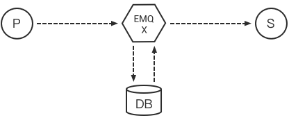
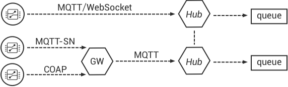
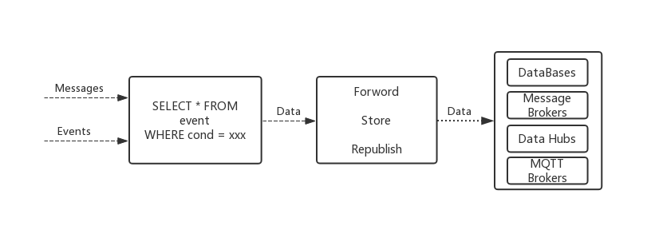
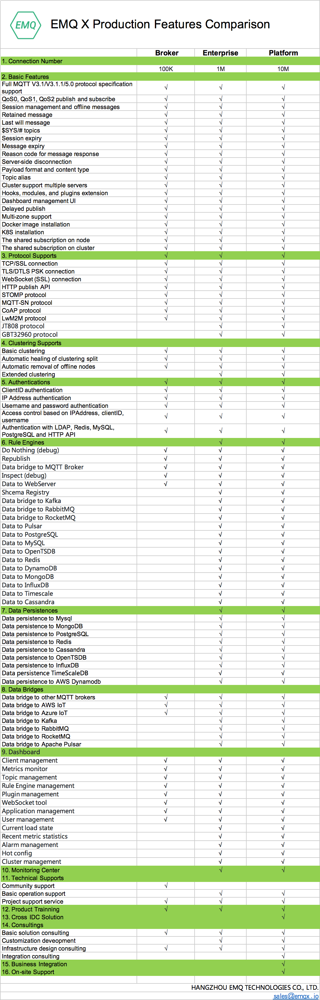

# Features List

- Full MQTT V3.1 / V3.1.1 and V5.0 protocol specification support
  - QoS0, QoS1, QoS2 message support
  - Persistent conversation and offline message support
  - Retained message support
  - Last Will message support
- TCP / SSL connection support
- MQTT / WebSocket / SSL support
- HTTP message publishing interface support
- $SYS/\# system theme support
- Client online status query and subscription support
- Client ID or IP address authentication support
- User name and password authentication support
- LDAP authentication
- Redis, MySQL, PostgreSQL, MongoDB, HTTP authentication integration
- Browser cookie authentication
- Access control (ACL) based on client ID, IP address, user name
- Multi-server node cluster (Cluster)
- Support manual, mcast, dns, etcd, k8s and other cluster discovery methods
- Automatic network partition healing
- Message rate limit
- Connection rate limit
- Configure nodes by partition
- Multi-server node bridge (Bridge)
- MQTT Broker bridge support
- Stomp protocol support
- MQTT-SN protocol support
- CoAP protocol support
- Stomp/SockJS support
- Delay Publish ($delay/topic)
- Flapping detection
- Blacklist support
- Shared subscription($share/<group\>/topic)
- TLS / PSK support
- Rule engine
  - No action (debug)
  - Message republish
  - Bridge data to MQTT Broker
  - Check (debug)
  - Send data to web service

<strong class="emqxce">
The following are the unique features of EMQ X Enterprise
</strong>

- Scalable RPC architecture: Separate Erlang's own cluster channel from EMQ X nodes data channel
- Data persistence
  - Redis stores subscription relationships, device online status, MQTT messages, retained messages, and publishes SUB/UNSUB events
  - MySQL stores subscription relationships, device online status, MQTT messages and retained messages
  - PostgreSQL  stores subscription relationships, device online status, MQTT messages and retained messages
  - MongoDB  stores subscription relationships, device online status, MQTT messages and retained messages
  - Cassandra  stores subscription relationships, device online status, MQTT messages and retained messages
  - DynamoDB  stores subscription relationships, device online status, MQTT messages and retained messages
  - InfluxDB stores MQTT timing messages
  - OpenTDSB stores MQTT timing messages
  - TimescaleDB stores MQTT timing messages
- Message bridge
  - Kafka bridge: EMQ X built-in Bridge directly forwards MQTT messages and device online and offline events to Kafka
  - RabbitMQ bridge: EMQ X built-in Bridge directly forwards MQTT messages and device online and offline events to RabbitMQ
  - Pulsar bridge: EMQ X built-in Bridge directly forwards MQTT messages and device online and offline events to Pulsar
  - RocketMQ bridge: EMQ X built-in Bridge directly forwards MQTT messages and device online and offline events to RocketMQ
- Rule engine
  - Message codec
  - Bridge data to Kafka
  - Bridge data to RabbitMQ
  - Bridge data to RocketMQ
  - Bridge data to Pulsar
  - Save data to PostgreSQL
  - Save data to MySQL
  - Save data to OpenTSDB
  - Save data to Redis
  - Save data to DynamoDB
  - Save data to MongoDB
  - Save data to InfluxDB
  - Save data to Timescale
  - Save data to Cassandra
- Schema Registry: provide data encoding and decoding capabilities for EMQ X events and messages



[EMQ X Enterprise](https://www.emqx.io/products/enterprise) is a powerful enterprise-level IoT MQTT messaging platform built by the people who develop the open source EMQ X Broker.

EMQ X Enterprise supports one-stop access to millions of IoT devices, MQTT&CoAP multi-protocol processing, and low-latency real-time communication. It maintains the simplicity and high performance of EMQ X Broker, while adding many enterprise-level features:

- The connection performance is enhanced to millions or tens of millions. It supports private protocol and industry protocol customization, is compatible with old network equipment access based on TCP / UDP private protocol, and supports full network multi-protocol equipment access;
- It supports Redis, MySQL, PostgreSQL, MongoDB and other database message data persistence, with message conversion and written to multiple time series databases of InfluxDB, OpenTSDB, TimescaleDB. It supports automatic loading subscriptions from Redis or database, without the need for the initiation from client;
- Message bridging of message and stream middleware: forwarding of messages to Kafka stream processing middleware with 100,000/s High-performance and highly reliable , seamless integration with enterprise message middleware of RabbitMQ, Pulsar ;
- With global professional team technical support. Our team covers 5 branches in North America, Europe, and China. There are professional founding teams from Huawei, IBM, Amazon, and nearly ten partners in Europe, North America, and India, providing First-class technical support and consulting services.

::: tip
Thank you for your support of EMQ X Broker. If you need business services, please contact our sales staff: sales-cn@emqx.io。
:::





## Function Description





## Function of enterprise version



### Message data storage

EMQ X Enterprise Version supports storing subscription relationships, MQTT messages, device status to Redis, MySQL, PostgreSQL, MongoDB, Cassandra, TimescaleDB, InfluxDB, DynamoDB, OpenTDSB databases:

For data storage related configuration, please refer to "Data Storage" chapter for details.

### Message bridge and forward

EMQ X Enterprise version supports directly forwarding MQTT messages to RabbitMQ, Kafka, Pulsar, RocketMQ, MQTTBroker, which can be used as a million-level IoT access server (IoT Hub):

### Rule engine

EMQ X rules engine can flexibly process messages and events.

EMQ X Enterprise version rules engine supports message re-publishing, bridging data to Kafka, Pulsar, RocketMQ, RabbitMQ, MQTT Broker, saving data to MySQL, PostgreSQL, Redis, MongoDB, DynamoDB, Cassandra, InfluxDB, OpenTSDB, TimescaleDB, and sending data to WebServer :

For the configuration of the rule engine, see the "Rules Engine" chapter for details.

### Schema Registry

Schema Registry
Currently, three formats of codec are supported: [Avro](https://avro.apache.org), [Protobuf](https://developers.google.com/protocol-buffers/) and custom encoding. Among them, Avro and Protobuf are data formats that depend on Schema. The encoded data is binary, and the decoded data is map format. The decoded data can be directly used by the rule engine and other plugins. The user-defined (3rd-party) codec service uses HTTP or TCP callback to make it closer to business needs.

For codec related configuration, please refer to "Codec" chapter for details.



## Comparison of different versions of EMQ X


