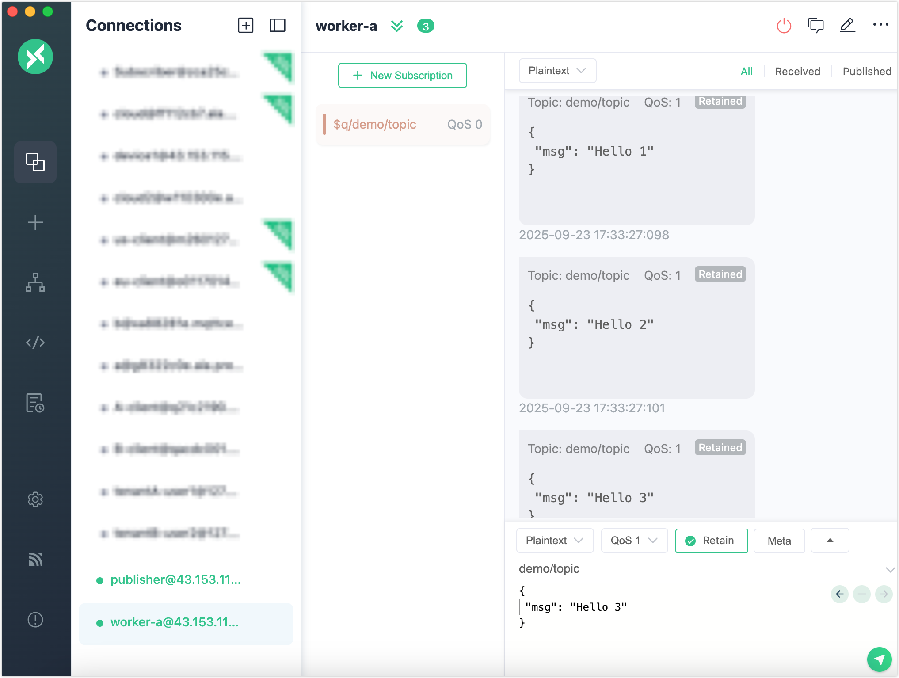

# Message Queue Quick Start

This page walks you through how to use the Message Queue feature in EMQX 6.0. You’ll use MQTTX to simulate clients, create and manage message queues from the EMQX Dashboard, and see how messages can be stored and delivered reliably.

## Objectives

This quick start showcases how EMQX Message Queues can:

- Persist messages even when subscribers are offline
- Support configurable dispatch strategies
- Enable Last-Value Semantics for message compaction

## Prerequisites

Before starting, ensure you have:

- EMQX 6.0+ running (Message Queue feature enabled)
- [MQTTX](https://mqttx.app/) (or any MQTT 5.0-capable client)
- Access to the EMQX Dashboard (default: `http://localhost:18083`)

## Test Message Queue Basic Features

This section demonstrates how EMQX Message Queues persist and deliver messages. You will simulate MQTT clients using MQTTX, observe how messages are retained and dispatched even when subscribers are offline.

### Step 1: Create a Message Queue

1. Navigate to **Message Queue** in the left menu.
2. Click the **Create** button in the upper-right corner of the page.

3. In the **Create Message Queue** dialog, configure the following settings:
   - **Topic Filter**: `demo/topic`
   - **Dispatch Strategy**: `Random`
   - **Data Retention Period**: `1` day
   - **Last Value Semantics**: `Disabled`
4. Click **Create**.

### Step 2: Publish Messages

Use MQTTX to simulate a client as a **publisher**:

1. Open MQTTX and create a client (e.g., `publisher`).
2. Connect to EMQX (`mqtt://localhost:1883`).
3. Publish messages to the topic `demo/topic` with QoS 1:

Example:

```
Topic: demo/topic
QoS: 1
Payload: {"msg": "Hello 1"}
```

Repeat with more payloads: `{"msg": "Hello 2"}`, etc.

At this point, there are no subscribers. Messages will be queued and persisted by EMQX.

### Step 3: Subscribe and Consume Messages

Use MQTTX to simulate a client as a **subscriber**:

1. Open a second client (e.g., `worker-a`).

2. Connect to EMQX.

3. Subscribe to the queue topic:

   ```json
   Topic: $q/demo/topic
   QoS: 1
   ```

You should now receive all previously published messages in the queue.



## Simulate Multiple Subscribers with Dispatch Strategies

In this section, you will simulate multiple subscribers connected to the same Message Queue and explore how different dispatch strategies influence message distribution behavior.

1. In your `publisher` client, publish a series of messages to the original topic (not prefixed with `$q/`), e.g.:

   ```bash
   for i in {1..10}; do
     mqttx pub -t demo/topic -m "message-$i" -q 1
   done
   ```

2. Create another MQTTX client (e.g., `worker-b`).

3. Connect to EMQX and subscribe to the same queue topic:

   ```json
   Topic: $q/demo/topic
   QoS: 1
   ```

   Now, both `worker-a` and `worker-b` are consuming messages from the same queue.

4. Observe the message flow in both subscriber clients.


### How Dispatch Strategies Affect Delivery

The behavior of message distribution depends on the selected **Dispatch Strategy** for the queue:

| Dispatch Strategy           | Behavior                                                     | Use Case                               |
| --------------------------- | ------------------------------------------------------------ | -------------------------------------- |
| `Least Inflight Subscriber` | Prefers subscribers with fewer in-flight (unacknowledged) messages. | Load balancing across uneven consumers |
| `Round Robin`               | Delivers messages alternately to each subscriber in strict rotation. | Fair distribution regardless of speed  |
| `Random` (default)          | Sends each message to a randomly chosen subscriber.          | Unpredictable or demo scenarios        |

You can verify these behaviors by watching how messages are delivered to `worker-a` and `worker-b`.

### Modify the Dispatch Strategy

You can change the strategy on the fly:

1. Go to **Message Queue** in Dashboard.
2. Click **Edit** next to your queue.
3. Select a new **Dispatch Strategy** and save.

Note that the new dispatch strategy will not apply while there are active subscribers online. You need to disconnect the clients and reconnect them back.

After switching, repeat the message publishing test and observe the difference in distribution patterns between the subscribers.

## Test Last-Value Semantics

This section demonstrates how to enable **Last-Value Semantics**, which ensures only the most recent message per key is retained in the queue, ideal for use cases such as device configuration updates.

### Step 1: Delete the Existing Queue

1. Navigate to **Message Queue** in the EMQX Dashboard.
2. Locate the queue with the topic filter `demo/topic`.
3. Click **Delete** in the **Actions** column.
4. Confirm deletion in the prompt.

This removes the previous queue and its stored messages.

### Step 2: Create a Queue with Last-Value Semantics

1. On the **Message Queue** page, click **Create**.
2. In the **Create Message Queue** dialog, configure the settings:
   - **Topic Filter**: `device/config`
   - **Dispatch Strategy**: `Random` (or your choice)
   - **Data Retention Period**: `1` day
   - **Last Value Semantics**: Toggle on
   - **Queue Key Expression**: `message.from` (or any field name you will use as key)
3. Click **Create**.

The "Queue Key Expression" defines how EMQX extracts a key from each message for deduplication in Last-Value Queues. This field supports configuration using [Variform expressions](../configuration/configuration.md#variform-expressions).

In this quick start, we use `message.from`, which extracts the key from the client ID of the message publisher. 

> For advanced usage of Queue Key Expressions, including custom keys and full message structure examples, see the [Queue Key Expression](./message-queue-task.md#queue-key-expression).

### Step 3: Publish Messages

1. Open MQTTX and select or create a client (e.g., `publisher`).

2. Connect to EMQX (`mqtt://localhost:1883`).

3. Publish messages to `device/config`:

   Example:

   | Field       | Value               |
   | ----------- | ------------------- |
   | **Topic**   | `device/config`     |
   | **QoS**     | 1                   |
   | **Payload** | `{"ssid": "wifi1"}` |

4. Publish another message with updated content using the same client (same client ID):

   ```json
   Payload: {"ssid": "wifi2"}
   ```

Since the **Queue Key Expression** is set to `message.from`, EMQX will automatically extract the client ID from each message and use it as the queue key. Messages from the same client will overwrite previous unconsumed messages in the queue.

### Step 4: Subscribe to the Queue

1. Create a second MQTTX client (e.g., `subscriber`) and connect to EMQX.

3. Subscribe to the queue topic:

   ```json
   Topic: $q/device/config
   QoS: 1
   ```

**Expected Behavior**:
Only the most recent message is delivered. In this case, only `{"ssid": "wifi2"}` will be received.

