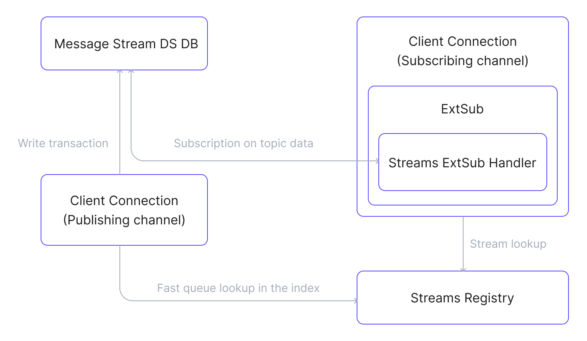

# MQTT Streams

EMQX 6.1 introduces the MQTT Streams, a streaming and replay feature that extends MQTT’s real-time publish/subscribe model with persistent, replayable message streams. It enables Kafka-like streaming capabilities while preserving MQTT semantics.

This page provides a complete overview of the MQTT Streams feature in EMQX, covering its design motivation, key concepts, internal architecture, message flow, and real-world application scenarios.

## What Is an MQTT Stream?

An MQTT Stream is a logical collection of MQTT messages that automatically collects messages matching a topic filter during its lifetime. It stores matching messages durably and allows clients to replay historical data by subscribing to a stream-specific topic.

## Why Use MQTT Streams?

MQTT is optimized for real-time messaging, but it has inherent limitations:

- Messages are typically delivered only to online subscribers.
- Historical data replay is not natively supported.
- Reprocessing past data requires external systems.
- Maintaining an ordered, replayable message history is difficult.

MQTT Streams extends MQTT with durable message storage and replay. It allows consumers to read historical messages and retrieve the latest state of devices without changing how MQTT clients publish or subscribe.

## MQTT Streams Key Concepts

- **MQTT Stream**

  A logical resource identified by an MQTT topic filter and managed with an explicit lifecycle. While active, it continuously stores matching messages within configured time or size limits. Stored messages can be replayed by subscribing consumers, without requiring any changes on the publishing side.

  - **Regular Stream**: A regular stream stores all matching messages without overwriting historical data. Consumers can replay all messages published after any given point in time by subscribing with a timestamp.
  - **Last-Value Stream**: A last-value stream enables [Last-Value semantics](#last-value-semantics). For messages with the same stream key, newer messages overwrite older ones, and the stream retains only the latest message associated with each key.

- **Topic Filter**

  An MQTT topic filter, such as `sensors/+/data`, that determines which published messages are captured into a stream. Only matching messages are ingested, and a single message may belong to multiple streams.

- **Stream Subscription**

  A special MQTT subscription used to consume messages from a stream. Clients subscribe using the `$s/<timestamp>/<topic_filter>` format. The timestamp specifies the replay starting point. Stream subscriptions operate independently of regular MQTT subscriptions and are delivered through the External Subscription mechanism.

- **Key Expression**

  A user-defined expression evaluated on each incoming message to extract a key. The expression may reference message content or metadata. The extracted key is used to guarantee message ordering within a storage partition. When Last-Value semantics are enabled for the stream, the key also defines the overwrite scope: newer messages with the same key replace older ones.

## MQTT Streams Architecture

MQTT Streams are implemented as a standalone EMQX application that is loosely coupled with the broker core and reuses existing infrastructure. Integration with EMQX is achieved through internal hooks and the External Subscription framework.

::: tip

External Subscription is an EMQX mechanism that connects external message sources (messages originating outside the live MQTT publish path) to MQTT client sessions, allowing those messages to be delivered to MQTT clients through standard MQTT subscriptions without changing client behavior.

:::

### Main Components

- **Streams Registry**: Manages the lifecycle of MQTT streams and maintains stream metadata and indexes. It uses a Mnesia table to efficiently look up streams by topic filter.
- **Streams Message Database**: Provides durable storage for stream messages and is built on top of EMQX [Durable Storage](../design/durable-storage.md). It persists messages, enforces retention limits, applies Last-Value semantics when enabled, and supports efficient message retrieval until messages expire according to retention policies.
- **Streams ExtSub Handler**: Integrates message streams with MQTT client sessions. It retrieves messages from Durable Storage and delivers them to subscribing clients through the External Subscription framework.

### MQTT Streams Data Flow Diagram

The following diagram shows the data flow between the MQTT Streams components:

### Publishing Flow

1. A client publishes a message to an MQTT topic.
2. An MQTT Streams hook is triggered to process the publication.
3. The hook queries the Streams Registry to identify streams whose topic filters match the message topic. 
4. For each matching stream, the message is written to the stream and persisted in Durable Storage.

### Subscribing and Consuming Flow

1. A client subscribes to a stream topic (`$s/<timestamp>/<topic_filter>`).
2. The External Subscription framework handles the subscription and initializes a Streams ExtSub handler for the stream topic.
3. The handler retrieves messages from Durable Storage according to the specified timestamp and retention rules.
4. Retrieved messages are passed to the External Subscription framework. 
5. The ExtSub application delivers messages to the client via standard MQTT delivery.

## MQTT Streams Core Features

MQTT Streams provide a set of core capabilities that define how messages are stored, ordered, retained, and delivered for replay-based consumption.

- **Timestamp-Based Replay**

  MQTT streams support replay starting from a specified timestamp. Consumers choose the timestamp when subscribing. Messages published before the timestamp are skipped.

- **Retention**

  The stream’s retention policy limits the message replay. Messages are retained for a limited time or size. Expired messages are removed automatically, regardless of whether they have been consumed.

- **Per-Key Ordering**

  MQTT streams do not guarantee a single global delivery order. Messages that share the same key are always delivered in the order in which they were published. Messages with different keys may be delivered in any order.

- **Last-Value Semantics**

  A stream may enable Last-Value semantics. Messages with the same key overwrite earlier messages. Only the latest value is retained. Messages without a resolved key are stored normally.

- **MQTT-Native Delivery**

  Stream messages are delivered using standard MQTT mechanisms. Publishers do not need to change their behavior. Message delivery to subscribers is integrated through External Subscription.

## Typical Use Cases

- **Historical Data Replay**: Reprocess past MQTT events for debugging or new business logic.
- **Time-Series Analysis**: Store and replay sensor data for analytics and predictive maintenance.
- **Event Sourcing**: Persist all state changes as an immutable event log.
- **IoT Digital Twins**: Maintain the latest state of physical devices in digital form.
- **Configuration Synchronization**: Ensure devices always receive the most recent configuration.

## Next Steps

Now that you understand the MQTT Streams fundamentals, explore how to put them into practice:

- [Create and Configure a Stream](./message-stream-task.md): Learn how to declare streams via Dashboard or REST API, and set last-value semantics and retention policies.
- [Quick Start Tutorial](./message-stream-quick-start.md): Follow a step-by-step guide using MQTTX to simulate real-world publisher and subscriber scenarios.
