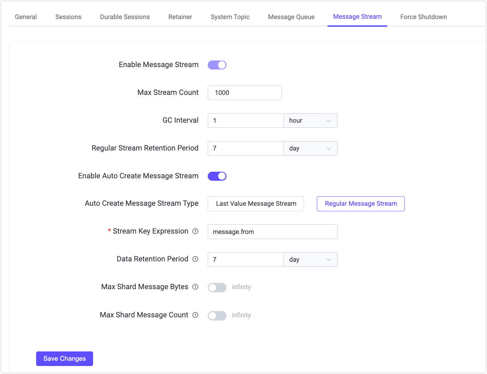
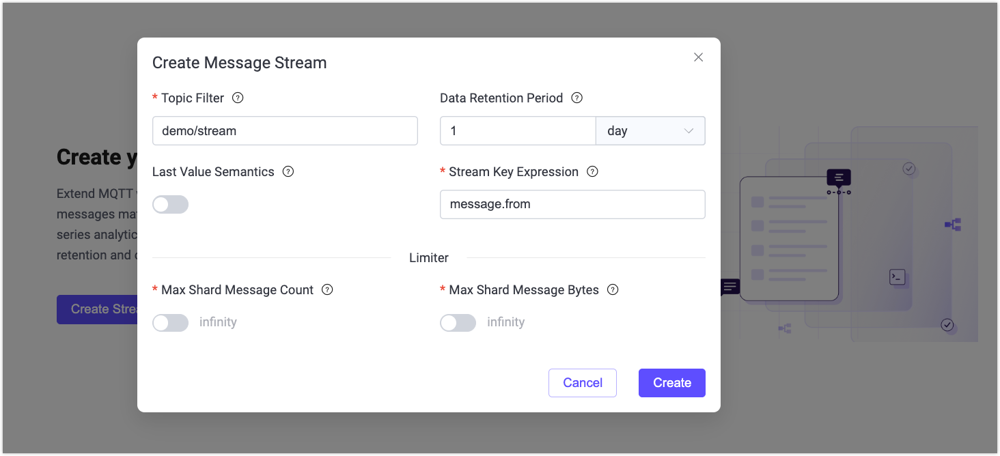
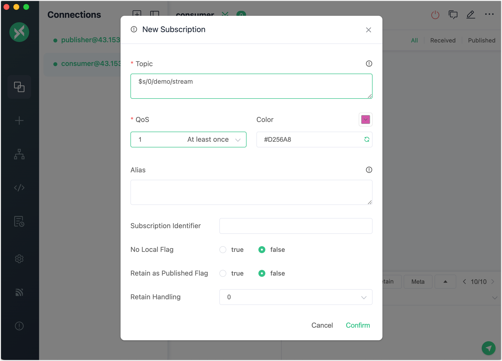
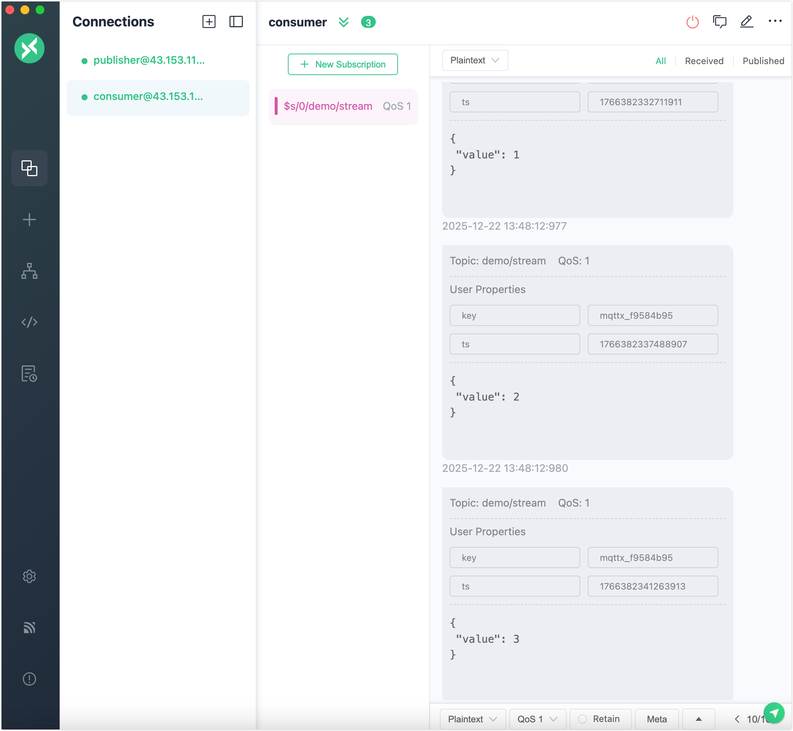
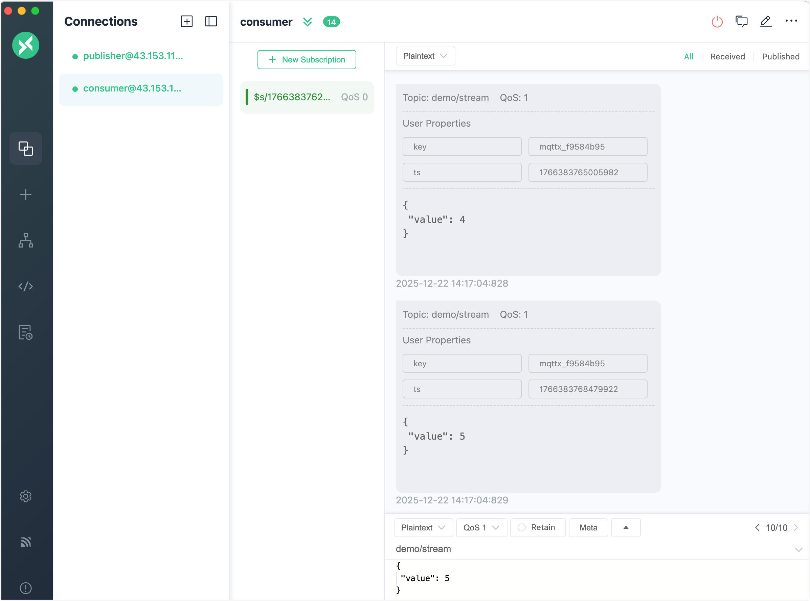
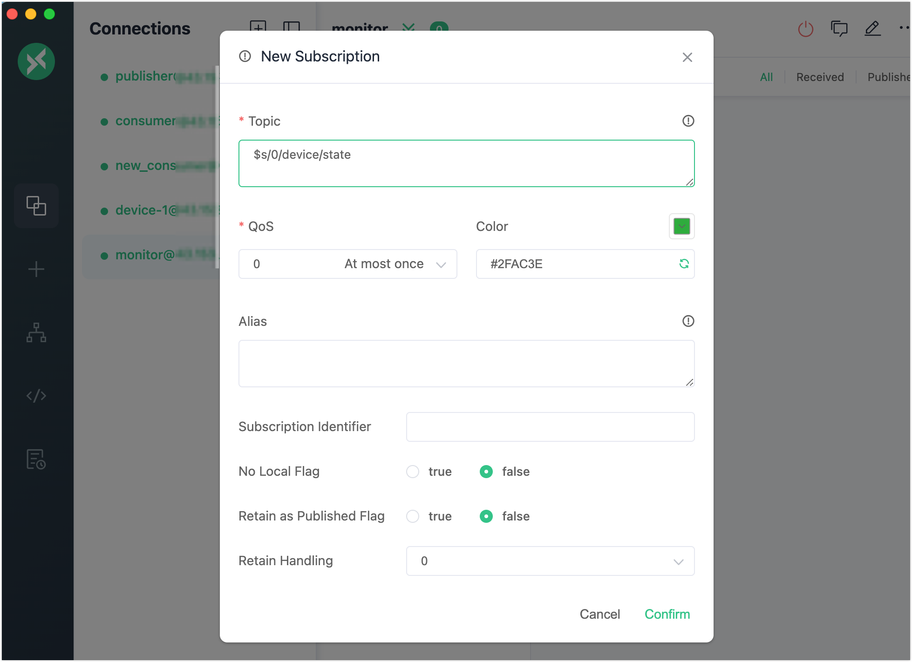
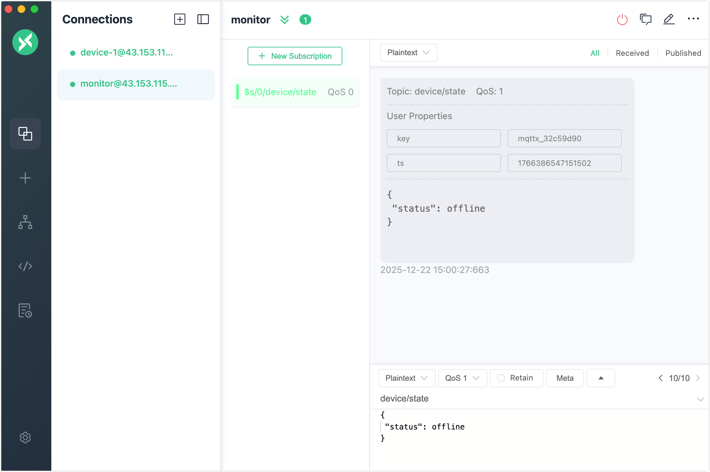

# Message Stream Quick Start

This page walks you through how to use the Message Stream feature in EMQX 6.1. You’ll use MQTTX to simulate clients, create and manage message streams from the EMQX Dashboard, and experience how messages can be stored, replayed, and compacted.

## Objectives

This quick start demonstrates how EMQX Message Streams can:

- Persist messages independently of subscriber availability
- Support timestamp-based replay
- Enable Last-Value semantics for state-oriented messaging

## Prerequisites

Before starting, ensure you have:

- EMQX 6.1+ running
- [MQTTX](https://mqttx.app/) (or any MQTT 5.0-capable client)
- Access to the EMQX Dashboard (default: `http://localhost:18083`)

## Test Message Streams Basic Features (Regular Stream)

This section demonstrates how Message Streams stores messages and allows consumers to replay historical data.

### Prerequisite

Before starting, ensure that the Message Streams feature is enabled and that the auto-creation behavior will not interfere with this example.

1. Go to **Message Stream** in the left menu.

2. If Message Stream is disabled, click **Settings**. You will be redirected to the **Management** -> **MQTT Settings** -> **Message Stream** page.

3. Toggle the **Enable Message Stream** switch on.

4. Verify the auto-create settings to ensure a **regular Message Stream** is used:

   - **Enable Auto Create Message Stream** is disabled, or

   - **Auto Create Message Stream Type** is set to **Regular Message Stream**

   > This prevents the stream from being auto-created as a Last-Value Message Stream, which would retain only the most recent message per key.

4. If you make any changes, click **Save Changes** to apply them.

   

### Step 1: Create a Message Stream

1. Navigate to **Message Stream** in the left menu.

2. Click **Create Stream** on the page, or click **Create** in the upper-right corner.

3. In the **Create Message Stream** dialog, configure the following settings:
   - **Topic Filter**: `demo/stream`
   - **Data Retention Period**: `1` day
   - **Last-Value Semantics**: Disabled
   - **Stream Key Expression**: `message.from`

4. Click **Create**.

   

### Step 2: Publish Messages

Use MQTTX to simulate a client acting as a **publisher**:

1. Open MQTTX and create a client (for example, `publisher`).

2. Connect to EMQX (`mqtt://localhost:1883`).

3. Publish several messages to the topic `demo/stream` with QoS 1.

   Examples:

   ```
   Topic: demo/stream
   QoS: 1
   Payload: {"value": 1}
   Payload: {"value": 2}
   Payload: {"value": 3}
   ```

Since this is a regular stream, **all messages are stored** in the stream.

### Step 3: Replay All Messages from the Stream

Now simulate a **consumer** that replays stored messages.

1. Open a second MQTTX client (for example, `consumer`).

2. Connect to EMQX.

3. Subscribe to the stream topic using the earliest timestamp:

   ```
   Topic: $s/0/demo/stream
   QoS: 1
   ```

   

**Expected Behavior**:
 You should receive all previously published messages, in publish order:

```
{"value": 1}
{"value": 2}
{"value": 3}
```

This confirms that:

- The stream is a regular message stream.
- Timestamp-based replay is working correctly.
- No messages were compacted or overwritten.



## Replay Messages from Different Positions

Message Streams allow consumers to control where message replay starts by specifying a timestamp when subscribing.

1. Publish additional messages from the `publisher` client:

   ```
   {"value": 4}
   {"value": 5}
   ```

2. In a new MQTTX client, subscribe to the stream using a later timestamp:

   ```
   Topic: $s/1766477011000/demo/stream
   QoS: 1
   ```

   In this example, `1766477011000` is a Unix timestamp in milliseconds. Only messages published **at or after** this time are delivered to the subscriber.

   ::: tip

   - The timestamp must be a Unix timestamp in milliseconds.
   - Use `0` to replay from the earliest available message.
   - Use a later timestamp to replay only newer messages.

   You can obtain the current timestamp in milliseconds using:

   - **Linux / macOS**:

     ```
     date +%s000
     ```

   - **JavaScript**:

     ```
     Date.now()
     ```

   :::

3. Click **Confirm**. Only messages published at or after the specified timestamp are delivered.

   

This demonstrates consumer-controlled replay, where different consumers can independently read the same message stream from different points in time without affecting each other.

## Test Last-Value Semantics

This section demonstrates how Last-Value Message Streams keep only the latest message per key, which is useful for representing state.

### Step 1: Delete the Existing Stream

1. Navigate to **Message Stream** in the Dashboard.
2. Locate the stream with the topic filter `demo/stream`.
3. Click **Delete** and confirm.

### Step 2: Create a Last-Value Message Stream

1. Click **Create** on the **Message Stream** page.
2. Configure the following settings:
   - **Topic Filter**: `device/state`
   - **Data Retention Period**: `1` day
   - **Last-Value Semantics**: Enabled
   - **Stream Key Expression**: `message.from`
3. Click **Create**.

The stream is now configured to retain only the latest message in streams with the same key.

### Step 3: Publish State Updates

1. In MQTTX, use a client with ID `device-1`.

2. Publish messages to `device/state`:

   ```
   Topic: device/state
   QoS: 1
   Payload: {"status": online}
   ```

3. Publish another message from the same client:

   ```json
   {"status": offline}
   ```

Because the **Stream Key Expression** is `message.from`, both messages share the same key. The second message overwrites the first.

### Step 4: Subscribe to the Stream

1. Open a new MQTTX client (for example, `monitor`).

2. Subscribe to the stream topic:

   ```
   Topic: $s/0/device/state
   QoS: 1
   ```

   

**Expected Behavior**:

Only the most recent message is delivered:

```
{"status": offline}
```

This demonstrates how Message Streams support state-oriented messaging patterns using Last-Value semantics.

