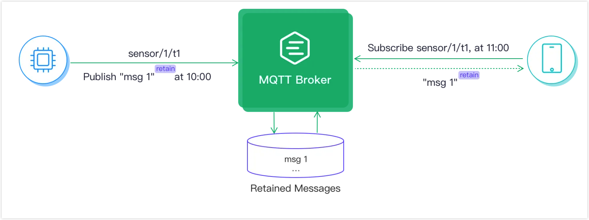

# Verify MQTT features 

To meet the needs of various IoT application scenarios, EMQX provides full support to a complete set of MQTT messaging features, for example, Will messages, Reserved messages, and Shared Subscriptions. All these features can greatly reduce development and managing difficulties.

This chapter will introduce how to use these features and how to verify them with [MQTT X CLI](https://mqttx.app/cli), to help you get familiar with the MQTT messaging services.

:::tip Prerequisites:

- Knowledge about [Publish and subscribe](./mqtt-publish-and-subscribe.md)
  :::

## Will message

**Operating steps:**

1. Enable Will Message at the broker side (enabled by default on EMQX). 
2. Set the topic and payload of the will message when the client initiates the connect request.
3. Subscribe to the topic of the will message with another client, and get ready to receive the will message. 
4. When the client is disconnected or closed, the broker will first send the preset will message and then forward it to online clients that subscribe to this topic.

**Use MQTT X CLI to verify:**

1. Initiate a connection request with one client, set the topic to `t/1` and payload to `A will message from MQTTX CLI`:

   ```bash
   $ mqttx conn -h 'localhost' -p 1883 --will-topic 't/1' --will-message 'A will message from MQTTX CLI'
   Connected
   ```

2. Subscribe to topic `t/1` with another client for receiving the will messages:

   ```bash
   mqttx sub -t 't/1' -h 'localhost' -p 1883 -v
   ```

3. Disconnect the client specified in Step 1, then the client specified in Step 2 will receive the will message:

   ```bash
   topic:  t/1
   payload:  A will message from MQTTX CLI
   ```

## Retained Message

Users can flag an MQTT message as `Retain`. When a message is retained, the MQTT broker must store the message under the topic and it must store the latest message only. If a subscriber who subcribes to this topic goes offline, it can receive the retained message immediately once it reconnects to the MQTT broker and do not have to wait. The illustration below shows how a retained message is received.

  

The retained message feature enables the subscribers actively fetch messages from publishers. New subscribers who subscribes to the same topic also can get the latest message immediately without waiting for the next round of publishing. For more detailed information on retained message, see [The Beginner's Guide to MQTT Retained Messages](https://www.emqx.com/en/blog/mqtt5-features-retain-message?utm_source=mqttx&utm_medium=referral&utm_campaign=mqttx-help-to-blog).

### Use MQTT X Client to Verify

This section demonstrates how to verify the retained message feature using the [MQTT X Client](https://mqttx.app/). 

1. Start the MQTT X Client. Click the **New Connection** to create an MQTT connection.

2. Type a connection `Name`. Leave other parameters as default. Connect the **Connect** button at the upper right corner to create an MQTT connection.

   - The `Host` is by default set to the name of [public MQTT Broker](https://www.emqx.com/en/mqtt/public-mqtt5-broker) provided by [EMQX Cloud](https://www.emqx.com/en/cloud).

     You can also use your localhost name `127.0.0.1`.

   - The `Port` must be set corresponding to the protocol selected.

   

3. After the success connection, publish a message to the topic `sensor/t1` in the message input box.

   1. Type the topic heading `sensor/t1` in the text box.
   2. Write the message.
   3. Click the send button.

   

4. Publish two retained messages to the topic `sensor/t2`. 

   1. Input the topic heading and message.
   2. Select `Retain` after you input the topic heading and message.
   3. Click the send button.

   

5. Click the **New Subscription** button to create a subscription.

6. Input `sensor/+` in the **Topic** text box. Click the **Confirm** button.

   :::tip

   With topic set to `sensor/+`, both `sensor/t1` and `sensor/t2` are subscribed. For more information on topics and wildcards, see [Understanding MQTT Topics & Wildcards by Case](https://www.emqx.com/en/blog/advanced-features-of-mqtt-topics).

   :::

   

7. Click the **Confirm** button. The subscription only receives the last retained message. 

   

   :::tip

   The normal message under the topic `sensor/t1` and the first retained message under the topic `sensor/t2` are not received. The MQTT broker only stores the latest retained message for each topic. The following illustration shows the latest retained message stored in the MQTT broker.

   

   :::  

8. If you want to clear the retained message from the MQTT broker, send an empty retained message  under the topic.

### Use MQTT X CLI to Verify

This section demonstrates how to verify the retained message feature using the command line.

1. Initiate a connection request with one client. Set the topic to `t/1`, payload to `A retained message from MQTTX CLI`,  and `retain = true`：

   ```bash
   mqttx pub -t 't/1' -m 'A retained message from MQTTX CLI' --retain true -h 'localhost' -p 1883
   ```

2. Subscribe to the topic `t/1` with another client. It will receive the retained message. Repeat this step and it will continuously receive the retained message:

   ```bash
   $ mqttx sub -t 't/1' -h 'localhost' -p 1883 -v
   topic:  t/1
   payload:  A retained message from MQTTX CLI
   retain: true
   ```

3. Publish an empty message to clear the retained message:

   ```bash
   mqttx pub -t 't/1' -m '' --retain true -h 'localhost' -p 1883
   ```

4. Repeat Step 2 and no retained messages are received, indicating the retained message is cleared. 

## Shared Subscription

**Operating steps:**

1. Enable Shared Subscription at the broker side (enabled by default on EMQX). 
2. When multiple subscribers subscribe to the same topic (original topic), they need to add a prefix to indicate shared subscribe group `$share/{group}` (shared subscribe topic), for example,
   - If the original topic is `t/1`, the shared subscription topic is `$share/my_group/t/1` (with `my_group` as the customized group name)
   - If the original ancestor is `/t/1`, the shared subscription topic is `$share/my_group//t/1`.
3. Use any client to publish multiple pieces of messages to the original topic sequentially, the messages will be forwarded to the subscribers following the preset shared subscribe rule. Each subscriber of the group will only receive one message at a time.

**Use MQTT X CLI to verify:**

1. Four subscribers are divided into 2 groups to subscribe to topic  `t/1`:

   ```bash
   # Client A and B subscribe to topic `$share/my_group1/t/1`
   mqttx sub -t '$share/my_group1/t/1' -h 'localhost' -p 1883
   
   ## Client C and D subscribe to topic  `$share/my_group2/t/1`
   mqttx sub -t '$share/my_group2/t/1' -h 'localhost' -p 1883
   ```

2. Use a new client to publish 4 messages with payloads `1`, `2`, `3`, and `4` to the original topic `t/1`:

   ```bash
   mqttx pub -t 't/1' -m '1' -h 'localhost' -p 1883
   mqttx pub -t 't/1' -m '2' -h 'localhost' -p 1883
   mqttx pub -t 't/1' -m '3' -h 'localhost' -p 1883
   mqttx pub -t 't/1' -m '4' -h 'localhost' -p 1883
   ```

3. Check the message received by the clients within each subscription group:

   - Subscription group (A and B) and Subscription group (C and D) simultaneously receive the messages.
   - One message will only be received once within each group.
