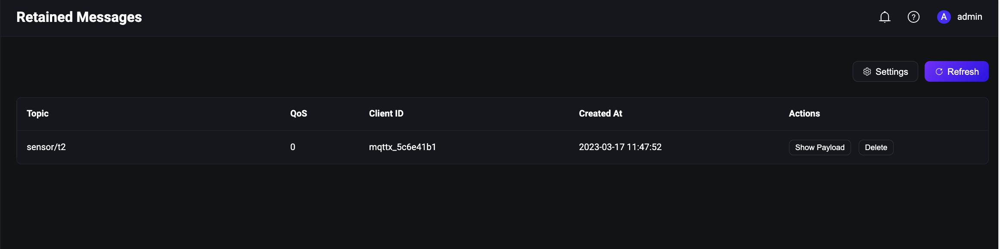

# Verify MQTT Features 

EMQX provides full support to a complete set of MQTT messaging features, for example, will messages, retained messages, and shared subscriptions. All these features can facilitate the IoT application development and management. <!--Add a link to MQTT Specific?-->


This section introduces how to use these features and verify them using [MQTT X Client](https://mqttx.app/) and [MQTT X CLI](https://mqttx.app/cli) to help you get familiar with the MQTT messaging services.

:::tip Prerequisites:

- Knowledge about [publish and subscribe](./mqtt-publish-and-subscribe.md)
  :::

## Will Message

A will message is the last stored message that is defined in advance and is sent by the server to the relevant subscriber when the network is disconnected unexpectedly. The will message feature is used in the following scenarios:

- I/O error or network failure occurs on the server.
- The client loses contact during a defined heartbeat period.
- The client closes the network connection before sending offline packets.
- The server closes the network connection before receiving the offline packet.

If a client wants to set a will message, it sets the topic and payload of the will message when it initiates the connect request. When another client subscribes to the topic of the will message, it receives the will message if the client disconnects to the server unexpectedly. For more information, see [Will Message](../mqtt/mqtt-last-will-and-testament.md) and [Use of MQTT Will Message](https://www.emqx.com/en/blog/use-of-mqtt-will-message).

### Use MQTT X Client to Verify

1. Run the EMQX server. 

2. Start the MQTT X Client. Click the **New Connection** to create an MQTT connection.

3. Configue the new connection. 

   In **General** section, fill in the general information of the client. 

   - **Name**: Type the connection as `Demo`. 
   - **Client ID**: Leave it as default. It is the one and only identification of a client connection and can be automatically generated by clicking the arrow button. <!--correct name of the button?-->
   - **Host**: Select the protocol to be used. The host IP address is set to `broker.emqx.io` by default. You need to replace with the actual IP address if EMQX is deployed on a non-local machine. The localhost `127.0.0.1` is used as an example in the following screenshots.
   - **Port**: Type the port corresponnding to the selected protocol.
   - **User name** and **Password**: Fill in the username and password if there are any or just leave them blank if no access control is used.

   In **Advanced** section, type `10` seconds in **Session Expiry Interval** to avoid that the session expires before the will message is sent.

   

   In **Last Will and Testament** section, fill in the will message configuration.

   - **Last-Will Topic**: Type `offline`.
   - **Last-Will QoS**: Set as the default value `0`.
   - **Last-Will Retain**: Set disabled as default. If enabled, the will message will also be a retained message.
   - **Last-Will Payload**: Type `I'm offline`.
   - **Will Delay Intervals (s)**: Set `5` seconds.

   

   Leave the rest settings as default. Click the **Connect** button.

4. Create a new connection for another client. Type the connection name as `Subscriber`.

5. Click **+ New Subscription** in the **Subscribe** pane. Type `offline` in the **Topic ** textbox. Leave the other settings as default. Click the **Confirm** button.

      

6. Select the client connection named "Demo" in the **Connections** pane. Right click and select **New Window**. In the new window, click the **Connect** button. 

   
   
6. Close the new window and wait for 5 seconds. The client connection "Subscriber" receive a will message `I'm offline`.

   

### Use MQTT X CLI to Verify

1. Initiate a connection request with one client. Set the topic to `t/1` and payload to `A will message from MQTTX CLI`:

   ```bash
   $ mqttx conn -h 'localhost' -p 1883 --will-topic 't/1' --will-message 'A will message from MQTTX CLI'
   Connected
   ```

2. Subscribe to topic `t/1` with another client for receiving the will messages:

   ```bash
   mqttx sub -t 't/1' -h 'localhost' -p 1883 -v
   ```

3. Disconnect the client specified in Step 1, then the client specified in Step 2 will receive the will message:

   ```bash
   topic:  t/1
   payload:  A will message from MQTTX CLI
   ```

## Retained Message

When a message is retained, the EMQX server must store the last message under the topic. Future subscribers who subscribes to the specific topic can receive the latest retained message immediately without waiting for the next publishing. The retained message feature enables the subscribers actively fetch messages from publishers. It is useful in scenarios when messages are published in an irregular way. For more detailed information on retained message, see [The Beginner's Guide to MQTT Retained Messages](https://www.emqx.com/en/blog/mqtt5-features-retain-message?utm_source=mqttx&utm_medium=referral&utm_campaign=mqttx-help-to-blog) and [Retained Messages](../mqtt/mqtt-retained-messages.md). 

The illustration below shows how a retained message is received.

  

### Use MQTT X Client to Verify

1. Start the MQTT X Client. Click the **New Connection** to create an MQTT connection.

2. Configue the new connection. 

   In **General** section, fill in the general information of the client. 

   - **Name**: Type a connection `Name`. 
   - **Client ID**: Leave it as default. It is the one and only identification of a client connection and can be automatically generated by clicking the arrow button. <!--correct name of the button?-->
   - **Host**: Select the protocol to be used. The host IP address is set to `broker.emqx.io` by default. You need to replace with the actual IP address if EMQT is deployed on a non-local machine. The localhost `127.0.0.1` is used as an example in the following screenshots.
   - **Port**: Type the port corresponnding to the selected protocol.
   - **User name** and **Password**: Fill in the username and password if there are any or just leave them blank if no access control is used.

   Leave the rest settings as default. Click the **Connect** button.

   

3. After the success connection, type the topic heading `sensor/t1` in the text box and compose the message as shown in the screenshot. Click the send button. A message under the topic `sensor/t1` is send to the dialogue box.

   

4. Publish two retained messages under the topic `sensor/t2`. 

   1. Type the topic heading as `sensor/t2`. Type the first message as `1`. Select `Retain`. Click the send button.
   2. Type the second message as `2`. Click the send button.

   

5. Click the **New Subscription** button to create a subscription. Input `sensor/+` in the **Topic** text box. Click the **Confirm** button. The subscription only receives the last retained message. 

   :::tip

   With topic set to `sensor/+`, both `sensor/t1` and `sensor/t2` are subscribed. For more information on topics and wildcards, see [Understanding MQTT Topics & Wildcards by Case](https://www.emqx.com/en/blog/advanced-features-of-mqtt-topics).

   :::

   

   

   :::tip

   The normal message under the topic `sensor/t1` and the first retained message under the topic `sensor/t2` are not received. The EMQX only stores the latest retained message for each topic. You can also check the latest retained message stored in the EMQX Dashboard.

   

   :::  

6. If you want to clear the retained message from the MQTT broker, send an empty retained message  under the topic.

### Use MQTT X CLI to Verify

1. Initiate a connection request with one client. Set the topic to `t/1`, payload to `A retained message from MQTTX CLI`,  and `retain = true`：

   ```bash
   mqttx pub -t 't/1' -m 'A retained message from MQTTX CLI' --retain true -h 'localhost' -p 1883
   ```

2. Subscribe to the topic `t/1` with another client. It will receive the retained message. Repeat this step and it will continuously receive the retained message:

   ```bash
   $ mqttx sub -t 't/1' -h 'localhost' -p 1883 -v
   topic:  t/1
   payload:  A retained message from MQTTX CLI
   retain: true
   ```

3. Publish an empty message to clear the retained message:

   ```bash
   mqttx pub -t 't/1' -m '' --retain true -h 'localhost' -p 1883
   ```

4. Repeat Step 2 and no retained messages are received, indicating the retained message is cleared. 

## Shared Subscription

When multiple clients subscribe to a same topic, they can form a group and receive messages with load balancing. With a shared subscription, the message is only sent to one of the subscribing clients. The next message published is sent to one of the other subscribing clients thus balancing the load on the clients and server. For more information on shared subscription, see [Shared Subscription](../mqtt/mqtt-shared-subscription.md).

### Use MQTT X Client to Verify

1. Start the MQTT X Client. Click the **New Connection** to create an MQTT connection.

2. Configue the new connection. 

   In **General** section, fill in the general information of the client. 

   - **Name**: Type a connection `Name`. 
   - **Client ID**: Leave it as default. It is the one and only identification of a client connection and can be automatically generated by clicking the arrow button. <!--correct name of the button?-->
   - **Host**: Select the protocol to be used. The host IP address is set to `broker.emqx.io` by default. You need to replace with the actual IP address if EMQT is deployed on a non-local machine. The localhost `127.0.0.1` is used as an example in the following screenshots.
   - **Port**: Type the port corresponnding to the selected protocol.
   - **User name** and **Password**: Fill in the username and password if there are any or just leave them blank if no access control is used.

   Leave the rest settings as default. Click the **Connect** button.

   

3. Click the **New Connection** to create 3 new connections with the **Name** set to `Subscriber1`, `Subscriber2` and `Subscriber3` respectively. Configure the new connections in the same way as described in Step 2.

4. Select the connection named "Subscriber1" in the **Connections** pane. Click the **New Subscription** button to create a subscription. 

   To form a group for mutiple subscribers, you need to add prefix and group name before the subscribed topic `$share/{group}`. In this test example, set the **Topic** name to `$share/a/t/1`. 

   - The prefix `$share` indicates this is a shared subscription.
   - `{group}` can be a customed name. Set to `a` in this example.
   - `t/1` indicates the original topic name.

   Leave other settings as default. Clicke the **Confirm** button.

   

5. Creat subscriptions for "Subscriber2" and "Subscriber3" in the same way. 
   - Set the **Topic** to `$share/a/t/1` for "Subscriber2".
   - Set the **Topic** to `$share/b/t/1` for "Subscriber3".

6. Click the client connection "Demo" created in Step 2. 

   - Send a message with the topic "t/1". The "Subscriber1" and "Subscriber3" receives the message. 

     

   - Send the same message again. The "Subscriber2" and "Subscriber3" receives the message.

     

:::tip

When the message of the shared subscription is published, the EMQX server forwards the message to different groups at the same time, but only one of the subscribers in the same group receive the message at a time.

:::

### Use MQTT X CLI to verify

1. Four subscribers are divided into 2 groups to subscribe to topic  `t/1`:

   ```bash
   # Client A and B subscribe to topic `$share/my_group1/t/1`
   mqttx sub -t '$share/my_group1/t/1' -h 'localhost' -p 1883
   
   ## Client C and D subscribe to topic  `$share/my_group2/t/1`
   mqttx sub -t '$share/my_group2/t/1' -h 'localhost' -p 1883
   ```

2. Use a new client to publish 4 messages with payloads `1`, `2`, `3`, and `4` to the original topic `t/1`:

   ```bash
   mqttx pub -t 't/1' -m '1' -h 'localhost' -p 1883
   mqttx pub -t 't/1' -m '2' -h 'localhost' -p 1883
   mqttx pub -t 't/1' -m '3' -h 'localhost' -p 1883
   mqttx pub -t 't/1' -m '4' -h 'localhost' -p 1883
   ```

3. Check the message received by the clients within each subscription group:

   - Subscription group (A and B) and Subscription group (C and D) simultaneously receive the messages.
   - One message will only be received once within each group.
