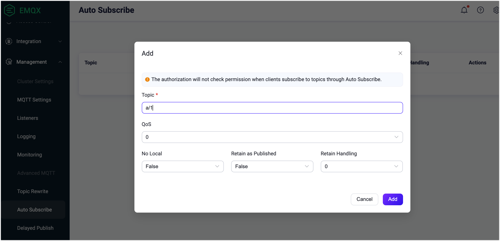
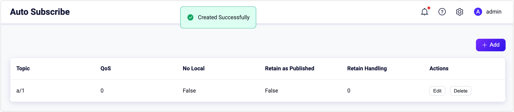
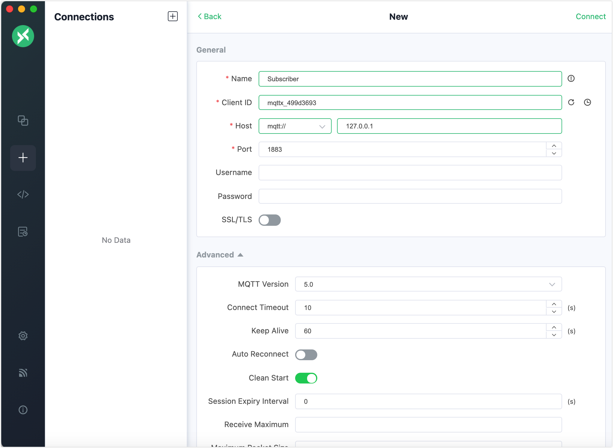
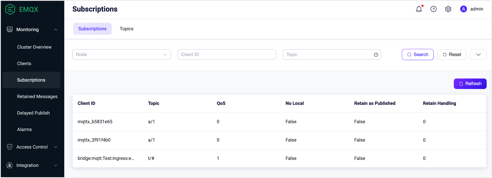
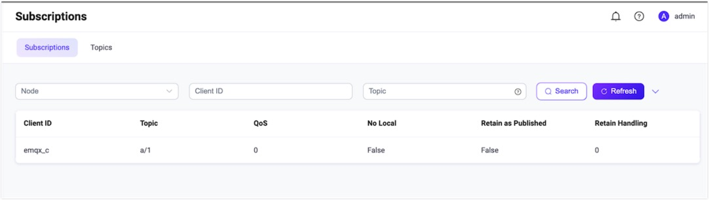

# Auto Subscribe

Auto Subscribe is an extended MQTT feature supported by EMQX. With **Auto Subscription** enabled, users can set multiple EMQX rules. After a client is successfully connected to EMQX, EMQX will complete the subscription process for the client automatically, and the clients no longer need to send `SUBSCRIBE` requests. 

Before EMQX 5.0, this feature is called **Proxy Subscription**.

## Configure Auto Subscribe via Dashboard

1. Open EMQX Dashboard. In the left navigation menu, click **Configuration**-> **MQTT**. 

2. On the **MQTT** page, click the **Extension** tab. Select the **Auto Subscribe** tab.

3. Click the **Add** button at the upper right corner. 

3. In the pop-up dialog box, type the test topic `a/1` in the **Topic** text box. Leave other settings as default. 

   - **Topic**: Type the topic that is automatically subscribed to for the client. 

   - **QoS**: Specify the quality of service of the topic. Options: `0`, `1`, and `2`.

   - **No local**: Options: `False` or `True`.

   - **Retain as Published**: Specify if the message sent with the specified topic will be retained. Options:  `False` or `True`.

   - **Retained Handling**: Options: `0`, `1`, and `2`.

     

   Click the **Add** button on the dialogue box. The auto subscribe topic `a/1` is created successfully.

   

Now the auto subscription function is enabled. New subscribers will subscribe to the topic `a/1` automatically once they are connected to the broker. 

## Configure Auto Subscribe via Configuration File

### Configuration Definition

| Field          | Definition                    | Range                                                       | Default |
| -------------- | ----------------------------- | ----------------------------------------------------------- | ------- |
| auto_subscribe | Auto subscribe configurations | topics                                                      | topics  |
| topics         | Subscription Options          | Subscription configurations list. See `Subscription Option` | []      |

Add the following configuration items to the configuration file.

```bash
auto_subscribe {
    topics = [
        {
            topic = "c/${clientid}"
        },
        {
            topic = "client/${clientid}/username/${username}/host/${host}/port/${port}"
            qos   = 1
            rh    = 0
            rap   = 0
            nl    = 0
        }
    ]
}
```

```bash
+---------------------------+             +----------------+
| clientid: demo_client1    |             |  EMQX   |
| username: admin | | |
| local host: 192.168.1.234 | <---------> |                |
| local port: 55678         |             |                |
+---------------------------+             +----------------+
```

### Subscription Option

| Field | Definition                                                   | Range                                                        | Default          |
| ----- | ------------------------------------------------------------ | ------------------------------------------------------------ | ---------------- |
| topic | Required. Topic                                              | String, placeholders supported                               | No default value |
| qos   | Not Required. Subscription QoS                               | 0 or 1 or 2. Refer to the MQTT QoS definition                | 0                |
| rh    | Not Required. MQTT version 5.0. Whether to send retain message when a subscription is created. | 0: Not send the retain message </br>1: Send  the retain message | 0                |
| rap   | Not Required. MQTT version 5.0. When forwarding messages, Whether to send with retain flag | 0: Set retain 0</br>1: Keep retain flag                      | 0                |
| nl    | Not Required. MQTT version 5.0. Whether the message can be forwarded to the client when published by itself | 0: Forwarded to self</br>1: Not forwarded to self            | 0                |

### Subscription Placeholders

| Placeholder | Definition                             |
| ----------- | -------------------------------------- |
| ${clientid} | Client ID                              |
| ${username} | Client Username                        |
| ${ip}       | Client TCP connection local IP address |
| ${port}     | Client TCP connection local Port       |

When the client uses versions lower than 5, the following subscriptions are available after connection.

```bash
topic: c/demo_client1
qos: 0
```

```bash
topic: client/demo_client1/username/admin/host/192.168.1.234/port/55678
qos: 1
```

When the client uses version 5, the following subscriptions are available after connection.

```bash
topic: c/demo_client1
qos: 0
rh: 0
rap: 0
nl: 0
```

```bash
topic: client/demo_client1/username/admin/host/192.168.1.234/port/55678
qos: 1
rh: 0
rap: 0
nl: 0
```

## Try Auto Subscription Using MQTT X Client

The topic `a/1` is configured as the auto subscribe topic in [Configure Auto Subscribe via Dashboard](#configure-auto-subscribe-via-dashboard). The following procedure demonstrates how a client subscribes to the topic `a/1` automatically once it is connected to the broker. 

:::tip Prerequisite

- Basic publishing and subscribing operations using [MQTT X Client](./publish-and-subscribe.md) 

:::

1. Start the MQTT X Client. Click the **New Connection** to create an MQTT connection named `Subscriber`.

   - The localhost `127.0.0.1` is used as an example in this demonstration.

   ::: tip

   For detailed instructions on creating an MQTT connection, see [MQTT X Client](./publish-and-subscribe.md).

   :::

   

2. Create another MQTT connection named `Publisher`.

3. Type `a/1` as the topic. Send a message on this topic. 

   - The client `Subscriber` receives the message automatically without creating a new subscription. 

   - The client `Publisher` also receives the message as it is also a new connection. 

     :::tip

     In the publish/subscribe pattern, a client can be both sender and subscriber.
     
     :::

4. Go to EMQX Dashboard. Click **Subscriptions** in the left navigation menu. 

   - It shows two subscriptions automatically subscribe to the topic "a/1".

   

## Try Auto Subscription using MQTT X CLI

:::tip Prerequisite

- Basic publishing and subscribing operations using [MQTT X CLI](./publish-and-subscribe.md) 

:::

1. Create a new connection with client ID as `emqx_c`.

   ```bash
   mqttx conn -c emqx_c
   ```

2. Go to EMQX Dashboard. Click **Subscriptions** in the left navigation menu. It shows the client `emqx_c` subscribes to the topic `a/1`.

   

