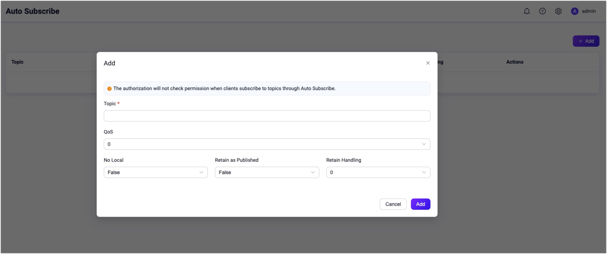

# Auto Subscribe

Auto Subscribe is an extended MQTT feature supported by EMQX. With **Auto Subscription** enabled, users can set multiple EMQX rules. After a client is successfully connected to EMQX, EMQX will complete the subscription process for the client automatically, and the clients no longer need to send `SUBSCRIBE` requests. 

Before EMQX 5.0, this feature is called **Proxy Subscription**.

## Configure Auto Subscribe via Dashboard

1. Open EMQX Dashboard. In the left navigation menu, click **Configuration**-> **MQTT**. 

2. On the **MQTT** page, click the **Extension** tab. Select the **Auto Subscribe** tab.

3. Click the **Add** button at the upper right corner. 

3. In the pop-up dialog box, type the test topic `a/1` in the **Topic** text box. Leave other settings as default. 

   - **Topic**: Type the topic that is automatically subscribed to for the client. 

   - **QoS**: Specify the quality of service of the topic. Options: `0`, `1`, and `2`.

   - **No local**: Options: `False` or `True`.

   - **Retain as Published**: Specify if the message sent with the specified topic will be retained. Options:  `False` or `True`.

   - **Retained Handling**: Options: `0`, `1`, and `2`.

     

   Click the **Add** button on the dialogue box. The auto subscribe topic `a/1` is created successfully.

   

Now the auto subscription function is enabled. New subscribers will subscribe to the topic `a/1` automatically once they are connected to the broker. 

## Try Auto Subscription Using MQTT X Client

The topic `a/1` is configured as the auto subscribe topic in [Configure Auto Subscribe via Dashboard](#configure-auto-subscribe-via-dashboard). The following procedure demonstrates how a client subscribes to the topic `a/1` automatically once it is connected to the broker. 

:::tip Prerequisite

- Basic publishing and subscribing operations using [MQTT X Client](./publish-and-subscribe.md) 

:::

1. Start the MQTT X Client. Click the **New Connection** to create an MQTT connection named `Subscriber`.

   - The localhost `127.0.0.1` is used as an example in this demonstration.

   ::: tip

   For detailed instructions on creating an MQTT connection, see [MQTT X Client](./publish-and-subscribe.md).

   :::

   

2. Create another MQTT connection named `Publisher`.

3. Type `a/1` as the topic. Send a message on this topic. 

   - The client `Subscriber` receives the message automatically without creating a new subscription. 

   - The client `Publisher` also receives the message as it is also a new connection. 

     :::tip

     In the publish/subscribe pattern, a client can be both sender and subscriber.
     
     :::

4. Go to EMQX Dashboard. Click **Subscriptions** in the left navigation menu. 

   - It shows two subscriptions automatically subscribe to the topic "a/1".

   

## Try Auto Subscription using MQTT X CLI

:::tip Prerequisite

- Basic publishing and subscribing operations using [MQTT X CLI](./publish-and-subscribe.md) 

:::

1. Create a new connection with client ID as `emqx_c`.

   ```bash
   mqttx conn -c emqx_c
   ```

2. Go to EMQX Dashboard. Click **Subscriptions** in the left navigation menu. It shows the client `emqx_c` subscribes to the topic `a/1`.

   

