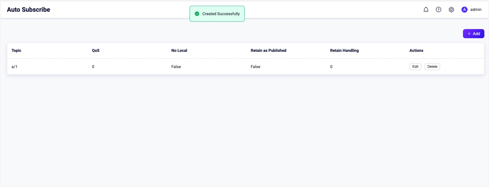
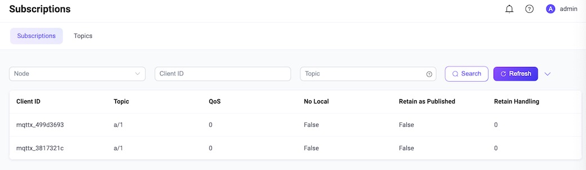

# Auto Subscribe

Auto Subscribe is an extended MQTT feature supported by EMQX. With **Auto Subscription** enabled, users can set multiple EMQX rules. After a client is successfully connected to EMQX, EMQX will complete the subscription process for the client automatically, and the clients no longer need to send `SUBSCRIBE` requests.

Before EMQX 5.0, this feature is called **Proxy Subscription**.

## Configure Auto Subscribe via Dashboard

1. Open EMQX Dashboard. In the left navigation menu, click **Management** -> **Auto Subscribe**. 

2. On the **Auto Subscribe** page, click the **+ Add** button at the upper right corner. 

3. In the pop-up dialog box, type the test topic `a/1` in the **Topic** text box. Leave other settings as default.

   - **Topic**: Type the topic that is automatically subscribed to for the client.

   - **QoS**: Specify the quality of service of the topic. Options: `0`, `1`, and `2`.

   - **No local**: Options: `False` or `True`.

   - **Retain as Published**: Specify if the message sent with the specified topic will be retained. Options:  `False` or `True`.

   - **Retained Handling**: Options: `0`, `1`, and `2`.

      

   Click the **Add** button on the dialogue box. The auto subscribe topic `a/1` is created successfully.

   

Now the auto subscription function is enabled. New subscribers will subscribe to the topic `a/1` automatically once they are connected to the broker.

## Try Auto Subscription Using MQTTX Desktop

The topic `a/1` is configured as the auto-subscribe topic in [Configure Auto Subscribe via Dashboard](#configure-auto-subscribe-via-dashboard). The following procedure demonstrates how a client subscribes to the topic `a/1` automatically once it is connected to the broker.

:::tip Prerequisite

Basic publishing and subscribing operations using [MQTTX Desktop](./publish-and-subscribe.md#mqttx-desktop).

:::

1. Start EMQX and MQTTX Desktop. Click the **New Connection** to create a client connection as a publisher.

   - Enter `Demo` in the **Name** field.
   - Enter the localhost `127.0.0.1` in **Host** to use as an example in this demonstration.
   - Leave other settings as default and click **Connect**.

   ::: tip

   More detailed instructions on creating an MQTT connection are introduced in [MQTTX Desktop](./publish-and-subscribe.md#mqttx-desktop).

   :::

   

3. Create another MQTT client connection named `Subscriber`.

3. Select client `Demo` in the **Connections** pane. Enter `a/1` as the topic. Send a message to this topic.

   - The client `Subscriber` receives the message automatically without creating a new subscription.

   - The client `Demo` also receives the message as it is also a new connection.

     ::: tip

     In the publish/subscribe pattern, a client can be both sender and subscriber.

     :::

4. Go to EMQX Dashboard. Click **Monitoring** -> **Subscriptions** from the left navigation menu. It shows two subscriptions automatically subscribe to the topic `a/1`.

   

## Try Auto Subscription using MQTTX CLI

:::tip Prerequisite

Basic publishing and subscribing operations using [MQTTX CLI](./publish-and-subscribe.md#mqttx-cli)

:::

1. Create a new connection with client ID as `emqx_c`.

   ```bash
   mqttx conn -i emqx_c
   ```

2. Go to EMQX Dashboard. Click **Monitoring** ->**Subscriptions** in the left navigation menu. It shows the client `emqx_c` subscribes to the topic `a/1`.

   

