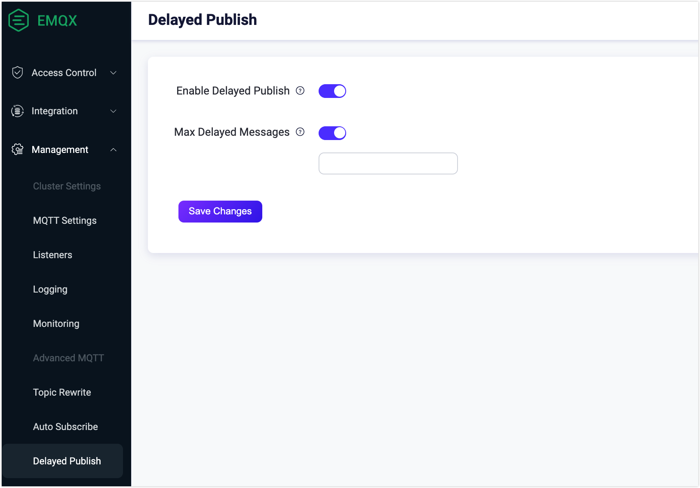
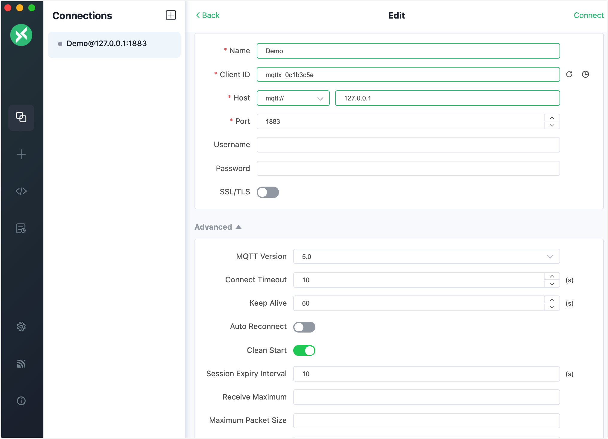
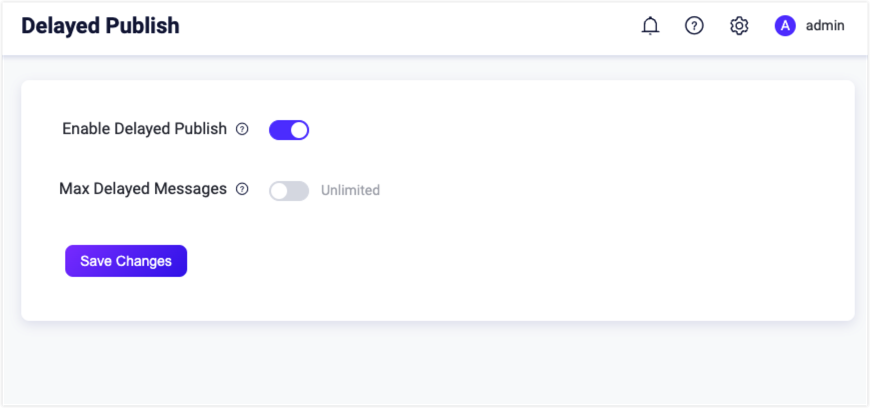
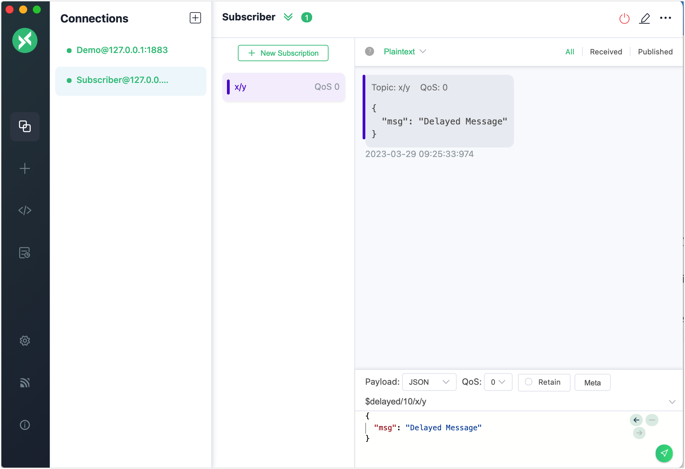

# Delayed Publish

Delayed publish is an extended MQTT feature supported by EMQX. When a client publishes a message to EMQX with the topic prefix `$delayed/{DelayInteval}`, it triggers the delayed publish feature. The messages will be published after a period of time predefined by the user. 

The specific format of the delay-publish topic is as below:

```bash
$delayed/{DelayInterval}/{TopicName}
```

- `$delayed`: Messages prefixed with `$delay` will be treated as messages that need to be delayed. The delay interval is determined by the content of the next topic level.
- `{DelayInterval}`: Specify the time interval for delaying the publishing of this MQTT message with the unit of second. The maximum allowed interval is 4294967 seconds. If `{DelayInterval}` cannot be parsed as an integer number, EMQX will discard the message and the client will not receive any information.
- `{TopicName}`: The topic name of the MQTT message.

Example:

- `$delayed/15/x/y`: Publish MQTT message to the topic `x/y` after 15 seconds
- `$delayed/60/a/b`: Publish MQTT message to the topic `a/b` after 1 minute
- `$delayed/3600/$SYS/topic`: Publish MQTT message to the topic  `$SYS/topic` after 1 hour

## Configure Delayed Publish via Dashboard

1. Open EMQX Dashboard. In the left navigation menu, click **Configuration**-> **MQTT**. 

2. On the **MQTT** page, click the **Extension**. Select the **Delayed Publish** tab.

   - **Enable**: Enable or disable delayed publish. By default, it is enabled.
   - **Max Delayed Messages**: The max number of delayed messages. 
     - If you select **Unlimited** from the drop-down list, you cannot specify the number.
     - If you select **Custom** from the drop-down list, you can specify the number.

   

## Configure Delayed Publish via Configuration File

Add the following configuration to the configuration file.

```bash
delayed {
    enable = true
    max_delayed_messages = 12435
}
```

`enable`: Enable or disable delayed publish.

`max_delayed_messages`: The max number of delayed messages.

## Try Delayed Publish with MQTT X Client

:::tip Prerequisite

- Basic publishing and subscribing operations using [MQTT X Client](./publish-and-subscribe.md) 

:::

1. Start the MQTT X Client. Click the **New Connection** to create an MQTT connection named `Demo`.

   - The localhost `127.0.0.1` is used as an example in this demonstration.

   ::: tip 

   For detailed instructions on creating an MQTT connection, see [MQTT X Client](./publish-and-subscribe.md).

   :::

   

2. Create another MQTT connection. Configure it as a subscriber. 

3. Select the connection named `Demo` in the **Connections** pane. Type the topic name `$delayed/10/x/y` in the topic text box and type the message as `Delayed Message`. 

   - `$delayed`: Indicates it is a delay message.
   - `10`: Indicates the delayed interval is 10 seconds.
   - `x/y`: Indicates the topic name of the message.

4. Select the connection named `Subscriber`. Click the **New Subscription** button to create a subscription.  Type `x/y` in the **Topic** textbox to subscribe to this topic.

   

5. Select the connection named `Demo` in the **Connections** pane. Click the send button to send the `Delayed Message` with topic `$delayed/10/x/y`.

   

6. Wait for 10 seconds. You will see the connection named `Subscriber` receive the delayed message after 10 seconds.

   

## Try Delayed Publish with MQTT X CLI

::: tip Prerequisite

- Basic publishing and subscribing operations using [MQTT X CLI](./publish-and-subscribe.md) 

:::

1. Create a new connection as a subscriber and subscribe to the topic `t/1`.

   ```bash
   mqttx sub -t t/1 -v
   ```

2. Open a new window in the terminal for the client as publisher. Use the following command to send a delayed message. The subscriber will receive the message after 5 seconds.

   ```bash
   mqttx pub -t "\$delayed/5/t/1" -m "Hello Delayed msg"
   ```

   

