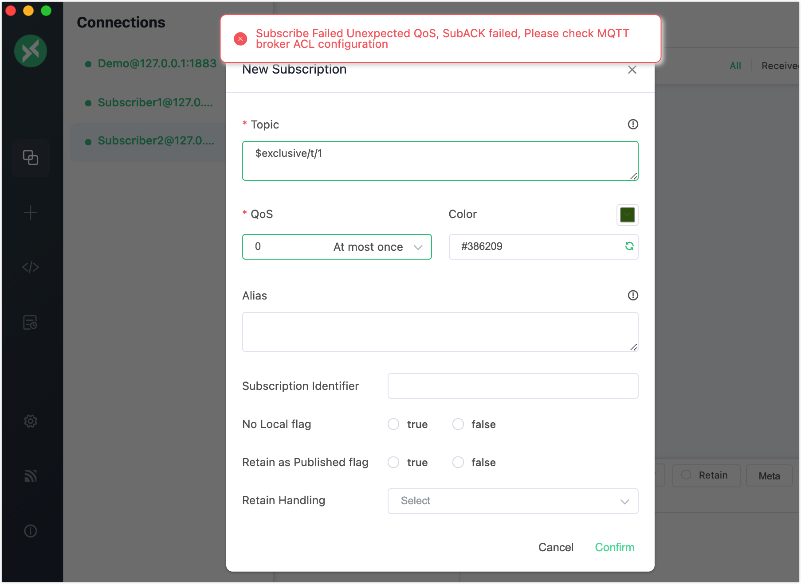

# Exclusive Subscription

Exclusive subscription is an extended MQTT feature supported by EMQX. It allows mutually exclusive subscriptions to topics. Only one subscriber is allowed to subscribe to a topic at a time. Other subscribers will not be able to subscribe to the corresponding topic until the current subscriber unsubscribe the subscription.

To make a subscription exclusive, you need to add a prefix to the topic heading. The table below show an example:

| Example | Prefix | Real Topic Name |
| --------------- | ----------- | ------------ |
| $exclusive/t/1 | $exclusive/ | t/1 |

When client **A** subscribes to `$exclusive/t/1`, other clients will fail to subscribe to `$exclusive/t/1` until **A** cancels the subscription to `$exclusive/t/1` .

::: tip Note

Exclusive subscriptions must be prefixed with `$exclusive/`, in the above example, other clients can still successfully subscribe via `t/1`.

:::

## Configure Exclusive Subscription via Configuration File

The exclusive subscription is disabled by default. You can enable this feature in `etc/emqx.conf`.

:::tip Note

Configuration using the Dashboard is currently not supported.

:::

```bash
mqtt.exclusive_subscription {
    enable = true
}
```

## Try Exclusive Subscription with MQTT X Client

::: tip Prerequisites

- Basic publishing and subscribing operations using [MQTT X Client](./publish-and-subscribe.md)
- Exclusive subscription is enabled.

:::

1. Start the MQTT X Client. Click the **New Connection** to create an MQTT connection named "Demo".

   - The localhost `127.0.0.1` is used as an example in this demonstration.

   ::: tip

   For detailed instructions on creating an MQTT connection, see [MQTT X Client](./publish-and-subscribe.md).

   :::

   

2. Create another 2 MQTT connections. Configure them as "Subscriber1" and "Subscriber2" respectively.

3. Select the connection named "Subscriber1" in the **Connections** pane. Click the **New Subscription** button to create a subscription.  Type `$exclusive/t/1` in **Topic** textbox to subscribe to this topic. Click **Confirm**.

   

4. Select the connection named "Subscriber2" in the **Connections** pane. Click the **New Subscription** button to create a subscription.  Type `$exclusive/t/1` in **Topic** textbox to subscribe to this topic. Click **Confirm**.

   - An error message "" pops up.

   

## Try Exclusive Subscription with MQTT X CLI

::: tip Prerequisites

- Basic publishing and subscribing operations using [MQTT X CLI](./publish-and-subscribe.md)
- Exclusive subscription is enabled.

:::

1. Use the following command to make an exclusive subscribscription.

   ```bash
   mqttx sub -t "$exclusive/t/1"
   ```

2. Use the command in step 1 again to make another subscription to the topic `$exclusive/t/1`. It will return:

   ```bash
   subscription negated to t/2 with code 135
   ```

   Subscription Error Code：

   | Code | Reason                                                  |
   | ---- | ------------------------------------------------------- |
   | 0x8F | Use `$exclusive/` without exclusive subscription enable |
   | 0x97 | A client has already subscribed to this topic           |

