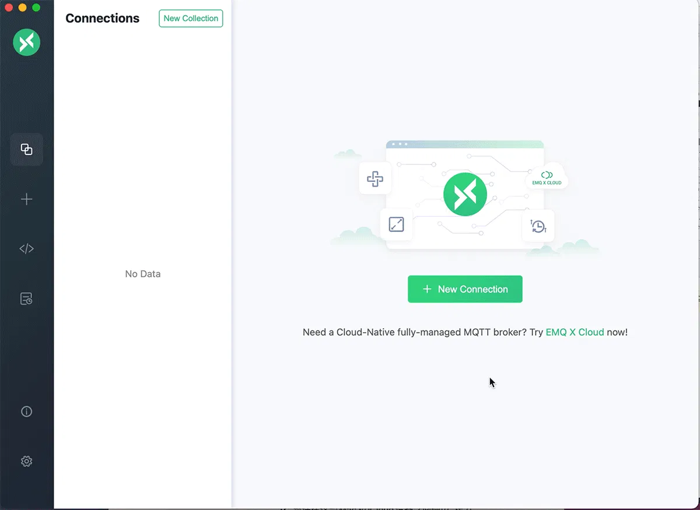

# Publish/Subscribe

MQTT is based on a [publish/subscribe model](../mqtt/mqtt-publish-and-subscribe.md) for message communication. The client can be both a publisher (publish a message) and a subscriber (subscribe to a topic). That is, when a client publishes a message to the broker, the broker will forward the message to clients subscribed to this topic after receiving it.

This chapter will introduce the commonly used MQTT client tools, and will walk you through the process of establishing client connections, subscribing to topics, publishing messages, as well as receiving and viewing messages.

**Messaging workflow**

Below is the typical workflow on how a message is published and then received by the subscriber. 

1. Publishers and subscribers initiate the connection request to EMQX with the correct connection URL and authentication information. Note: Both are connected to the same EMQX;
2. The subscriber subscribes to the topic. By default, messages with no matching subscribers will be discarded immediately;
3. The publisher publishes messages, please ensure that the topic of the message can be matched with the subscriber, and the subscriber has subscribed to the corresponding topic;
4. The subscriber receives the message.

In the next section, we will introduce how to test the connection with different client tools, including Dashboard Websocket and MQTT X. 

:::: tabs type:card

::: tab MQTT X
[MQTT X](https://mqttx.app) is a cross-platform MQTT desktop client open sourced by [EMQ](https://www.emqx.com). It can run on macOS, Linux, Windows, and Ubuntu. MQTT X has provided features like support for customized scripts for MQTT Pub/Sub simulation, format conversion for MQTT messages, and logging. 

Leveraging the easy-to-use graphic interface of MQTT X, you can connect MQTT broker or cloud with one click and test MQTT/TCP, MQTT/TLS, and MQTT/WebSocket connections. 



> You can also use [MQTT X Web](http://www.emqx.io/online-mqtt-client#/recent_connections) to complete the development and debugging via MQTT over WebSocket, with no need to download or install any tools. 

Below is the workflow of how to use MQTT X to connect, publish/subscribe, and view messages:

1. Download and install MQTT X: Download the installation package from the application store or [MQTT X website](https://mqttx.app/) based on your operating system. For detailed operation steps, see [MQTT X - Installation](https://mqttx.app/docs/downloading-and-installation).
2. Configure the MQTT connection and message publish/subscribe services: Fill in the EMQX connection information and establish a connection. For detailed operations, see [MQTT X - Get Started](https://mqttx.app/docs/get-started#connect). For **Host**, select the `mqtt://` protocol and fill in the IP address (Default: `localhost`) of the corresponding listener, set **Port** to 1883. Fill in the username and password if there are any or just leave them blank if no access control is used. 
3. Message publish/subscribe and view: After you are connected to EMQX, you can begin to use MQTT X to send messages. For detailed operations, see [MQTT X - Publish and subscription](https://mqttx.app/docs/get-started#publish-and-subscription).

:::

::: tab MQTT X CLI

[MQTT X CLI](https://mqttx.app/cli) is an open-source MQTT 5.0 command line tool provided by [EMQ](https://www.emqx.com). It is an [MQTT X](https://mqttx.app) tool running on the command line tool so users test and debug MQTT services and applications with no need for a graphic interface. 

Besides cross-platform support, dependency-free, and support to various MQTT features, you can also use MQTT X for a quick performance test. 

Below is the workflow of how to use MQTT X CLI to connect, publish/subscribe, and view messages:

1. Download and install MQTT CLI. Here we will take macOS as an example, for the other operating systems, see [MQTT X CLI - Installation](https://mqttx.app/docs/cli/downloading-and-installation). 

   ```bash
   # Homebrew
   brew install emqx/mqttx/mqttx-cli
   # Intel Chip
   curl -LO https://www.emqx.com/zh/downloads/MQTTX/v1.9.0/mqttx-cli-macos-x64
   sudo install ./mqttx-cli-macos-x64 /usr/local/bin/mqttx
   # Apple Silicon
   curl -LO https://www.emqx.com/zh/downloads/MQTTX/v1.9.0/mqttx-cli-macos-arm64
   sudo install ./mqttx-cli-macos-arm64 /usr/local/bin/mqttx
   ```


2. In the command line tool, execute the following command to connect to EMQX and subscribe to the `testtopic/#` topic:

   ```shell
   mqttx sub -t 'testtopic/#' -q 1 -h 'localhost' -p 1883 'public' -v
   ```

   After successful execution, the command line will be in blocking receive state and will print the message after receiving the message.

   Parameter Description:

   - `-t`: Subscription topic
   - `-q`: QoS of the message (default: 0)
   - `-h`: IP address of the listener (default: `localhost`)
   - `-p`: Broker port (default:`1883`)
   - `-v`: Print the topic before the message

   For more parameters, see  [MQTT X CLI - Subscribe](https://mqttx.app/docs/cli/get-started#subscribe).

3. Open a new command line window, execute the command below to connect to EMQX, and publish a message to topic `testtopic/#`:

   ```bash
   mqttx pub -t 'testtopic/1' -q 1 -h 'localhost' -p 1883 -m 'from MQTTX CLI'
   ```

   After successful execution, the command line will establish the connection, publish the message and then disconnect from the broker, and the command line window in Step 2 will print the following message:

   ```bash
   topic:  testtopic/1
   payload:  from MQTTX CLI
   ```

   Parameters:

   - `-t`: Subscription topic
   - `-q`: QoS of the message (default: 0)
   - `-h`: IP address of the listener (default: `localhost`)
   - `-p`: Broker port (default:`1883`)
   - `-m`: Message body

   For information on more parameters, see  [MQTT X CLI - Publish](https://mqttx.app/docs/cli/get-started#publish).

:::

::: tab Dashboard WebSocket 

[EMQX Dashboard](../dashboard/introduction.md) provides a WebSocket client as a quick and highly effective MQTT test tool. With this MQTT over WebSocket, you can test connecting to EMQX, subscribing to topics, and publishing messages.  

1. In EMQX Dashboard, click **Diagnose** -> **WebSocket Client** on the left navigation tree. 
2. Fill in the connection information in the **Connection** section. For **Host**, fill in the corresponding IP address (Default:  `localhost`), for **Port**, keep the default  `8083`, and then fill in the user name and password if there are any, or just leave them blank. 
3. Click the **Connect** button to establish a connection.
4. Set the topic to subscribe in the **Subscription** section. Here we will fill in  `testtopic/#` as **Topic**, select the corresponding QoS, and then click the **Subscribe** button to finish the subscription.  `testtopic/#`  will be added to the table below. After the subscription, all messages matching the topic will be forwarded to this connection and added to the **Received** section.
5. Set the topic for the message to be published in the **Publish** section. Fill in the topic in the **Topic** field (wildcards like `+` and `#` are not supported), here we will fill in `testtopic/1`, fill in the message body under **Payload**, select the corresponding QoS, and whether this is a retained message. Click the **Publish** button, and one record will be added to the **Published** section below.
6. The message will be routed to all subscribers, as we have already subscribed to this topic in step 5, one new record will also be added to the **Received** section below.

Now we have successfully experienced the entire messaging services with the Dashboard WebSocket client. 

:::

::::
