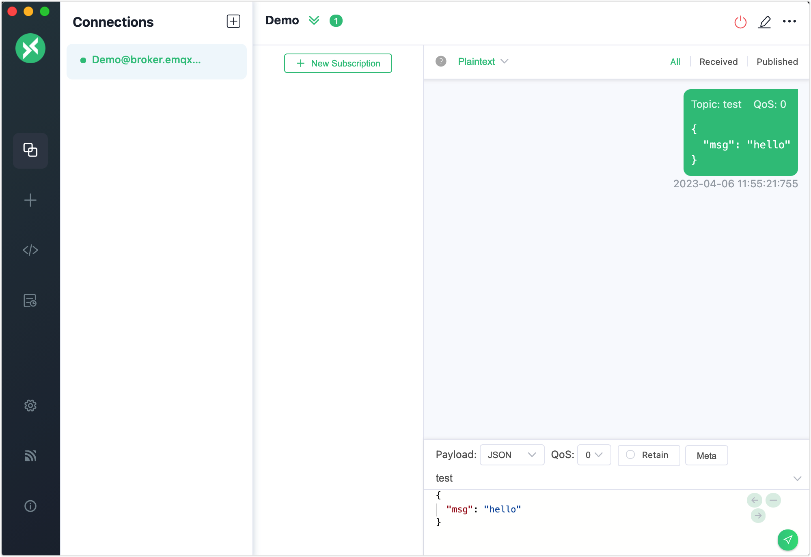
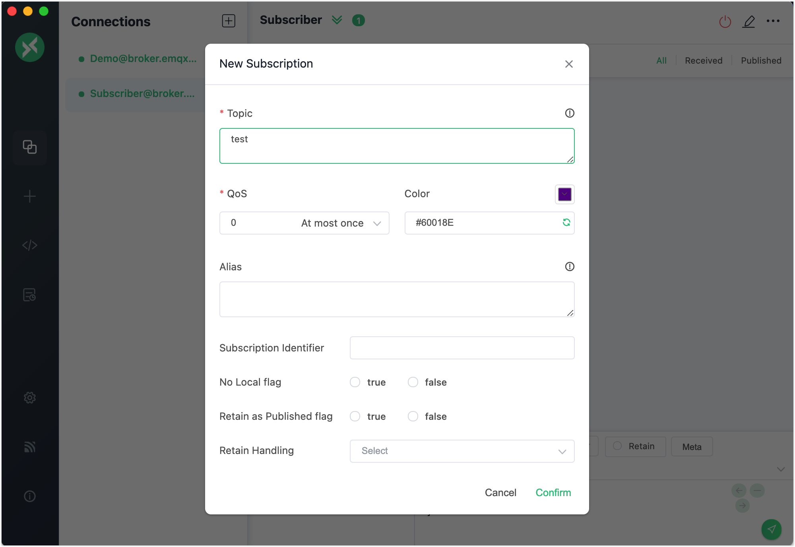
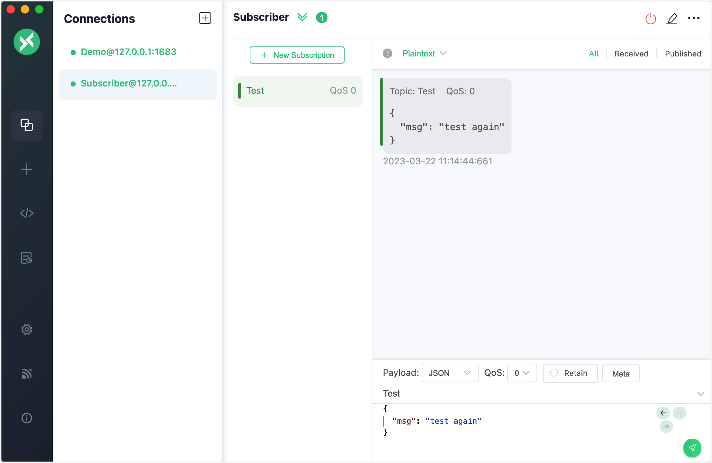
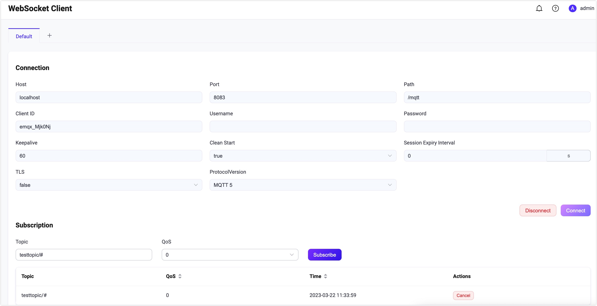

# Publish/Subscribe

MQTT is based on a [publish/subscribe model](../mqtt/mqtt-publish-and-subscribe.md) for message communication. As an MQTT messaging platform, clients connected to the EMQX Enterprise can publish and subscribe messages. A client can be both a publisher and a subscriber. When a client publishes a message with a certain topic to the EMQX server, the server forwards the message to any clients who subscribe to this topic. 

EMQ provides the developers with some verification tools to test the MQTT messaging services and applications. This chapter introduces the commonly used MQTT 5.0 client tools and how to use these tools to verify the following messaging services:

- Establish client connections
- Subscribe to topics
- Publish messages
- Receive and view messages

In  this chapter, it also introduces some advanced publishing and subcribing operations, such as:

- Exclusive subscription
- Depayed publish
- Auto subscribe
- Topic Rewrite

## MQTT X

[MQTT X](https://mqttx.app) includes 3 types of MQTT 5.0 verification tools:

- MQTT X Client
- MQTT X CLI
- MQTT Websocket

### MQTT X Client

[MQTT X Client](https://mqttx.app) is a cross-platform MQTT desktop client tool open sourced by [EMQ](https://www.emqx.com). It provides users with an easy-to-use graphic interface to allow users to quickly create and test MQTT connections, publish and subscribe MQTT messages. 

Before you test, download and install the MQTT X Client:

1. Download the installation package from the application store or [MQTT X website](https://mqttx.app/) based on your operating system. 
2. Install the MQTT X Client. For detailed instruction, see [MQTT X - Installation](https://mqttx.app/docs/downloading-and-installation).

Follow the instructions below to use the MQTT X desktop client for a simple test:

1. Start the MQTT X Client. Click the **New Connection** to create an MQTT connection.

2. Configue the new connection. 

   In **General** section, fill in the general information of the client. 

   - **Name**: Type a connection `Name`. 
   - **Client ID**: Leave it as default. It is the one and only identification of a client connection and can be automatically generated by clicking the refresh button.
   - **Host**: Select the protocol to be used. Select `mqtt://` or `ws://`. If an `SSL/TLS` authentication connection is used, you needs to select `mqtts://` or `Wss://`. The host IP address is set to `broker.emqx.io` by default. You need to replace with the actual IP address if EMQT is deployed on a non-local machine. The localhost `127.0.0.1` is used as an example in the following screenshots.
   - **Port**: Type the port corresponnding to the selected protocol.
   - **User name** and **Password**: Fill in the username and password if there are any or just leave them blank if no access control is used.
   - **SSL/TLS**: Enable the SSL/TLS by clicking the toggle button if an `SSL/TLS` authentication connection is used.

   Leave the rest settings as default. Click the **Connect** button.

   

3. After the success connection, type the topic heading `test` in the text box and compose the message as shown in the screenshot. Click the send button. A message under the topic `test` is send to the dialogue box.

   

4. Create another new connection following the configuration instruction in Step 4 and set the name to "Subscriber". 

5. Click the **New Subscription**. 

   **Topic**: Type `test` in the text box. 

   **QoS**: Set as the default value.

   **Color**: You can select the color to mark the description.

   Leave other options empty for the general test. <!--Add details later if needed-->

   Click the **Confirm** button.

   

6. Select the client "Demo" at the **Connections** pane. Publish a new message under the topic "Test". You can see the client named "Subscriber" receives a new message.

   

   

For detailed and advanced operations, see [MQTT X - Publish and subscription](https://mqttx.app/docs/get-started#publish-and-subscription).

### MQTT X CLI

[MQTT X CLI](https://mqttx.app/cli) is an open-source MQTT 5.0 command line tool provided by [EMQ](https://www.emqx.com). It is an [MQTT X](https://mqttx.app) tool running on the command line tool so users test and debug MQTT services and applications with no need for a graphic interface. 

Besides cross-platform support, dependency-free, and support to various MQTT features, you can also use MQTT X for a quick performance test. 

Follow the instructions below to connect, publish/subscribe, and view messages using MQTT X CLI:

1. Download and install MQTT CLI. Here we will take macOS as an example, for the other operating systems, see [MQTT X CLI - Installation](https://mqttx.app/docs/cli/downloading-and-installation). 

   ```bash
   # Homebrew
   brew install emqx/mqttx/mqttx-cli
   # Intel Chip
   curl -LO https://www.emqx.com/zh/downloads/MQTTX/v1.9.0/mqttx-cli-macos-x64
   sudo install ./mqttx-cli-macos-x64 /usr/local/bin/mqttx
   # Apple Silicon
   curl -LO https://www.emqx.com/zh/downloads/MQTTX/v1.9.0/mqttx-cli-macos-arm64
   sudo install ./mqttx-cli-macos-arm64 /usr/local/bin/mqttx
   ```


2. In the command line tool, execute the following command to connect to EMQX and subscribe to the `testtopic/#` topic:

   ```shell
   mqttx sub -t 'testtopic/#' -q 1 -h 'localhost' -p 1883 'public' -v
   ```

   After successful execution, the command line will be in blocking receive state and will print the message after receiving the message.

   Parameter Description:

   - `-t`: Subscription topic
   - `-q`: QoS of the message (default: 0)
   - `-h`: IP address of the listener (default: `localhost`)
   - `-p`: Broker port (default:`1883`)
   - `-v`: Print the topic before the message

   For more parameters, see  [MQTT X CLI - Subscribe](https://mqttx.app/docs/cli/get-started#subscribe).

3. Open a new command line window, execute the command below to connect to EMQX, and publish a message to topic `testtopic/#`:

   ```bash
   mqttx pub -t 'testtopic/1' -q 1 -h 'localhost' -p 1883 -m 'from MQTTX CLI'
   ```

   After successful execution, the command line will establish the connection, publish the message and then disconnect from the broker, and the command line window in Step 2 will print the following message:

   ```bash
   topic:  testtopic/1
   payload:  from MQTTX CLI
   ```

   Parameters:

   - `-t`: Subscription topic
   - `-q`: QoS of the message (default: 0)
   - `-h`: IP address of the listener (default: `localhost`)
   - `-p`: Broker port (default:`1883`)
   - `-m`: Message body

   For information on more parameters, see  [MQTT X CLI - Publish](https://mqttx.app/docs/cli/get-started#publish).

### MQTT X Web

[MQTT X Web](https://mqttx.app/web) is a browser-based MQTT 5.0 WebSocket client tool. You can use it to complete the development and debugging via MQTT over WebSocket, with no need to download or install any tools. The testing operations using the MQTT X Web is basically the same as using the MQTT X Client.

## Dashboard WebSocket 

[EMQX Dashboard](../dashboard/introduction.md) provides a WebSocket client as a quick and highly effective MQTT test tool. With this MQTT over WebSocket, you can test connecting to EMQX, subscribing to topics, and publishing messages.  

1. In EMQX Dashboard, click **Diagnose** -> **WebSocket Client** on the left navigation tree. 

2. Fill in the connection information in the **Connection** section. 

   - **Host**: Fill in the corresponding IP address (Default:  `localhost`).
   - **Port**: Keep the default port `8083`, 
   - **Username** and **Password**: Fill in the username and password if there are any or just leave them blank if no access control is used. 

   Leave other settings as default.

3. Click the **Connect** button to establish a connection.

4. Set the **topic** to subscribe as `testtopic/#` in the **Subscription** section. Click the **Subscribe** button to finish the subscription. The topic `testtopic/#`  will be added to the table below.

   

   After the subscription, all messages matching the topic will be forwarded to this connection and added to the **Received** section.

5. Set the topic for the message to be published in the **Publish** section. 

   - **Topic**: Set to `testtopic/1` (wildcards like `+` and `#` are not supported).
   - **Payload**: Set to `{"msg": 'Hello"}`.
   - **QoS**: Set as defatult value `0`. 
   - **Retain**: Select the checkbox if you want to set it as a retained message. For more information on retained message, see [Retained Message](./explore-mqtt.md).

   Click the **Publish** button, and one record will be added to the **Published** section below. The message will be routed to all subscribers. As the publisher is also the receiver in this test, one new record will also be added to the **Received** section below.

   


