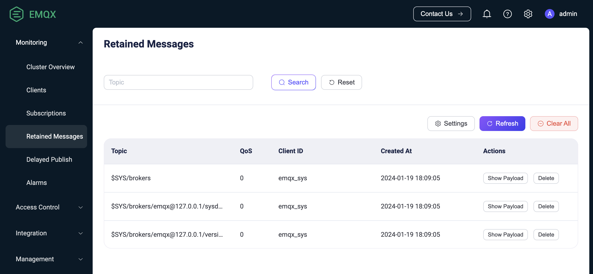

# Retained Message

EMQX implements the retained message feature of MQTT. You can flag one message published under a certain topic as `Retained` and save it as a persistent message on the EMQX. When any new subscribers subscribe to a topic that matches the topic of the retained message, they immediately receive that message, even if it was published before they subscribed to the topic.

You can use client tools to test this messaging service in EMQX. This section introduces how to use the [MQTT X Client](https://mqttx.app/) and [MQTT X CLI](https://mqttx.app/cli) to simulate clients and try how a retained message is published and received.

:::tip Prerequisites

- Knowledge about MQTT [Retained Message](./mqtt-concepts.md)
- Basic publishing and subscribing operations using [MQTT X](./publish-and-subscribe.md)

:::

## Publish Retained Message with MQTT X Client

1. Start the MQTT X Client. Click the **New Connection** to create an MQTT connection named `Demo`.

   - The localhost `127.0.0.1` is used as an example in this demonstration.

   ::: tip

   For detailed instructions on creating an MQTT connection, see [MQTT X Client](./publish-and-subscribe.md).

   :::

   

3. After the successful connection, type the topic heading `sensor/t1` in the text box and compose the message as shown in the screenshot. Click the send button. A message under the topic `sensor/t1` appears in the dialogue box.

   

4. Publish two retained messages with the topic `sensor/t2`. 

   1. Type the topic as `sensor/t2`. Type the first message as `1`. Select **Retain**. Click the send button.
   2. Type the second message as `2`. Click the send button.

   

5. Click the **New Subscription** button to create a subscription. Input `sensor/+` in the **Topic** text box. Click the **Confirm** button. The subscription only receives the last retained message. 

   :::tip

   With the topic set to `sensor/+`, both `sensor/t1` and `sensor/t2` are subscribed. For more information on topics and wildcards, see [Understanding MQTT Topics & Wildcards by Case](https://www.emqx.com/en/blog/advanced-features-of-mqtt-topics).

   :::

   

   :::tip

   The first message with the topic `sensor/t1` and the first retained message with the topic `sensor/t2` is not received. The EMQX only stores the latest retained message for each topic. You can also check the latest retained message stored in the EMQX Dashboard, see [View Retained Message in Dashboard](#view-retained-message-in-dashboard).

   :::  

6. If you want to clear the retained message from the MQTT broker, send an empty retained message to the topic.

## Publish Retained Message with MQTT X CLI

1. Initiate a connection request with one client. 

1. Use the following command to publish a retained message with the payload "A retained message from MQTTX CLI" to the topic "t/1". Set the topic to `t/1`, payload to `A retained message from MQTTX CLI`,  and `retain = true`：

   ```bash
   mqttx pub -t 't/1' -m 'A retained message from MQTTX CLI' --retain true -h 'localhost' -p 1883
   ```

3. Initiate another new client connection request to the same broker. Subscribe to the topic `t/1` with the new client. It will receive the retained message. 

   If you continuously create new clients and let them subscribe to the topic `t/1`, all new clients you created will receive the retained message.

   ```bash
   $ mqttx sub -t 't/1' -h 'localhost' -p 1883 -v
   topic:  t/1
   payload:  A retained message from MQTTX CLI
   retain: true
   ```

3. Publish an empty message to clear the retained message:

   ```bash
   mqttx pub -t 't/1' -m '' --retain true -h 'localhost' -p 1883
   ```

4. Initiate a new client connection and subscribe to the topic `t/1`. No retained messages are received, indicating the retained message is cleared. 

## View Retained Message in Dashboard

When a user publishes a retained message, EMQX will save this message in the system. The user can view this message on the Retained Messages list page. When the user subscribes to the topic of this retained message, EMQX will publish this message to the topic, and users can receive this message immediately by subscribing to the topic.

The default expiration time of the retained message is never expired unless the user manually deletes this message.

### Retained Messages List

On the **Retained Messages** list page, users can view all retained messages in the system, including the topic, QoS, publish time, and client ID. The page also provides options to view the payload of a retained message and delete it using the **Show Payload** and **Delete** buttons respectively. Users can refresh the list using the **Refresh** button and access the retained message settings page using the **Settings** button.

The default will save three types of retained messages [system topics](./mqtt-concepts.md). If it is a cluster environment, it will keep different system topics' retained messages according to other node names. They are:

- $SYS/brokers/+/sysdescr: System description of the current EMQX node
- $SYS/brokers/+/version: Version number of the current EMQX node
- $SYS/brokers - Number and name of all nodes of the current EMQX



### Delete Retained Message

To delete a retained message in EMQX, users can either publish an empty message to the topic of the retained message in the client or use the EMQX Dashboard. In the Dashboard, users can simply click the **Delete** button on the Retained Messages list page to remove a retained message. Additionally, users can also set the expiration time for retained messages on the Retained Messages configuration page, allowing EMQX to automatically delete them when they expire.