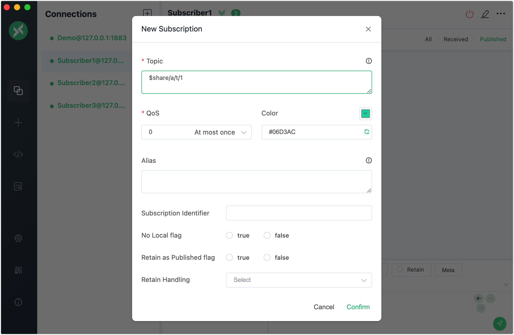
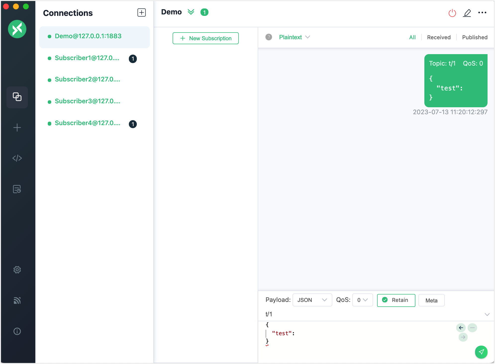
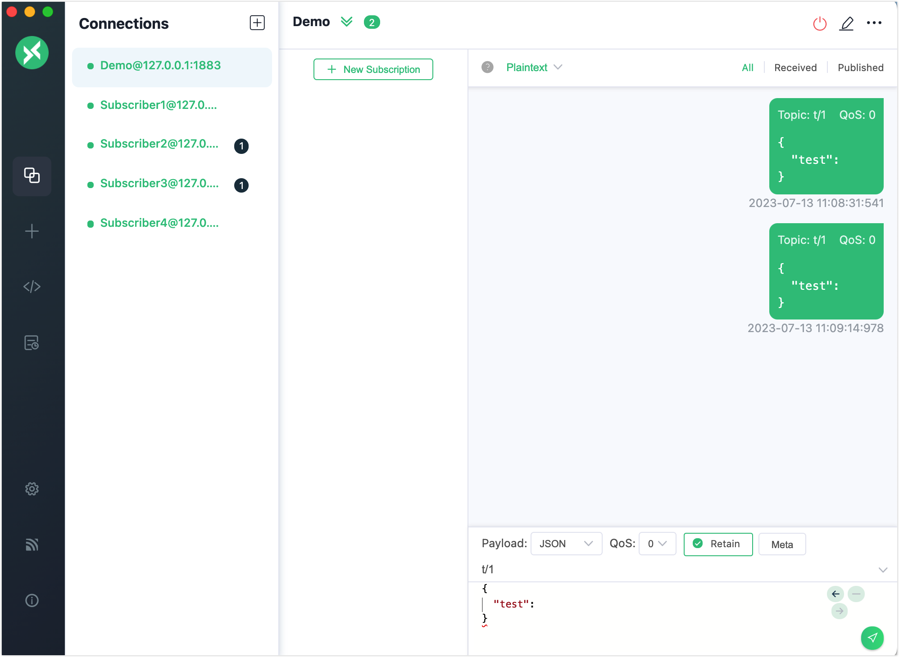

# Shared Subscription

EMQX implements the shared subscription feature of MQTT. A shared subscription is a subscription mode to implement load balancing among multiple subscribers. Clients can be divided into multiple subscription groups, and messages are still forwarded to all subscription groups, but only one client within each subscription group receives the message at a time. You can add a `$share` prefix to the original topic to enable shared subscriptions for a group of subscribers.

You can use client tools to try this messaging service in EMQX. This section introduces how to use the [MQTT X Client](https://mqttx.app/) and [MQTT X CLI](https://mqttx.app/cli) to simulate clients and try how messages are received through a shared subscription.

:::tip Prerequisites

- Knowledge about MQTT [Shared Subscription](./mqtt-concepts.md)
- Basic publishing and subscribing operations using [MQTT X](./publish-and-subscribe.md) 

:::

## Try Shared Subscription with MQTT X Client

1. Start the MQTT X Client. Click the **New Connection** to create an MQTT connection named "Demo".

   - The localhost `127.0.0.1` is used as an example in this demonstration.

   ::: tip 

   For detailed instructions on creating an MQTT connection, see [MQTT X Client](./publish-and-subscribe.md).

   :::

   

2. Click the **New Connection** to create 3 new connections with the **Name** set to `Subscriber1`, `Subscriber2` and `Subscriber3` respectively. Configure the new connections in the same way as described in step 2.

3. Select the connection named "Subscriber1" in the **Connections** pane. Click the **New Subscription** button to create a subscription. 

   To form a group for multiple subscribers, you need to add prefix `$share` and group name `{group}` before the subscribed topic `t/1`. In this demonstration, set the **Topic** name to `$share/a/t/1`. 

   - The prefix `$share` indicates this is a shared subscription.
   - `{group}` can be a customed name. Set to `a` in this example.
   - `t/1` indicates the original topic name.

   Leave other settings as default. Click the **Confirm** button.

   

4. Create subscriptions for "Subscriber2" and "Subscriber3" in the same way. 

   - Set the **Topic** to `$share/a/t/1` for "Subscriber2".
   - Set the **Topic** to `$share/b/t/1` for "Subscriber3".

5. Click the client connection "Demo" created in step 2. 

   - Send a message with the topic "t/1". "Subscriber1" and "Subscriber3" receive the message. 

     

   - Send the same message again. "Subscriber2" and "Subscriber3" receive the message.

     

:::tip

When the message of the shared subscription is published, the EMQX broker forwards the message to different groups at the same time, but only one of the subscribers in the same group receives the message at a time.

:::

## Try Shared Subscription with MQTT X CLI

1. Four subscribers are divided into 2 groups and subscribe to topic  `t/1`:

   ```bash
   # Client A and B subscribe to topic `$share/my_group1/t/1`
   mqttx sub -t '$share/my_group1/t/1' -h 'localhost' -p 1883
   
   ## Client C and D subscribe to topic  `$share/my_group2/t/1`
   mqttx sub -t '$share/my_group2/t/1' -h 'localhost' -p 1883
   ```

2. Use a new client to publish 4 messages with payloads `1`, `2`, `3`, and `4` to the original topic `t/1`:

   ```bash
   mqttx pub -t 't/1' -m '1' -h 'localhost' -p 1883
   mqttx pub -t 't/1' -m '2' -h 'localhost' -p 1883
   mqttx pub -t 't/1' -m '3' -h 'localhost' -p 1883
   mqttx pub -t 't/1' -m '4' -h 'localhost' -p 1883
   ```

3. Check the message received by the clients within each subscription group:

   - Subscription group (A and B) and Subscription group (C and D) simultaneously receive the messages.
   - Only one of the subscribers in the same group receives the message at a time.