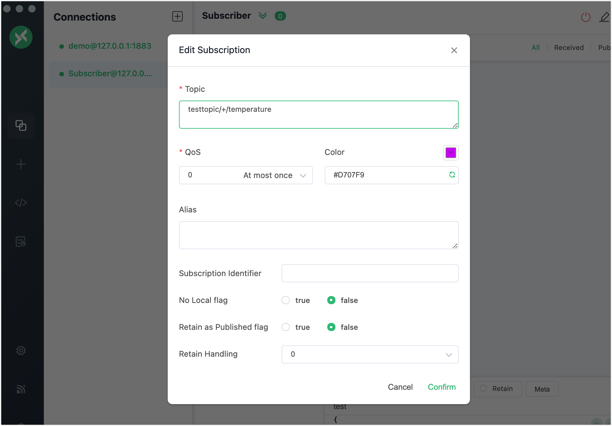
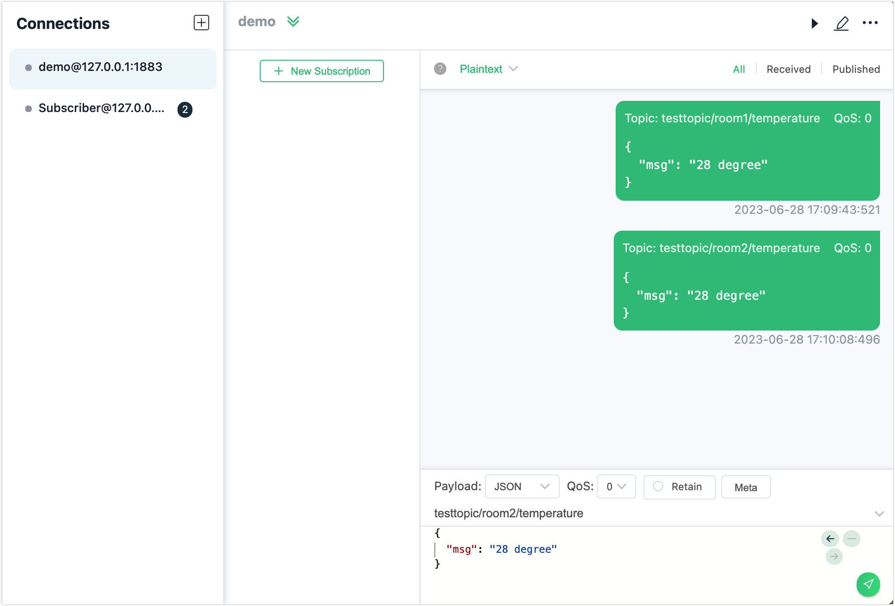
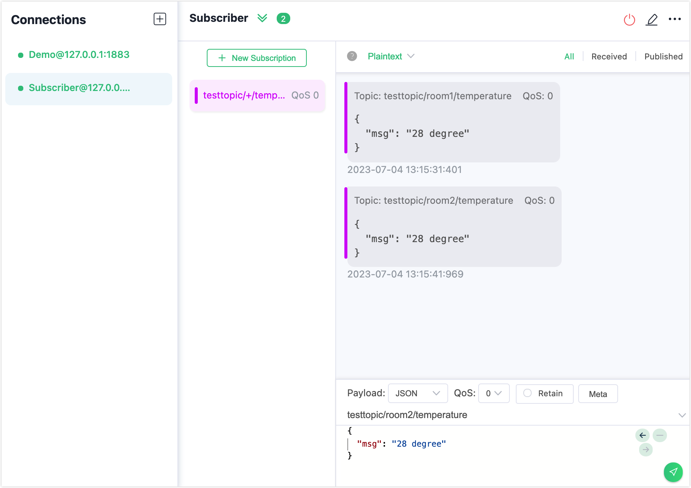
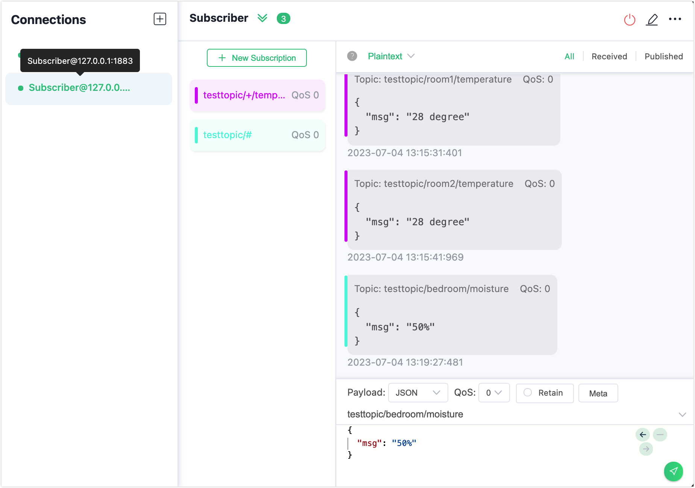

# Wildcard Subscription

MQTT topic name is a UTF-8 encoded string used for message routing. To provide more flexibility, MQTT supports a hierarchical topic namespace. A topic is typically leveled and separated with a slash `/` between the levels such as `chat/room/1`. A [wildcard subscription](https://docs.oasis-open.org/mqtt/mqtt/v5.0/os/mqtt-v5.0-os.html#_Topic_Names_and) is a subscription with a topic filter containing one or more wildcard characters. This allows the subscription to match more than one topic name. This page introduces the usage of two types of wildcards supported in MQTT and how to make a wildcard subscription in EMQX. 

## Single-Level Wildcard

`+` (U+002B) is a wildcard character that matches only one topic level. The single-level wildcard can be used at any level in the topic filter, including the first and last levels. Where it is used, it must occupy an entire level of the filter. It can be used at more than one level in the topic filter and can be used in conjunction with the multi-level wildcard. Below are some examples of using the single-level wildcard:

```
"+" is valid
"sensor/+" is valid
"sensor/+/temperature" is valid
"sensor+" is invalid (does not occupy an entire level)
```

If the client subscribes to the topic `sensor/+/temperature`, it will receive messages from the following topics:

```awk
sensor/1/temperature
sensor/2/temperature
...
sensor/n/temperature
```

But it will not match the following topics:

```bash
sensor/temperature
sensor/bedroom/1/temperature
```

## Multi-Level Wildcard

`#` (U+0023) is a wildcard character that matches any number of levels within a topic. When using a multi-level wildcard, it must occupy an entire level and must be the last character of the topic, for example:

```pgsql
"#" is valid, matches all topics
"sensor/#" is valid
"sensor/bedroom#" is invalid (+ or # are only used as a wildcard level)
"sensor/#/temperature" is invalid (# must be the last level)
```

## Try Wildcard  Subscription with MQTTX Client

This section demonstrates how to use the MQTTX client to simulate subscriptions to wildcard topics. 

In this demonstration, you can create one client connection `demo` as a publisher to publish messages. Then, you can create another client connection as a subscriber. The subscriber subscribes to the following wildcard topics:

- `testtopic/+/temperature`
- `testtopic/#`

1. Start the MQTTX Client. Click the **New Connection** to create an MQTT connection named `Demo`.

   - The localhost `127.0.0.1` is used as an example in this demonstration.

   ::: tip

   For detailed instructions on creating an MQTT connection, see [MQTTX Client](./publish-and-subscribe.md).

   :::

   

2. Click **+** in the **Connections** pane to create another connection as a subscriber. Set **Name** to `Subscriber`.

3. Select `Subscriber` in **Connections** and click **+ New Subscription**. In the pop-up dialogue, input `testtopic/+/temperature` in the **Topic** field. Leave other options as default.

   

4. Select `Demo` in **Connections**. Type `testtopic/room1/temperature` in the topic field and type the message payload `28 degree` in the message field. Click the send button. Send another message with the topic `testtopic/room2/temperature`.

      

5. Select `Subscriber` in **Connections**. You can see the subscriber receives the two messages the publisher sends.

      

6. Click **+ New Subscription**. In the pop-up dialogue, use the default topic `testtopic/#` in the **Topic** field. Leave other options as default.

7. Select `Demo` in **Connections**. Type `testtopic/bedroom/moisture` in the topic field and type the message payload `50%` in the message field. Click the send button.

8. Select `Subscriber` in **Connections**. You can see the subscriber receives the message from the publisher.

      