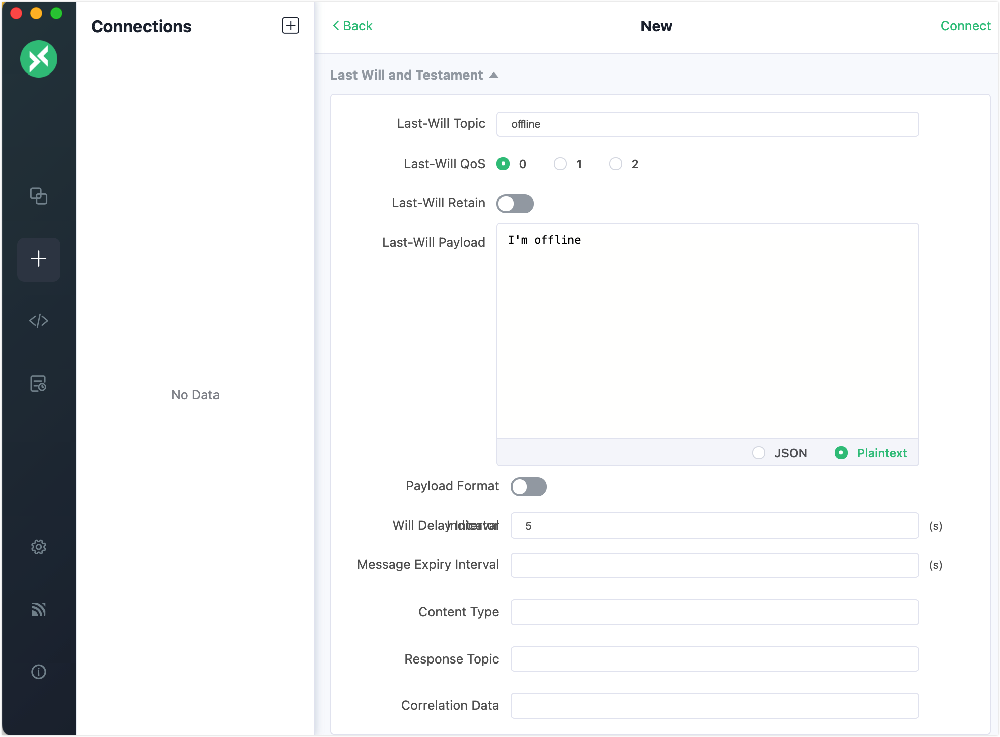
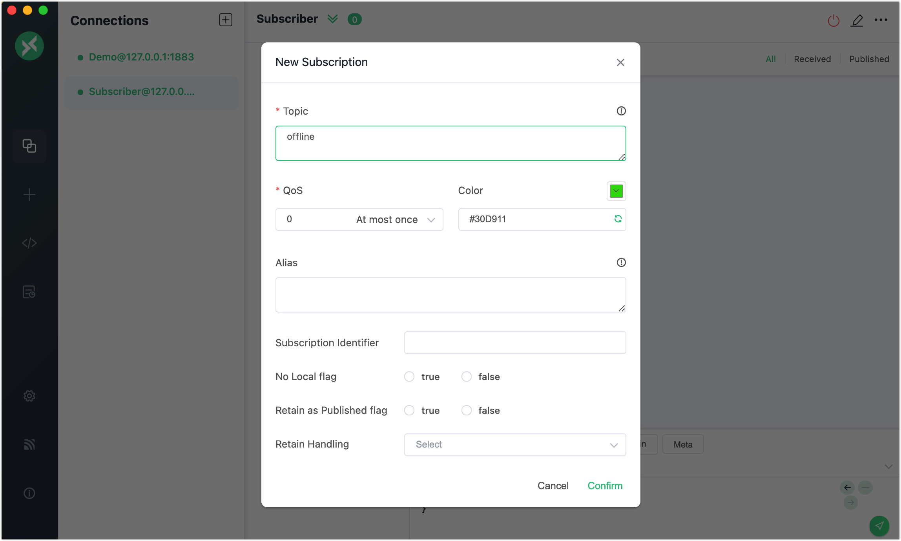
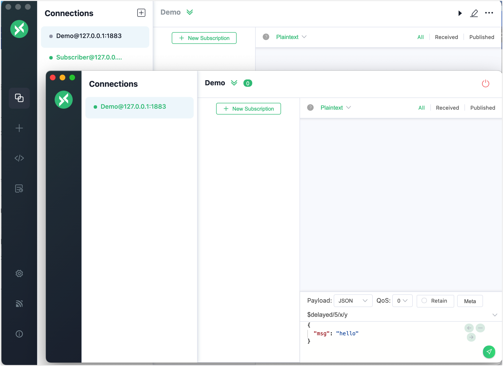
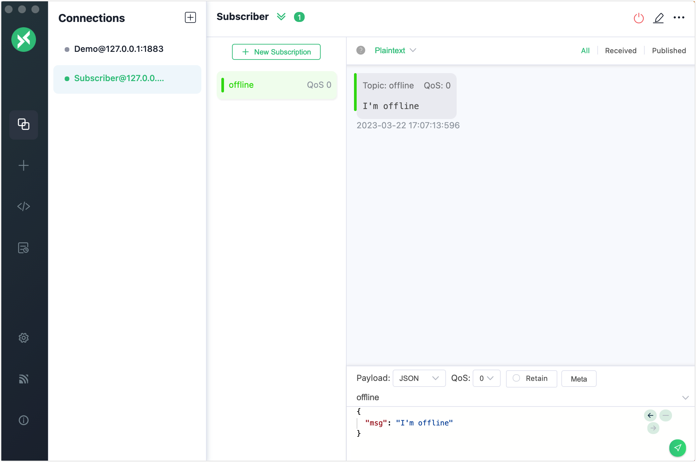

# Will Message

The EMQX implements the will message feature of MQTT. If a will message is set for a client, EMQX sends the message to relevant subscribers when the client is accidentally disconnected, so that the subscribers can be informed and update the client status.

You can use client tools to test this messaging service in EMQX. This section introduces how to use the [MQTT X Client](https://mqttx.app/) and [MQTT X CLI](https://mqttx.app/cli) to simulate clients and test how a will message is published and received.

:::tip Prerequisites

- Knowledge about MQTT [Will Message](./mqtt-concepts.md/#will-message)
- Basic publishing and subscribing operations using [MQTT X](./publish-and-subscribe.md)

:::

## Publish Will Message with MQTT X Client

1. Start the MQTT X Client. Click the **New Connection** to create an MQTT connection named "Demo".

   - The localhost `127.0.0.1` is used as an example in this demonstration.

   ::: tip

   For detailed instructions on creating an MQTT connection, see [MQTT X Client](./publish-and-subscribe.md).

   :::

   

   In **Last Will and Testament** section, fill in the will message configuration.

   - **Last-Will Topic**: Type `offline`.
   - **Last-Will QoS**: Set as the default value `0`.
   - **Last-Will Retain**: Set disabled as default. If enabled, the will message will also be a retained message.
   - **Last-Will Payload**: Type `I'm offline`.
   - **Will Delay Intervals (s)**: Set `5` seconds.

   

   Leave the rest settings as default. Click the **Connect** button.

2. Create a new connection for another client. Type the connection name as `Subscriber`.

3. Click **New Subscription** in the **Subscribe** pane. Type `offline` in the **Topic** textbox. Leave the other settings as default. Click the **Confirm** button.

   

4. Select the client connection named "Demo" in the **Connections** pane. Right click and select **New Window**. In the new window, click the **Connect** button. 

   

5. Close the new window and wait for 5 seconds. The client connection "Subscriber" receive a will message `I'm offline`.

   

   

## Publish Will Message with MQTT X CLI

1. Initiate a connection request with one client. Set the topic to `t/1` and payload to `A will message from MQTTX CLI`:

   ```bash
   $ mqttx conn -h 'localhost' -p 1883 --will-topic 't/1' --will-message 'A will message from MQTTX CLI'
   Connected
   ```

2. Subscribe to topic `t/1` with another client for receiving the will messages:

   ```bash
   mqttx sub -t 't/1' -h 'localhost' -p 1883 -v
   ```

3. Disconnect the client specified in Step 1, then the client specified in Step 2 will receive the will message:

   ```bash
   topic:  t/1
   payload:  A will message from MQTTX CLI
   ```

