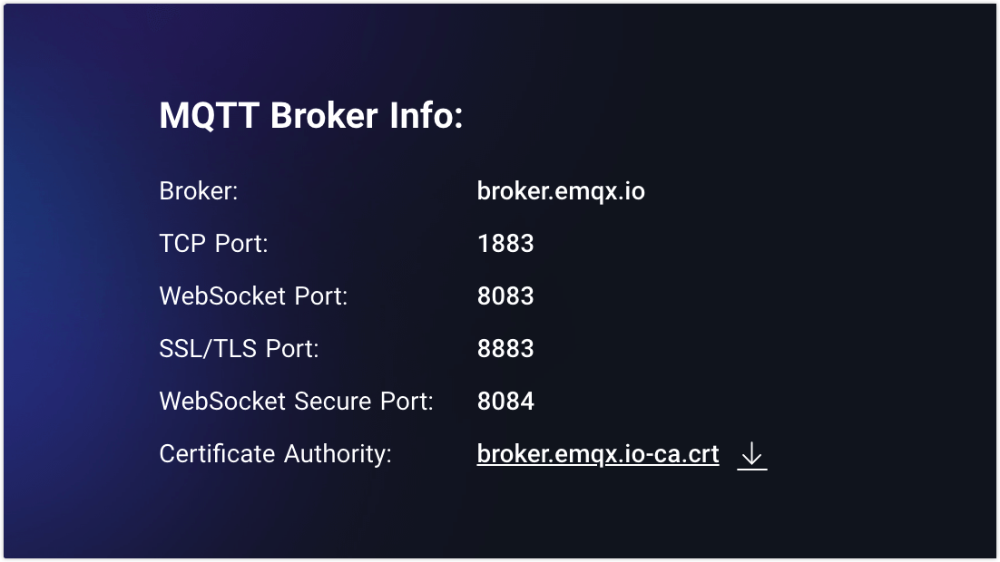
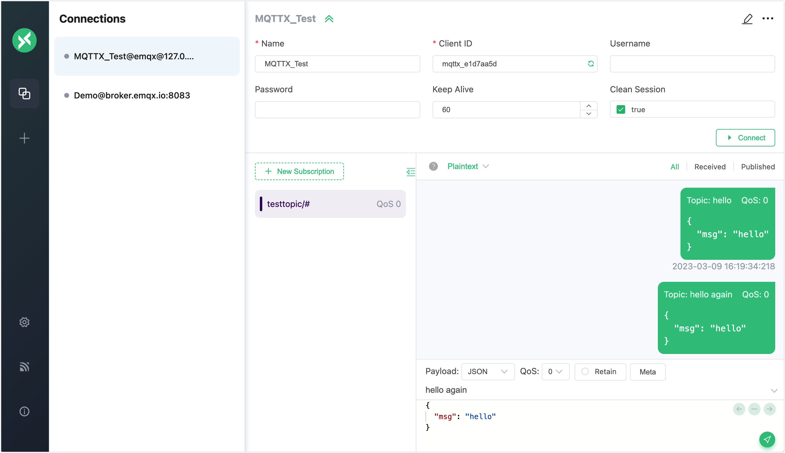

# Test with MQTT Clients 

It is more safe and efficient for the developers to test the EMQX messaging services using client tools before connecting the real-time devices to the EMQX broker and developing the IoT applications. If some errors are detected during the testing, the developers can troubleshoot them in the test environment rather than in production.

Even before a local deployment of EMQX, you can also leverage the free online public [MQTT broker](https://www.emqx.com/en/mqtt/public-mqtt5-broker) and MQTT client tools provided by [EMQ](https://www.emqx.com) as verification tools for quick testing of the MQTT messaging services and application development. 



This chapter introduces the commonly used MQTT 5.0 client tools and provides a simple demonstration on how to use these tools to test the following messaging services:

- Establish client connections
- Subscribe to topics
- Publish messages
- Receive and view messages

## MQTT X

[MQTT X](https://mqttx.app) is an elegant cross-platform MQTT 5.0 verification tool open-sourced by EMQ. It includes 3 types of tools. 

- MQTT X Client
- MQTT X CLI
- MQTT Web

### MQTT X Client

[MQTT X Client](https://mqttx.app) is a cross-platform MQTT desktop client tool. It provides users with an easy-to-use graphic interface to allow users to quickly create, test MQTT connections, and publish/subscribe MQTT messages. 

Before you test, download, and install the MQTT X Client:

1. Download the installation package from the application store or [MQTT X website](https://mqttx.app/) based on your operating system. 
2. Install the MQTT X Client. For detailed instructions, see [MQTT X - Installation](https://mqttx.app/docs/downloading-and-installation).

Follow the instructions below to use the MQTT X desktop client for a simple test:

1. Start the MQTT X Client. Click the **New Connection** to create an MQTT connection.

2. Configure the new connection. 

   In the **General** section, fill in the general information of the client. 

   - **Name**: Type a connection `Name`. 
   - **Client ID**: Leave it as default. It is the one and only identification of a client connection and can be automatically generated by clicking the refresh button.
   - **Host**: Select the protocol to be used. Select `mqtt://` or `ws://`. If an `SSL/TLS` authentication connection is used, you need to select `mqtts://` or `Wss://`. The host IP address is set to `broker.emqx.io` by default, indicating you will connect to the public broker. If you are working with your own EMQX, replace it with the actual IP.
   - **Port**: Type the port corresponding to the selected protocol.
   - **Username** and **Password**: Fill in the username and password if your broker enables user authentication or just leave them blank.
   - **SSL/TLS**: Enable the SSL/TLS by clicking the toggle button if an `SSL/TLS` authentication connection is used.

   Leave the rest settings as default. Click the **Connect** button.

   

3. After the successful connection, type the topic heading `test` in the text box and compose the message as shown in the screenshot. Click the send button. A message under the topic `test` appears in the dialogue box.

   

4. Create another new connection following the configuration instruction in step 2 and set the name to `Subscriber`. 

5. Select the connection named "Subscriber" in the **Connections** pane. Click the **New Subscription**. 

   **Topic**: Type `test` in the text box. 

   **QoS**: Set as the default value.

   **Color**: You can select the color to mark the description.

   Leave other options empty for the general test. <!--Add details later if needed-->

   Click the **Confirm** button.

   

6. Select the client `Demo` at the **Connections** pane. Publish a new message on the topic `test`. You can see the client named `Subscriber` receives a new message.

   

Now you have tried the basic publishing and subscribing operations using the MQTT X Client. For detailed and advanced operations, see [MQTT X - Publish and Subscription](https://mqttx.app/docs/get-started#publish-and-subscription).

### MQTT X CLI

[MQTT X CLI](https://mqttx.app/cli) is an open-source MQTT 5.0 command line tool provided by EMQ. It is an [MQTT X](https://mqttx.app) tool running on the command line tool so users can test and debug MQTT services and applications with no need for a graphic interface. 

Follow the instructions below to connect, publish/subscribe, and view messages using MQTT X CLI:

1. Download and install MQTT CLI. The demonstration takes macOS as an example, for the other operating systems, see [MQTT X CLI - Installation](https://mqttx.app/docs/cli/downloading-and-installation). 

   ```bash
   # Homebrew
   brew install emqx/mqttx/mqttx-cli
   # Intel Chip
   curl -LO https://www.emqx.com/zh/downloads/MQTTX/v1.9.0/mqttx-cli-macos-x64
   sudo install ./mqttx-cli-macos-x64 /usr/local/bin/mqttx
   # Apple Silicon
   curl -LO https://www.emqx.com/zh/downloads/MQTTX/v1.9.0/mqttx-cli-macos-arm64
   sudo install ./mqttx-cli-macos-arm64 /usr/local/bin/mqttx
   ```


2. In the command line tool, execute the following command to connect to EMQX and subscribe to the `testtopic/#` topic:

   ```shell
   mqttx sub -t 'testtopic/#' -q 1 -h 'localhost' -p 1883 'public' -v
   ```

   Parameter Description:

   - `-t`: Subscription topic
- `-q`: QoS of the message (default: 0)
   - `-h`: IP address of the listener (default: `localhost`)
   - `-p`: Broker port (default:`1883`)
   - `-v`: Print the topic before the message
   
   After successful execution, the command line will be in blocking receive state and will print the message after receiving the message.

   For information on more parameters, see  [MQTT X CLI - Subscribe](https://mqttx.app/docs/cli/get-started#subscribe).

3. Open a new command line window, execute the command below to connect to EMQX, and publish a message to topic `testtopic/#`:

   ```bash
   mqttx pub -t 'testtopic/1' -q 1 -h 'localhost' -p 1883 -m 'from MQTTX CLI'
   ```

   Parameters:

   - `-t`: Subscription topic
   - `-q`: QoS of the message (default: 0)
   - `-h`: IP address of the listener (default: `localhost`)
   - `-p`: Broker port (default:`1883`)
   - `-m`: Message body
   
   After successful execution, the command line will establish the connection, publish the message and then disconnect from the broker, and the command line window in step 2 will print the following message:
   
   ```bash
   topic:  testtopic/1
   payload:  from MQTTX CLI
   ```

   For information on more parameters, see  [MQTT X CLI - Publish](https://mqttx.app/docs/cli/get-started#publish).

### MQTT X Web

[MQTT X Web](https://mqttx.app/web) is a browser-based MQTT 5.0 WebSocket client tool. You can use it to complete the development and debugging via MQTT over WebSocket, with no need to download or install any tools. The testing operations using the MQTT X Web is basically the same as using the [MQTT X Client](#mqtt-x-client).



## Dashboard WebSocket 

[EMQX Dashboard](../dashboard/introduction.md) provides a WebSocket client as a quick and highly effective MQTT test tool. With this MQTT over WebSocket, you can test connecting to EMQX, subscribing to topics, and publishing messages.  

1. In EMQX Dashboard, click **Diagnose** -> **WebSocket Client** on the left navigation menu. 

2. Fill in the connection information in the **Connection** section. 

   - **Host**: Fill in the corresponding IP address (Default:  `localhost`).
   - **Port**: Keep the default port `8083`.
   - **Username** and **Password**: Fill in the username and password if there are any or just leave them blank if no access control is used. 

   Leave other settings as default.

3. Click the **Connect** button to establish a connection.

4. Set the **topic** to subscribe as `testtopic/#` in the **Subscription** section. Click the **Subscribe** button to finish the subscription. The topic `testtopic/#`  will be added to the table below.

   

   After the subscription, all messages matching the topic will be forwarded to this connection.

5. Set the topic for the message to be published in the **Publish** section. 

   - **Topic**: Set to `testtopic/1` (wildcards like `+` and `#` are not supported).
   - **Payload**: Set to `{"msg": 'Hello"}`.
   - **QoS**: Set as default value `0`. 
   - **Retain**: Select the checkbox if you want to set it as a retained message. For more information on retained messages, see [Retained Message](./mqtt-concepts.md).

   Click the **Publish** button, and one record will be added to the **Published** section below. The message will be routed to all subscribers. As the publisher is also the receiver in this test, one new record will also be added to the **Received** section below.

   


