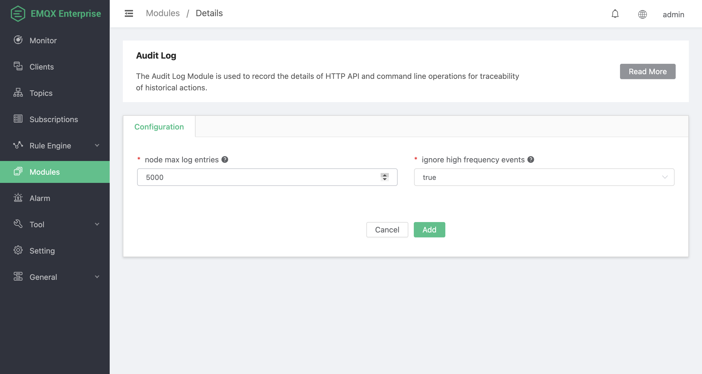

# Audit Log

The Audit Log feature can record critical operations on the EMQX cluster to meet enterprise compliance and data security requirements. You can refer to the [Audit Log](../advanced/audit-log.md) for usage instructions. You can add the audit log module and configure the feature on the Dashboard modules page. This page introduces how to add the audit log module in Dashboard.

## Add Audit Log Module

1. Click **Modules** from the left navigation menu on the Dashboard.
2. Click the **Add Module** button on the page.
3. On the module select page, click the **Local Modules** tab.
4. Navigate to **Audit Log** and click **Select**.
5. Configure the following options for the audit log module.
   - **Node max log entries**: The upper limit of stored log entries, with a default value of `5000`. Once the number of stored log entries reaches this limit, the earliest recorded log entry on that node is automatically deleted to make room for new log entries. This helps control the number of logs per node to prevent excessive resource consumption that could impact performance.
   - **Ignore high frequency events**: By default, it ignores high-frequency operations in certain scenarios, with a default value of `true`. High-frequency events include operations such as subscribe/publish/unsubscribe and kicking a specific client. These operations might be frequently called through the REST API, resulting in an excessive number of audit log entries. When enabled, EMQX will ignore these high-frequency events and not record them in the audit log to reduce the log volume. If you need to record these high-frequency events, you can set this parameter to `false`.

6. Click **Add** to add the module. You will see the audit log appear on the modules page.

   
