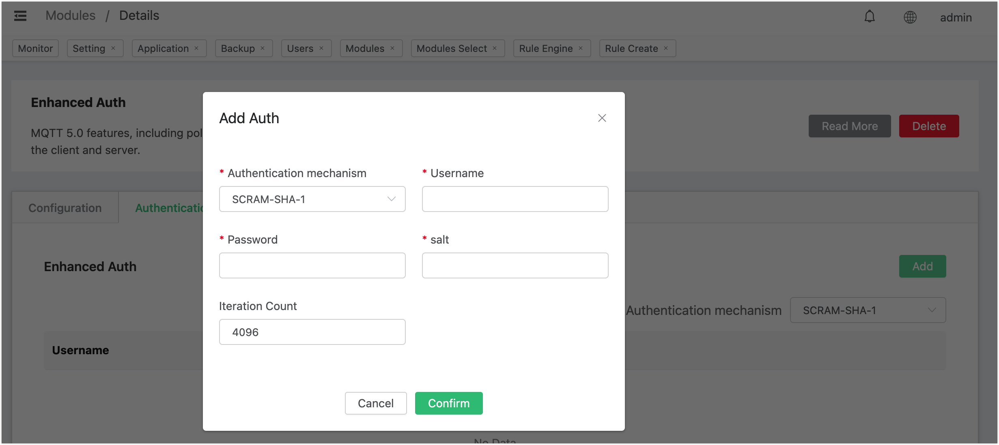

# MQTT 增强认证

EMQX 还为用户提供了基于 [Salted Challenge Response Authentication Mechanism（SCRAM）](https://doubleoctopus.com/security-wiki/protocol/salted-challenge-response-authentication-mechanism/)的增强认证功能。

SCRAM 认证是一种比密码认证更复杂的机制，它依赖与 MQTT 5.0 提供的增强认证机制，需要在连接期间交换额外的 MQTT 报文。同时由于 SCRAM 认证不依赖外部数据源，因此使用更加简单轻量。

::: tip

SCRAM 认证仅支持使用 MQTT v5.0 的连接。

:::

## 通过 Dashboard 配置

在 [EMQX Dashboard ](http://127.0.0.1:18083/#/authentication)页面，点击左侧导航栏的**模块**，点击**添加模块**。

在**模块/选择**页面，通过关键词检索找到 **MQTT 增强认证**模块。将鼠标指向 MQTT 增强认证，点击 选择。在随后的**参数设置**页面，点击**添加**。

**MQTT 增强认证**功能无需进一步的参数配置，在随后打开的模块/详情页，点击**添加**即可启用 MQTT 增强认证。后续您可在**模块**页面停止该模块，或点击**管理**配置认证信息。在随后打开的 **MQTT 增强认证**页面，点击**认证信息**页签，随后点击**添加**，即可创建相关认证信息。

