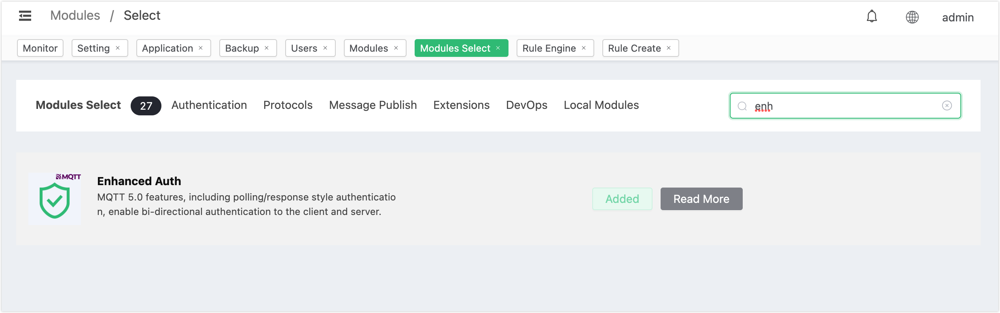

# MQTT 5.0 Enhanced Authentication

EMQX also supports the MQTT 5.0 enhanced authentication. This authenticator implements [Salted Challenge Response Authentication Mechanism (SCRAM) (opens new window)](https://en.wikipedia.org/wiki/Salted_Challenge_Response_Authentication_Mechanism)authentication and uses the built-in database of EMQX to store client credentials (*users*).

SCRAM is a more complicated mechanism than password verification. It requires exchanging additional MQTT packages during connection. SCRAM authentication does not depend on external data sources, and it is simple and lightweight to use.

TIP

SCRAM authenticator only supports MQTT 5.0 connection.

## Configure with Dashboard

On [EMQX Dashboard](http://127.0.0.1:18083/#/authentication), click on the **Modules** option in the left navigation menu. Then, click on **Add Module**.

On the **Modules/Select** page, search for the **Enhanced Auth** module. Hover over the module and click on **Select**. 

The **Enhanced Auth** feature does not require further parameter configuration. On the subsequent **Parameter Settings** page, click on **Add** to enable the module. You can later stop the module on the **Modules** page or click on **Manage** to configure authentication information. On the subsequent **Enhanced Auth** page, click on the **Authentication Info** tab, then click on **Add** to create relevant authentication information.

