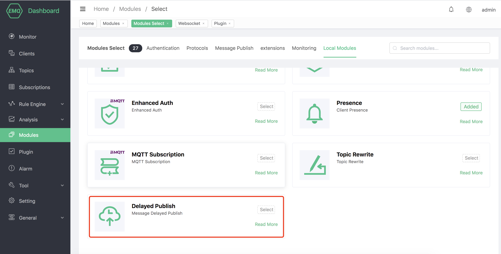

# Delayed publish

## Create module

Open [EMQ X Dashboard](http://127.0.0.1:18083/#/modules), click the "Modules" tab on the left, and choose to add:


Select delayed publish module, no need to configure parameters, directly open



## Introduction to delayed publish
The delayed publication function of EMQ X can realize the function of delaying the publication of PUBLISH packets according to the time interval configured by the user. When the client uses the special subject prefix `$delayed/{DelayInteval}` to publish messages to EMQ X, the delayed publishing function will be triggered.

The specific format of the delayed publish topic is as follows:

```bash
$delayed/{DelayInterval}/{TopicName}
```

-`$delayed`: All messages that use `$delay` as the subject prefix will be regarded as messages that need to be delayed. The delay interval is determined by the content in the next topic level.
-`{DelayInterval}`: Specify the time interval for delaying the publication of this MQTT message, in seconds. The maximum allowed interval is 4294967 seconds. If `{DelayInterval}` cannot be parsed as an integer number, EMQ X will discard the message and the client will not receive any information.
-`{TopicName}`: Topic name of MQTT message.

E.g:

-`$delayed/15/x/y`: Publish the MQTT message to topic `x/y` after 15 seconds.
-`$delayed/60/a/b`: Publish MQTT message to ʻa/b` in 1 minute.
-`$delayed/3600/$SYS/topic`: MQTT messages will be published to `$SYS/topic` in 1 hour.