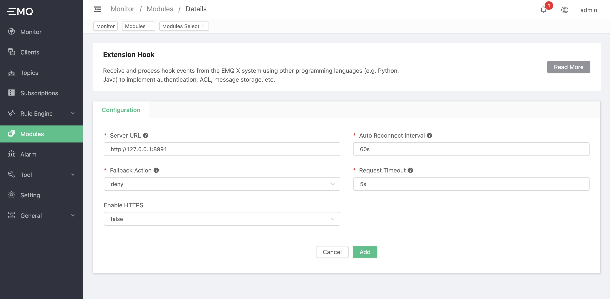

# Multi-language extension-hook

In EMQX Enterprise 4.2.0, we provide multi-language extension support. Among them, the **Multilingual Extension Hook** module allows the use of other programming languages ​​(such as Python, Java, etc.) to directly mount hooks to the EMQX system to receive and process the hook events of the EMQX system to achieve the expansion and customization of EMQX purpose. For example, users can customize using other programming languages:

-Authentication and authorization of client access
-ACL authentication for publish/subscribe
-Persistence and bridging of messages
-Publish/subscribe, or notification processing of client online and offline events

## Design

**Multi-language extension hook** function is provided by the ʻemqx-exhook` plugin. It uses [gRPC](https://www.grpc.io) as the communication framework for RPC.

The architecture is as follows:

```
  EMQX
+========================+                 +========+==========+
|    ExHook              |                 |        |          |
|   +----------------+   |      gRPC       | gRPC   |  User's  |
|   |   gRPC Client  | ------------------> | Server |  Codes   |
|   +----------------+   |    (HTTP/2)     |        |          |
|                        |                 |        |          |
+========================+                 +========+==========+
```

It shows: The ExHook module in EMQX acts as a gRPC client, sending all hook events in the system to the user's gRPC server.

Consistent with EMQX's native hook, it also supports chained calculation and return:


## Interface design

As the event processing end, that is, the gRPC server. It requires a user-defined implementation of the hook list that needs to be mounted, and the callback function for how to handle each hook event after it arrives. These interfaces are defined as a gRPC service named `HookProvider` in **Multilingual Extension Hook**. The list of interfaces that need to be implemented includes:

```
syntax = "proto3";

package emqx.exhook.v1;

service HookProvider {

  rpc OnProviderLoaded(ProviderLoadedRequest) returns (LoadedResponse) {};

  rpc OnProviderUnloaded(ProviderUnloadedRequest) returns (EmptySuccess) {};

  rpc OnClientConnect(ClientConnectRequest) returns (EmptySuccess) {};

  rpc OnClientConnack(ClientConnackRequest) returns (EmptySuccess) {};

  rpc OnClientConnected(ClientConnectedRequest) returns (EmptySuccess) {};

  rpc OnClientDisconnected(ClientDisconnectedRequest) returns (EmptySuccess) {};

  rpc OnClientAuthenticate(ClientAuthenticateRequest) returns (ValuedResponse) {};

  rpc OnClientCheckAcl(ClientCheckAclRequest) returns (ValuedResponse) {};

  rpc OnClientSubscribe(ClientSubscribeRequest) returns (EmptySuccess) {};

  rpc OnClientUnsubscribe(ClientUnsubscribeRequest) returns (EmptySuccess) {};

  rpc OnSessionCreated(SessionCreatedRequest) returns (EmptySuccess) {};

  rpc OnSessionSubscribed(SessionSubscribedRequest) returns (EmptySuccess) {};

  rpc OnSessionUnsubscribed(SessionUnsubscribedRequest) returns (EmptySuccess) {};

  rpc OnSessionResumed(SessionResumedRequest) returns (EmptySuccess) {};

  rpc OnSessionDiscarded(SessionDiscardedRequest) returns (EmptySuccess) {};

  rpc OnSessionTakeovered(SessionTakeoveredRequest) returns (EmptySuccess) {};

  rpc OnSessionTerminated(SessionTerminatedRequest) returns (EmptySuccess) {};

  rpc OnMessagePublish(MessagePublishRequest) returns (ValuedResponse) {};

  rpc OnMessageDelivered(MessageDeliveredRequest) returns (EmptySuccess) {};

  rpc OnMessageDropped(MessageDroppedRequest) returns (EmptySuccess) {};

  rpc OnMessageAcked(MessageAckedRequest) returns (EmptySuccess) {};
}
```

The HookProvider part:

- `OnProviderLoaded`: Define how the HookProvider is loaded and return the list of hooks that need to be mounted. Only the hooks in this list will be called back to the HookProivder service.
- `OnProviderUnloaded`: Define how the HookProvider is unloaded, only for notification.

Hook event part:

- Methods prefixed with `OnClient`, `OnSession`, `OnMessage` correspond to the methods in [hooks](../advanced/hooks.md) one-to-one. They have the same calling timing and similar parameter lists.
- Only `OnClientAuthenticate`, `OnClientCheckAcl`, `OnMessagePublish` are allowed to carry the return value to the EMQ X system, other callbacks are not supported.

For details of the interface and parameter data structure, please refer to: [exhook.proto](https://github.com/emqx/emqx/blob/master/apps/emqx_exhook/priv/protos/exhook.proto)


## Development Guide

When users use the multi-language extension hook function, they need to implement the gRPC service of `HookProvider` to receive the callback events sent by ExHook.

The steps are as follows:

1. Copy the current version of `lib/emqx_exhook-<x.y.z>/priv/protos/exhook.proto` file.
2. Use the gRPC framework of the corresponding programming language to generate the gRPC server code of ʻexhook.proto`.
3. Implement the interface defined in exhook.proto as needed.

After the development is completed, the service needs to be deployed to a server that can communicate with EMQX, and the port is open.

The gRPC framework of each language can refer to: [grpc-ecosystem/awesome-grpc](https://github.com/grpc-ecosystem/awesome-grpc)


## Create module

After successfully deploying the `HookProvider` service, you can open the multilingual hook extension module through the dashboard page and configure its service address to use it normally.

Open [EMQX Dashboard](http://127.0.0.1:18083/#/modules), click the "Modules" tab on the left, and choose to add:


Select "Multilingual Extension Hook":


Configure `HookProvider` service related parameters:



After clicking add, the module is added


So far, the configuration of the multi-language extension hook has been completed.
