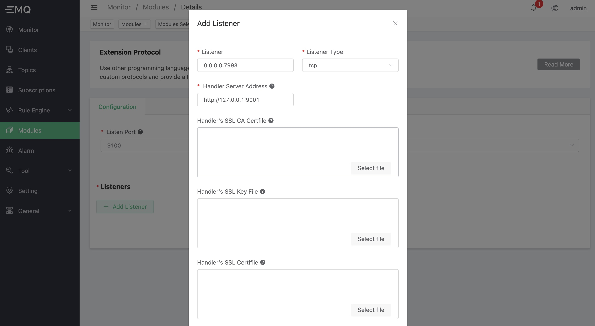

# Multi-language extension-protocol access

In EMQX Enterprise 4.2.0, we provide multi-language extension support. Among them, the **Multilingual Extended Protocol Access** module allows other programming languages ​​(such as Python, Java, etc.) to directly process byte data messages to achieve custom protocol analysis, and provides Pub/Sub interfaces to achieve message exchange with the system .

The scalability brought by this function to EMQX is very powerful. It can process any proprietary protocol in a programming language familiar to users, and enjoy the advantages of extremely high concurrent connections brought by the EMQX system.

## Features

-Very strong expansion capability. Use gRPC as the RPC communication framework to support various mainstream programming languages
-Fully asynchronous IO. The connection layer is implemented in a completely asynchronous non-blocking I/O way
-The connection layer is transparent. Fully support TCP\TLS UDP\DTLS connection management, and provide a unified API for the upper layer
-Connection management capabilities. For example, the maximum number of connections, rate limits for connections and throughput, IP blacklists, etc.

## Architecture


The main contents of this module include:

1. **Connection layer:** This part mainly **maintains the life cycle of Socket, and the sending and receiving of data**. Its functional requirements include:

    -Listen to a port. When a new TCP/UDP connection arrives, a connection process is started to maintain the connection status.
    -Call the ʻOnSocketCreated` callback. Used to notify the external module that a new connection has been established**.
    -Call the ʻOnScoektClosed` callback. Used to notify the external module that the connection is **closed**.
    -Call the ʻOnReceivedBytes` callback. Used to notify the external module ** the newly received data packet for this connection**.
    -Provide `Send` interface. Called by external modules, **used to send data packets**.
    -Provide `Close` interface. Called by external modules, **used to actively close the connection**.

2. **Protocol/session layer:** This part mainly provides PUB/SUB interface** to realize message intercommunication with the EMQX Broker system. include:

    -Provide ʻAuthenticate` interface. Used by external modules to register clients to the cluster.
    -Provide `StartTimer` interface. Called by external modules to start timers such as heartbeat for the connection process.
    -Provide `Publish` interface. Used by external modules to publish messages in EMQX Broker.
    -Provide the `Subscribe` interface. It is used by external modules to subscribe to a topic in order to receive certain downlink messages from EMQX Broker.
    -Provide the ʻUnsubscribe` interface. Called by external modules to unsubscribe a topic.
    -Call the ʻOnTimerTimeout` callback. It is used to handle events that the timer expires.
    -Call the ʻOnReceivedMessages` callback. Used to receive downlink messages (after subscribing to the topic successfully, if there is a message on the topic, this method will be called back)

## Interface design

From the gRPC perspective, ExProto will act as a client to send callback requests to the `ConnectionHandler` service. At the same time, it will also serve as a server to provide `ConnectionAdapter` services to external modules to provide various interface calls. As shown:


For details, see: [exproto.proto](https://github.com/emqx/emqx-exproto/blob/dev/e4.2.0/priv/protos/exproto.proto), for example, the definition of the interface is:

```protobuff
syntax = "proto3";

package emqx.exproto.v1;

// The Broker side service. It provides a set of APIs to
// handle a protocol access
service ConnectionAdapter {

  // - socket layer

  rpc Send(SendBytesRequest) returns (CodeResponse) {};

  rpc Close(CloseSocketRequest) returns (CodeResponse) {};

  // - protocol layer

  rpc Authenticate(AuthenticateRequest) returns (CodeResponse) {};

  rpc StartTimer(TimerRequest) returns (CodeResponse) {};

  // - pub/sub layer

  rpc Publish(PublishRequest) returns (CodeResponse) {};

  rpc Subscribe(SubscribeRequest) returns (CodeResponse) {};

  rpc Unsubscribe(UnsubscribeRequest) returns (CodeResponse) {};
}

service ConnectionHandler {

  // - socket layer

  rpc OnSocketCreated(SocketCreatedRequest) returns (EmptySuccess) {};

  rpc OnSocketClosed(SocketClosedRequest) returns (EmptySuccess) {};

  rpc OnReceivedBytes(ReceivedBytesRequest) returns (EmptySuccess) {};

  // - pub/sub layer

  rpc OnTimerTimeout(TimerTimeoutRequest) returns (EmptySuccess) {};

  rpc OnReceivedMessages(ReceivedMessagesRequest) returns (EmptySuccess) {};
}
```

## Development Guide

Before using this module, users need to develop and deploy a gRPC service and implement the interface defined by ʻexproto.proto`.

The steps are as follows:

1. Copy the current version of `lib/emqx_exproto-<x.y.z>/priv/protos/exproto.proto` file.
2. Use the gRPC framework of the corresponding programming language to generate the gRPC server code of ʻexproto.proto`.
3. Implement the interface of the `ConnectionHandler` service in exproto.proto.

After the development is completed, the service needs to be deployed to a server that can communicate with EMQX, and the port is open.

The gRPC framework of each language can be referred to: [grpc-ecosystem/awesome-grpc](https://github.com/grpc-ecosystem/awesome-grpc)


## Create module

After successfully deploying the gRPC service, you can open the multi-language extension protocol access module through the dashboard page, and configure the following three parts to use it successfully:

1. The listening address of ExProto's `ConnectionApdapter` service. Used to receive gRPC requests.
2. Configure **Listener (Listener)** to provide TCP/UDP/SSL/DTLS address monitoring. Used to monitor and receive device connections.
3. Specify a service address of `ConnectionHandler` for each listener. A service used to send various event callbacks to users.

Open [EMQX Dashboard](http://127.0.0.1:18083/#/modules), click the "Modules" tab on the left, and choose to add:


Select "Multilingual Extended Protocol Access":


Configure the listening address of the `ConnectionAdapter` service, and whether to enable SSL listening for it:


Click "Add Listener" to configure the listener for the ExProto module, including:

1. The listener's `listening address` and `listening type`, which indicate how to receive the Socket connection of the custom protocol.
2. The `Handler Service Address` of the ConnectionHandler and possible SSL certificate configuration, which indicate how ExProto accesses the ConnectionHandler service.



Click OK to complete the listener addition; click Add to complete the creation of the module:


So far, the configuration of multi-language extended protocol access has been completed.