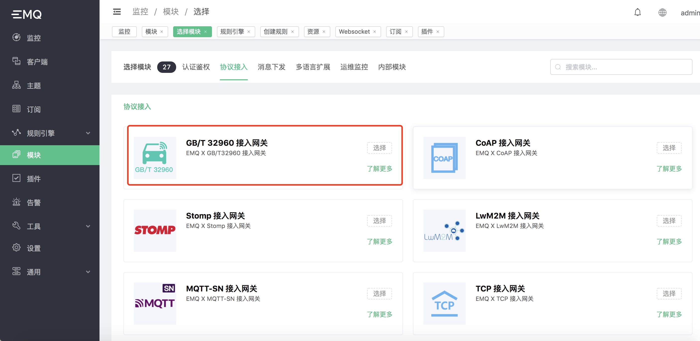
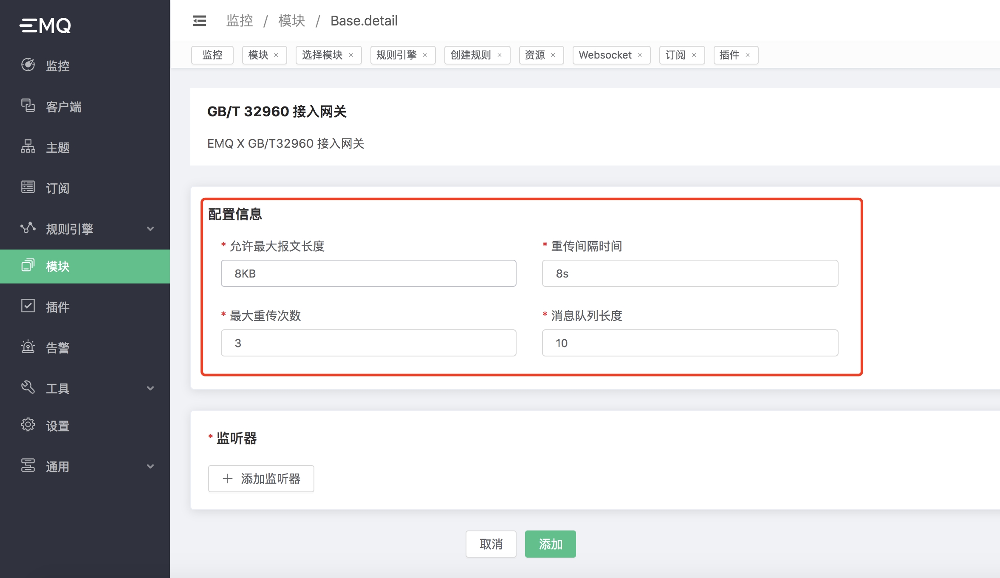
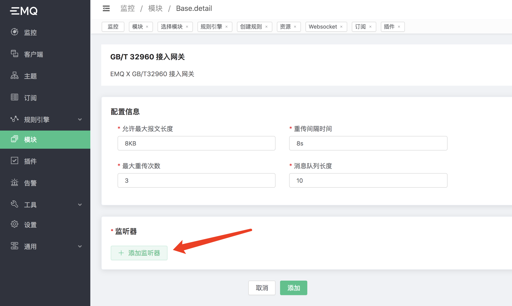
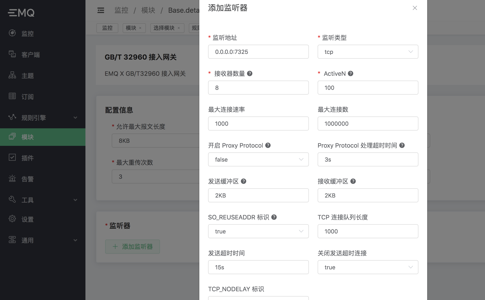
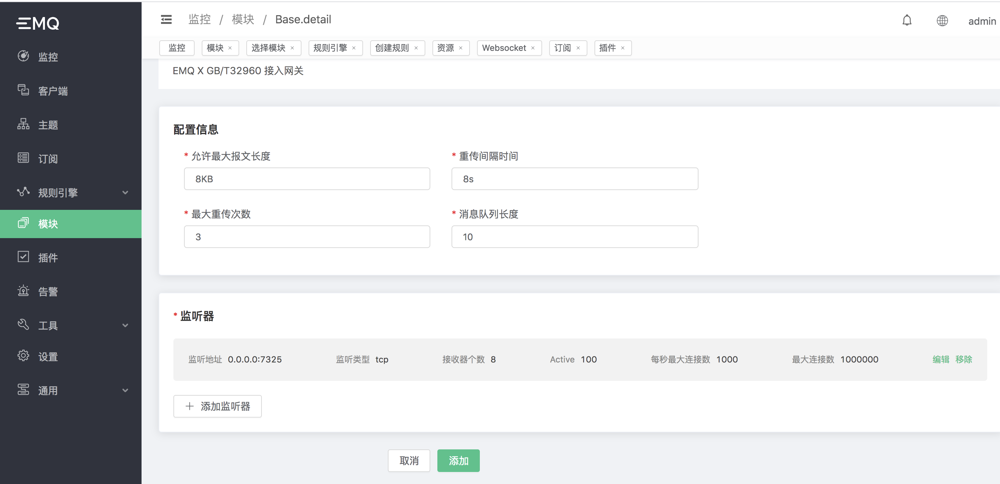
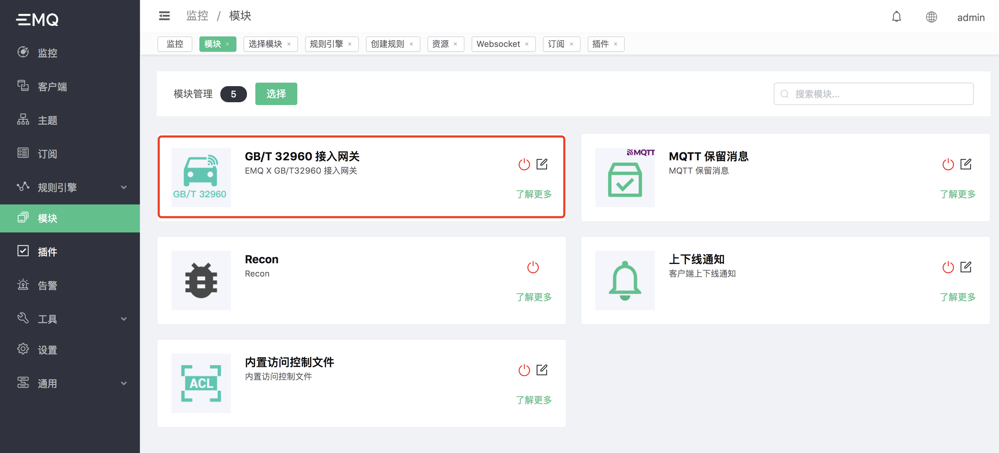

# GB/T 32960 Protocol Gateway

## Protocol Overview

**emqx-gbt32960** acts as an access gateway for EMQX. Based on its functional logic and its relation to the overall system, the message exchange process can be divided into three parts: Terminal side, Broker side, and Other side:

```
|<-- Terminal -->|<----------- Broker Side ---------->|<---  Others  --->|
|<-    Side    ->|                                    |<--    Side    -->|

+---+                                                   PUB  +-----------+
| D |  INCOMING  +-------------+    PUB     +---------+   -->| subscriber|
| E |----------->|             |----------->|         |--/   +-----------+
| V |            |emqx-gbt32960|            |  EMQX  |
| I |<-----------|             |<-----------|         |<--   +-----------+
| C |  OUTGOING  +-------------+    PUB     +---------+   \--| publisher |
| E |                                                   PUB  +-----------+
+---+
```

1. **Terminal side**: Exchanges data using the GB/T 32960 protocol, supporting different types of data reporting and sending downstream messages to terminals.
2. **Broker side**: After decoding messages, `emqx-gbt32960` handles registration/authentication or publishes the data packets to specific topics; it also subscribes to downstream topics, converts the downstream PUBLISH messages into GB/T 32960 protocol message format, and sends them to the terminal.
3. **Other sides**: Can subscribe to the upstream PUBLISH message topics from (2) to receive reported messages or publish messages to downstream topics to send data to terminals.

## Create Module

Open the [EMQX Dashboard](http://127.0.0.1:18083/#/modules), click on the “Modules” tab on the left and choose to add:


Select the GB/T 32960 protocol gateway:



Configure basic parameters:



Add a listener port:



Configure listener parameters:



Click **Confirm** to go to the parameter configuration page:



Click **Add** to complete the module addition:



### Configuration Parameters

| Parameter               | Description                                         |
| ----------------------- | --------------------------------------------------- |
| Max Packet Length       | Maximum size of a single GB/T 32960 protocol packet |
| Retransmission Interval | Interval between message retransmissions            |
| Max Retransmissions     | Maximum number of retransmission attempts           |
| Message Queue Length    | Maximum length of the message cache queue           |

**Conventions:**

- Payloads are formatted in JSON
- JSON keys use **PascalCase**

## Data Reporting Flow

**Data flow**: Terminal -> emqx_gbt32960 -> EMQX

### Vehicle Login

Topic: `gbt32960/${vin}/upstream/vlogin`

```
{
  "Cmd": 1,
  "Encrypt": 1,
  "Vin": "1G1BL52P7TR115520",
  "Data": {
    "ICCID": "12345678901234567890",
    "Id": "C",
    "Length": 1,
    "Num": 1,
    "Seq": 1,
    "Time": {
      "Day": 29,
      "Hour": 12,
      "Minute": 19,
      "Month": 12,
      "Second": 20,
      "Year": 12
    }
  }
}
```

### Vehicle Logout

Topic: `gbt32960/${vin}/upstream/vlogout`

```
{
  "Cmd": 4,
  "Encrypt": 1,
  "Vin": "1G1BL52P7TR115520",
  "Data": {
    "Seq": 1,
    "Time": {
      "Day": 1,
      "Hour": 2,
      "Minute": 59,
      "Month": 1,
      "Second": 0,
      "Year": 16
    }
  }
}
```

### Information Reporting

Topic: `gbt32960/${vin}/upstream/info`

> Different information types differ only in the properties of the `Infos` object.
>  The `Type` field is used to distinguish message types.
>  `Infos` is an array, representing multiple info packets reported per message.

#### Vehicle Data

```
{
  "Cmd": 2,
  "Encrypt": 1,
  "Vin": "1G1BL52P7TR115520",
  "Data": {
    "Infos": [
      {
        "AcceleratorPedal": 90,
        "BrakePedal": 0,
        "Charging": 1,
        "Current": 15000,
        "DC": 1,
        "Gear": 5,
        "Mileage": 999999,
        "Mode": 1,
        "Resistance": 6000,
        "SOC": 50,
        "Speed": 2000,
        "Status": 1,
        "Type": "Vehicle",
        "Voltage": 5000
      }
    ],
    "Time": {
      "Day": 1,
      "Hour": 2,
      "Minute": 59,
      "Month": 1,
      "Second": 0,
      "Year": 16
    }
  }
}
```

#### Drive Motor Data

```json
{
    "Cmd": 2,
    "Encrypt": 1,
    "Vin": "1G1BL52P7TR115520",
    "Data": {
        "Infos": [
            {
                "Motors": [
                    {
                        "CtrlTemp": 125,
                        "DCBusCurrent": 31203,
                        "InputVoltage": 30012,
                        "MotorTemp": 125,
                        "No": 1,
                        "Rotating": 30000,
                        "Status": 1,
                        "Torque": 25000
                    },
                    {
                        "CtrlTemp": 125,
                        "DCBusCurrent": 30200,
                        "InputVoltage": 32000,
                        "MotorTemp": 145,
                        "No": 2,
                        "Rotating": 30200,
                        "Status": 1,
                        "Torque": 25300
                    }
                ],
                "Number": 2,
                "Type": "DriveMotor"
            }
        ],
        "Time": {
            "Day": 1,
            "Hour": 2,
            "Minute": 59,
            "Month": 1,
            "Second": 0,
            "Year": 16
        }
    }
}
```

#### Fuel Cell Data

```json
{
    "Cmd": 2,
    "Encrypt": 1,
    "Vin": "1G1BL52P7TR115520",
    "Data": {
        "Infos": [
            {
                "CellCurrent": 12000,
                "CellVoltage": 10000,
                "DCStatus": 1,
                "FuelConsumption": 45000,
                "H_ConcSensorCode": 11,
                "H_MaxConc": 35000,
                "H_MaxPress": 500,
                "H_MaxTemp": 12500,
                "H_PressSensorCode": 12,
                "H_TempProbeCode": 10,
                "ProbeNum": 2,
                "ProbeTemps": [120, 121],
                "Type": "FuelCell"
            }
        ],
        "Time": {
            "Day": 1,
            "Hour": 2,
            "Minute": 59,
            "Month": 1,
            "Second": 0,
            "Year": 16
        }
    }
}
```

#### Engine Data

```json
{
    "Cmd": 2,
    "Encrypt": 1,
    "Vin": "1G1BL52P7TR115520",
    "Data": {
        "Infos": [
            {
                "CrankshaftSpeed": 2000,
                "FuelConsumption": 200,
                "Status": 1,
                "Type": "Engine"
            }
        ],
        "Time": {
            "Day": 1,
            "Hour": 22,
            "Minute": 59,
            "Month": 10,
            "Second": 0,
            "Year": 16
        }
    }
}
```

#### Vehicle Location Data

```json
{
    "Cmd": 2,
    "Encrypt": 1,
    "Vin": "1G1BL52P7TR115520",
    "Data": {
        "Infos": [
            {
                "Latitude": 100,
                "Longitude": 10,
                "Status": 0,
                "Type": "Location"
            }
        ],
        "Time": {
            "Day": 1,
            "Hour": 22,
            "Minute": 59,
            "Month": 10,
            "Second": 0,
            "Year": 16
        }
    }
}
```

#### Extreme Values Data

```json
{
    "Cmd": 2,
    "Encrypt": 1,
    "Vin": "1G1BL52P7TR115520",
    "Data": {
        "Infos": [
            {
                "MaxBatteryVoltage": 7500,
                "MaxTemp": 120,
                "MaxTempProbeNo": 12,
                "MaxTempSubsysNo": 14,
                "MaxVoltageBatteryCode": 10,
                "MaxVoltageBatterySubsysNo": 12,
                "MinBatteryVoltage": 2000,
                "MinTemp": 40,
                "MinTempProbeNo": 13,
                "MinTempSubsysNo": 15,
                "MinVoltageBatteryCode": 11,
                "MinVoltageBatterySubsysNo": 13,
                "Type": "Extreme"
            }
        ],
        "Time": {
            "Day": 30,
            "Hour": 12,
            "Minute": 22,
            "Month": 5,
            "Second": 59,
            "Year": 17
        }
    }
}
```

#### Alarm Data

```json
{
    "Cmd": 2,
    "Encrypt": 1,
    "Vin": "1G1BL52P7TR115520",
    "Data": {
        "Infos": [
            {
                "FaultChargeableDeviceNum": 1,
                "FaultChargeableDeviceList": ["00C8"],
                "FaultDriveMotorNum": 0,
                "FaultDriveMotorList": [],
                "FaultEngineNum": 1,
                "FaultEngineList": ["006F"],
                "FaultOthersNum": 0,
                "FaultOthersList": [],
                "GeneralAlarmFlag": 3,
                "MaxAlarmLevel": 1,
                "Type": "Alarm"
            }
        ],
        "Time": {
            "Day": 20,
            "Hour": 22,
            "Minute": 23,
            "Month": 12,
            "Second": 59,
            "Year": 17
        }
    }
}
```

#### Rechargeable Energy Storage Device Voltage Data

```json
{
    "Cmd": 2,
    "Encrypt": 1,
    "Vin": "1G1BL52P7TR115520",
    "Data": {
        "Infos": [
            {
                "Number": 2,
                "SubSystems": [
                    {
                        "CellsTotal": 2,
                        "CellsVoltage": [5000],
                        "ChargeableCurrent": 10000,
                        "ChargeableSubsysNo": 1,
                        "ChargeableVoltage": 5000,
                        "FrameCellsCount": 1,
                        "FrameCellsIndex": 0
                    },
                    {
                        "CellsTotal": 2,
                        "CellsVoltage": [5001],
                        "ChargeableCurrent": 10001,
                        "ChargeableSubsysNo": 2,
                        "ChargeableVoltage": 5001,
                        "FrameCellsCount": 1,
                        "FrameCellsIndex": 1
                    }
                ],
                "Type": "ChargeableVoltage"
            }
        ],
        "Time": {
            "Day": 1,
            "Hour": 22,
            "Minute": 59,
            "Month": 10,
            "Second": 0,
            "Year": 16
        }
    }
}
```

#### Rechargeable Energy Storage Device Temperature Data

```json
{
    "Cmd": 2,
    "Encrypt": 1,
    "Vin": "1G1BL52P7TR115520",
    "Data": {
        "Infos": [
            {
                "Number": 2,
                "SubSystems": [
                    {
                        "ChargeableSubsysNo": 1,
                        "ProbeNum": 10,
                        "ProbesTemp": [0, 0, 0, 0, 0, 0, 0, 0, 19, 136]
                    },
                    {
                        "ChargeableSubsysNo": 2,
                        "ProbeNum": 1,
                        "ProbesTemp": [100]
                    }
                ],
                "Type": "ChargeableTemp"
            }
        ],
        "Time": {
            "Day": 1,
            "Hour": 22,
            "Minute": 59,
            "Month": 10,
            "Second": 0,
            "Year": 16
        }
    }
}
```

## Data Resend

Topic: `gbt32960/${vin}/upstream/reinfo`

**Data format:** **Omitted** (Same as real-time data reporting).

## Downstream Data Flow

> Request Flow: EMQX -> emqx_gbt32960 -> Terminal
> Response Flow: Terminal -> emqx_gbt32960 -> EMQX

Downstream topic: `gbt32960/${vin}/dnstream`
Upstream response topic: `gbt32960/${vin}/upstream/response`

### Parameter Query

**Request:**

```json
{
  "Action": "Query",
  "Total": 2,
  "Ids": ["0x01", "0x02"]
}
```

**Response:**

```json
{
  "Cmd": 128,
  "Encrypt": 1,
  "Vin": "1G1BL52P7TR115520",
  "Data": {
    "Total": 2,
    "Params": [
      {"0x01": 6000},
      {"0x02": 10}
    ],
    "Time": {
      "Day": 2,
      "Hour": 11,
      "Minute": 12,
      "Month": 2,
      "Second": 12,
      "Year": 17
    }
  }
}
```

### Parameter Setting

**Request:**

```json
{
  "Action": "Setting",
  "Total": 2,
  "Params": [
    {"0x01": 5000},
    {"0x02": 200}
  ]
}
```

**Response:**

```json
// fixme? Does the terminal respond in this format?
{
  "Cmd": 129,
  "Encrypt": 1,
  "Vin": "1G1BL52P7TR115520",
  "Data": {
    "Total": 2,
    "Params": [
      {"0x01": 5000},
      {"0x02": 200}
    ],
    "Time": {
      "Day": 2,
      "Hour": 11,
      "Minute": 12,
      "Month": 2,
      "Second": 12,
      "Year": 17
    }
  }
}
```

### Terminal Control

> Command parameters vary depending on the command; empty if no parameters.

**Remote Upgrade:**

```json
{
  "Action": "Control",
  "Command": "0x01",
  "Param": {
    "DialingName": "hz203",
    "Username": "user001",
    "Password": "password01",
    "Ip": "192.168.199.1",
    "Port": 8080,
    "ManufacturerId": "BMWA",
    "HardwareVer": "1.0.0",
    "SoftwareVer": "1.0.0",
    "UpgradeUrl": "ftp://emqtt.io/ftp/server",
    "Timeout": 10
  }
}
```

**Terminal Shutdown:**

```json
{
  "Action": "Control",
  "Command": "0x02"
}
```

...

**Terminal Alarm:**

```json
{
  "Action": "Control",
  "Command": "0x06",
  "Param": {
    "Level": 0,
    "Message": "alarm message"
  }
}
```
