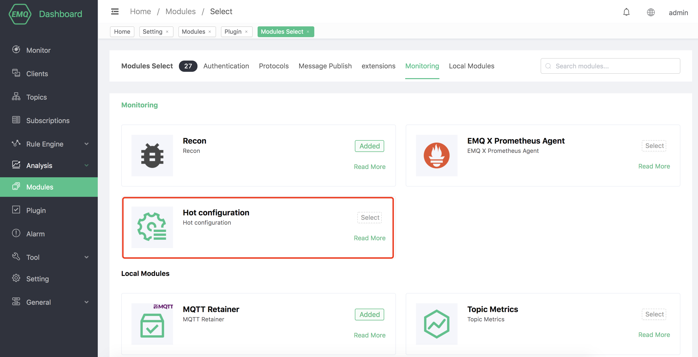
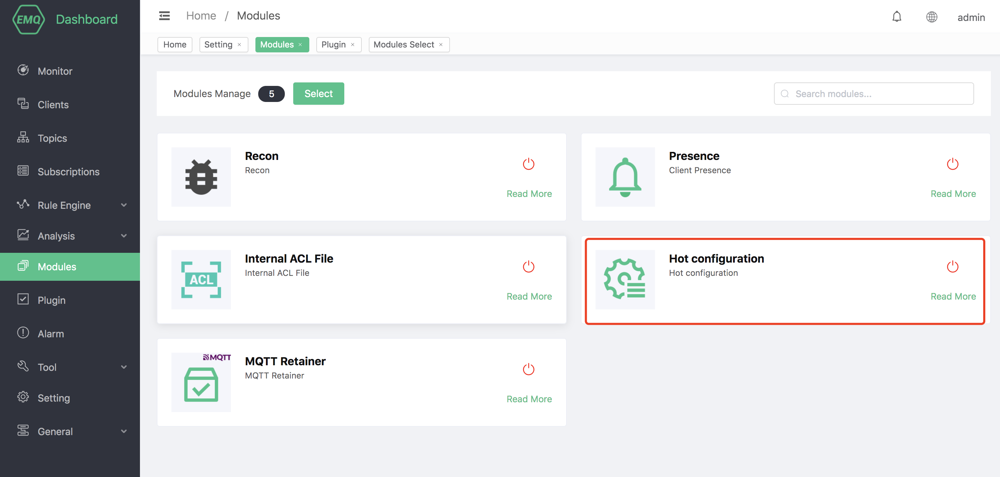
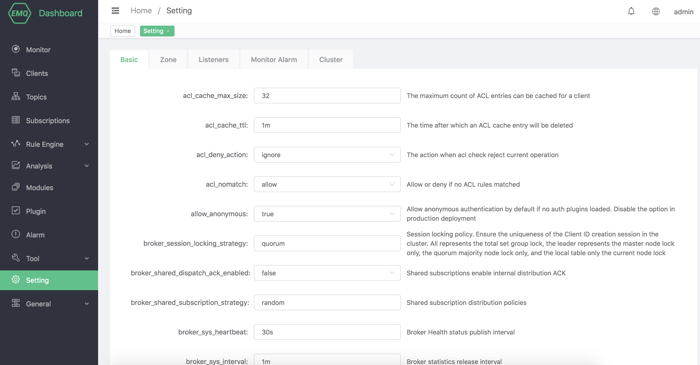

# Hot configuration

After the hot configuration is enabled, EMQX will copy a configuration copy from the configuration file, and all configurations that can be modified on the Dashboard will be persisted to the disk.
If modifying the configuration file will overwrite the hot configuration, please use it with caution.

## Create module

Open [EMQX Dashboard](http://127.0.0.1:18083/#/modules) and click on the "Modules" tab on the left:

Select the hot configuration module:

After clicking the selection, the module is added:

emqx provides more configuration modifications in dashboard, including basic configuration, zones, listeners, monitoring alarms, etc.

