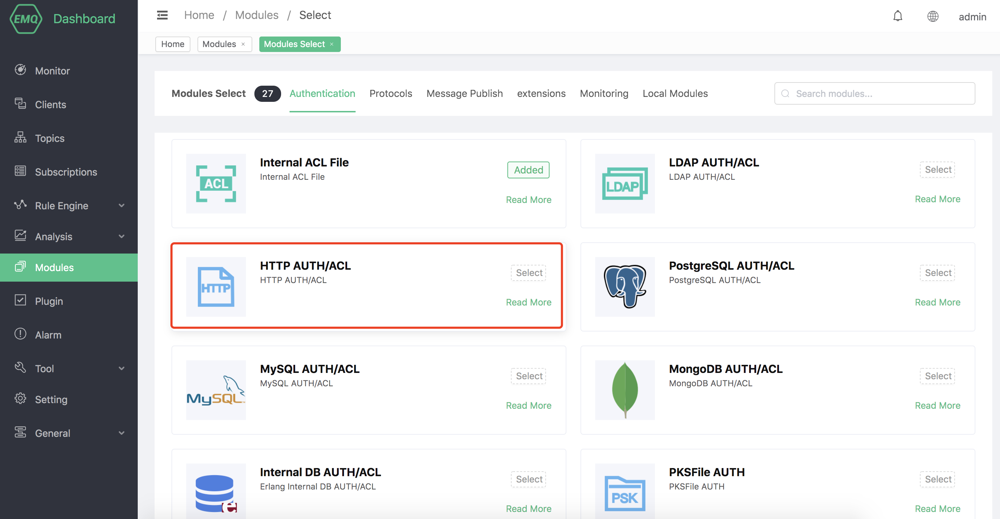
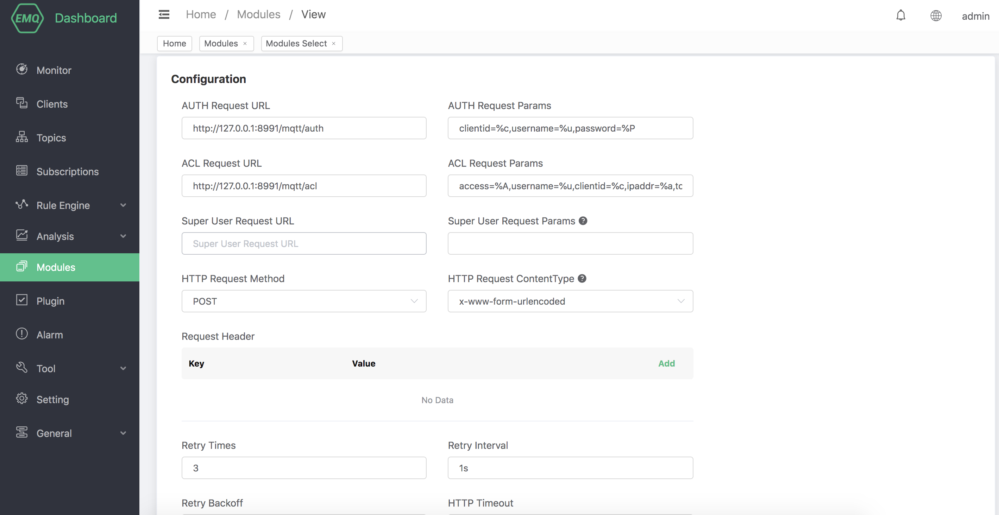
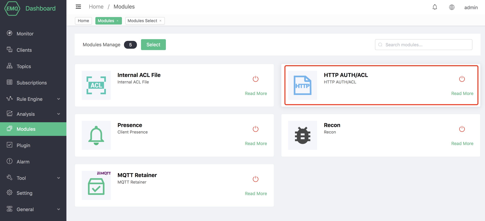

# HTTP Authentication/ACL

HTTP Authentication/ACL uses an external self-built HTTP application authentication data source, and judges the authentication result based on the data returned by the HTTP API, which can implement complex authentication logic and complex ACL verification logic.

## Create module

Open [EMQX Dashboard](http://127.0.0.1:18083/#/modules), click the "Modules" tab on the left, and choose to add:


Select HTTP Authentication/ACL module



Configure related parameters



After clicking add, the module is added




## HTTP authentication principle

EMQX uses the relevant information of the current client as parameters in the device connection event, initiates a request for query permissions to the user-defined authentication service, and processes the authentication request through the returned HTTP **response status code** (HTTP statusCode).

 -Authentication failed: The API returns status codes other than 200
 -Successful authentication: API returns 200 status code
 -Ignore authentication: API returns 200 status code and response body is `ignore`


## Authentication request

When performing identity authentication, EMQX will use the current client information to fill in and initiate the authentication query request configured by the user, and query the authentication data of the client on the HTTP server.

```bash

## Authentication request address
http://127.0.0.1:8991/mqtt/auth

## HTTP request method
## Value: POST | GET
POST

## Request parameters
clientid=%c,username=%u,password=%P
```

When the HTTP request method is GET, the request parameters will be passed in the form of URL query string; POST request will submit the request parameters in the form of ordinary form (content-type is x-www-form-urlencoded).

You can use the following placeholders in the authentication request. EMQX will automatically fill in the client information when requesting:

-%u: username
-%c: Client ID
-%a: Client IP address
-%r: Client access protocol
-%P: Plain text password
-%p: client port
-%C: TLS certificate common name (domain name or subdomain name of the certificate), valid only when TLS connection
-%d: TLS certificate subject, only valid when TLS connection

::: tip
It is recommended to use the POST and PUT methods. When using the GET method, the plaintext password may be recorded in the server log during the transmission along with the URL.
:::


## HTTP access control principle

EMQX uses current client-related information as parameters in device publishing and subscription events to initiate a request for permissions to a user-defined authentication service, and process ACL authorization requests through the returned HTTP **response status code** (HTTP statusCode).

 -No permission: The API returns status codes other than 200
 -Authorization is successful: API returns 200 status code
 -Ignore authorization: API returns 200 status code and response body is `ignore`

## HTTP request information

HTTP API basic request information, configuration certificate, request header and retry rules.

When publishing and subscribing authentication, EMQX will use the current client information to fill in and initiate the ACL authorization query request configured by the user, and query the authorization data of the client on the HTTP server.

## superuser request

First check whether the client is a super user. If the client is a super user, the ACL query will be skipped.

```bash
# etc/plugins/emqx_auth_http.conf

## Super user request address
http://127.0.0.1:8991/mqtt/superuser

## HTTP request method
## Value: POST | GET
POST

## Super User Request Parameters
clientid=%c,username=%u
```

## ACL Access Control Request

```bash

## Access control request address
http://127.0.0.1:8991/mqtt/acl

## HTTP request method
## Value: POST | GET
POST

## Access control request parameters
access=%A,username=%u,clientid=%c,ipaddr=%a,topic=%t,mountpoint=%m

```

## Request description

When the HTTP request method is GET, the request parameters will be passed in the form of a URL query string; POST and PUT requests will submit the request parameters in the form of ordinary forms (content-type is x-www-form-urlencoded).

You can use the following placeholders in the authentication request. EMQX will automatically fill in the client information when requesting:

-%A: Operation type, '1' subscription; '2' release
-%u: client user name
-%c: Client ID
-%a: Client IP address
-%r: Client access protocol
-%m: Mountpoint
-%t: Subject

::: tip
It is recommended to use the POST and PUT methods. When using the GET method, the plaintext password may be recorded in the server log during the transmission along with the URL.
:::
