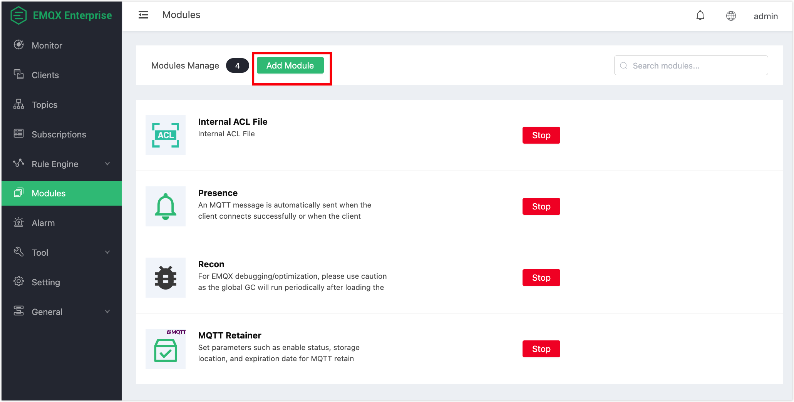
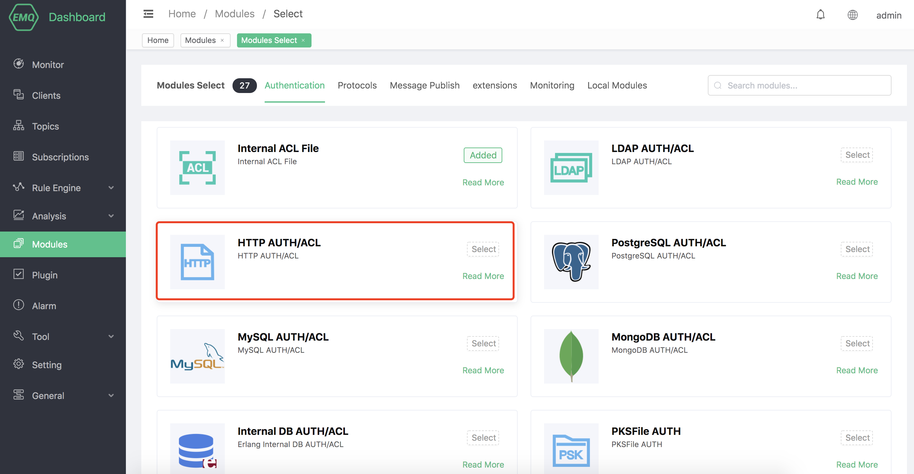
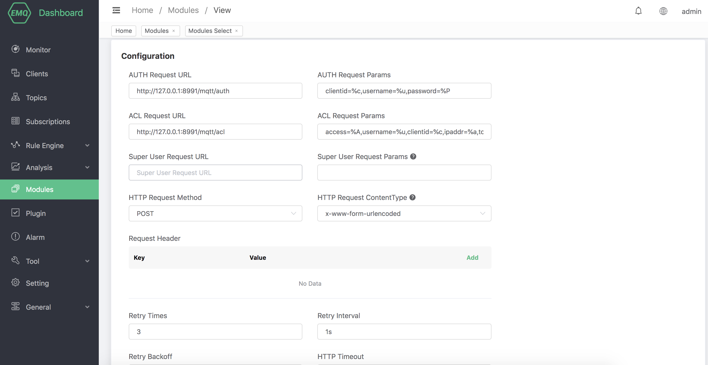
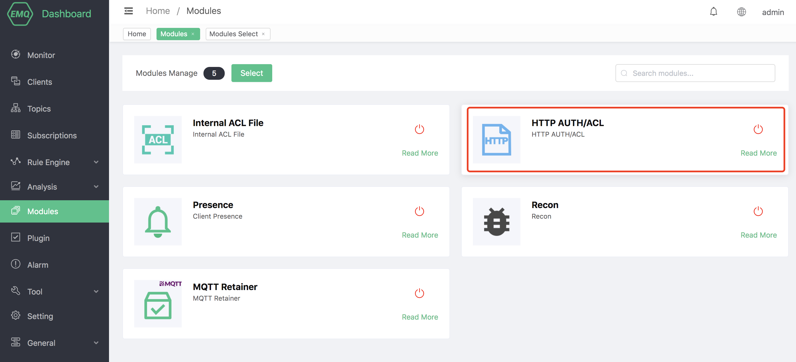

# HTTP Authentication/ACL

The HTTP Authentication/ACL feature in EMQX allows you to integrate with an external, self-hosted HTTP service to perform client authentication and access control. By evaluating the data returned from your HTTP API, EMQX can implement complex authentication logic and Access Control List (ACL) policies.

This guide explains how HTTP authentication and access control work in EMQX, providing instructions for adding the HTTP AUTH/ACL module through the EMQX Dashboard.

## HTTP Authentication Principle

When a client attempts to connect, EMQX gathers relevant client information and sends an HTTP request to a user-defined authentication service. The outcome of the authentication is determined by the HTTP response status code returned by that service:

- **Authentication failed**: The API returns any status code other than `200`.
- **Authentication successful**: The API returns a `200` status code.
- **Authentication ignored**: The API returns a `200` status code, and the response body is `ignore`.

This mechanism allows EMQX to delegate complex identity verification logic to an external system, such as a custom web application or authentication API.

### Authentication Request

To authenticate a client, EMQX sends an HTTP request to the configured authentication endpoint, including client credentials and metadata. The parameters in the request are automatically populated with real-time client information.

**Example Configuration**

```bash
## Authentication request URL
http://127.0.0.1:8991/mqtt/auth

## HTTP request method
## Options: POST | GET
POST

## Request parameters
clientid=%c,username=%u,password=%P
```

- For **GET** requests, parameters are appended to the URL as query strings.
- For **POST** (or **PUT**) requests, parameters are included in the request body using the `application/x-www-form-urlencoded` format.

## HTTP Access Control Principle

When a connected client attempts to publish to a topic or subscribe to one, EMQX uses the client’s connection and request data to initiate an HTTP request to a user-defined ACL service. The service evaluates whether the operation is allowed and returns an appropriate HTTP response.

EMQX determines the result of the ACL check based on the HTTP response status code and the response body:

- **Authorization denied**: The API returns a status code other than `200`.
- **Authorization granted**: The API returns a `200` status code.
- **Authorization ignored**: The API returns a `200` status code and the response body is `ignore`.

This allows EMQX to delegate publish/subscribe permissions to an external access control system.

### Superuser Request

Before performing ACL checks, EMQX can check whether the client is a superuser.

If a superuser request URL is configured, EMQX will send an HTTP request to the specified endpoint to determine whether the client has superuser privileges. If the client is verified as a super user, all subsequent ACL checks are skipped and full access is granted.

**Example Configuration**:

```bash
# etc/plugins/emqx_auth_http.conf

## Super user request address
http://127.0.0.1:8991/mqtt/superuser

## HTTP request method
## Value: POST | GET
POST

## Super User Request Parameters
clientid=%c,username=%u
```

### Access Control Request

If the client is not a superuser, EMQX proceeds to perform an ACL check by sending a request to the configured access control endpoint. This request includes detailed information about the client's operation (publish or subscribe) and metadata.

```bash
## ACL request URL
http://127.0.0.1:8991/mqtt/acl

## HTTP request method
## Options: POST | GET
POST

## Request parameters
access=%A,username=%u,clientid=%c,ipaddr=%a,topic=%t,mountpoint=%m

```

- For **GET** requests, parameters are included as URL query strings.
- For **POST** (recommended), parameters are sent in the request body using the `application/x-www-form-urlencoded` format.

### Supported Placeholders

The following placeholders can be used in both authentication and access control (ACL) HTTP request parameters. EMQX automatically replaces them with actual values from the connecting client:

| Placeholder | Description                                                  |
| ----------- | ------------------------------------------------------------ |
| `%A`        | Operation type: `1` for subscribe, `2` for publish           |
| `%u`        | Username of the client                                       |
| `%P`        | Plaintext password provided by the client                    |
| `%c`        | Client ID                                                    |
| `%a`        | Client IP address                                            |
| `%p`        | Client source port                                           |
| `%r`        | Protocol used by the client (e.g., `MQTT`, `MQTT over WebSocket`) |
| `%m`        | Mountpoint                                                   |
| `%t`        | Topic name (relevant in publish/subscribe actions)           |
| `%C`        | Common Name (CN) from the client’s TLS certificate (valid only for TLS connections) |
| `%d`        | Subject from the client’s TLS certificate (valid only for TLS connections) |

::: tip

Although GET is supported, it is recommended to use **POST** or **PUT** to avoid exposing sensitive data such as passwords in server logs or URLs.

:::

### HTTP Request Configuration

In addition to the endpoint and parameters, you can customize how EMQX sends HTTP requests for both authentication and authorization operations:

- **Request headers**: You can add custom HTTP headers to be included in each request. The header value supports placeholders, such as %u, %c, and %a, which will be dynamically replaced with client information at runtime.

  Examples:

  - Set a fixed `Host` header:

    > **Key**: `Host`
    >  **Value**: `example.com`

  - Specify a custom content type:

    > **Key**: `content-type`
    >  **Value**: `application/json`

  - Pass the client ID in a custom header:

    > **Key**: `X-Client-ID`
    >  **Value**: `%c`

- **Certificates**: Configure TLS client certificates for secure HTTPS communication.

- **Retry policy**: Define how EMQX retries failed requests (e.g., on timeout or server error).

These options provide flexibility to securely integrate with your backend authentication service, regardless of its security model or infrastructure.

## Add HTTP AUTH/ACL Module in Dashboard

To enable HTTP-based authentication and access control in the EMQX Dashboard, you can add the HTTP AUTH/ACL module:

1. Open the EMQX Dashboard in your browser.

2. In the left-hand navigation panel, click **Modules**. 

3. Click **Add Module** to create a new module.

   

4. From the list of available modules, select **HTTP AUTH/ACL**.

   

5. Fill in the required configuration parameters, including request URLs, methods, headers, and any placeholder values.

   

6. Click **Add** to save the configuration and enable the module.

   

Once added, the module will start processing authentication and authorization requests based on your HTTP service configuration.
