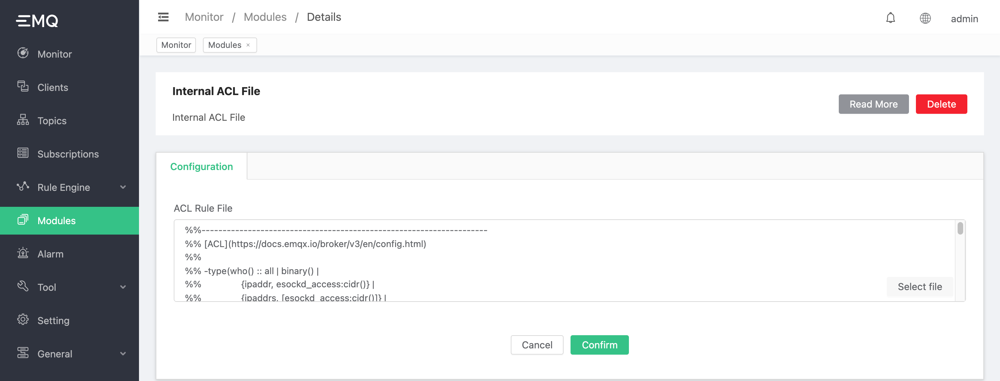

# Builtin ACL File

The builtin ACL sets rules through files, which is simple and lightweight enough to use, and is suitable for projects with predictable number of rules, no changes in demand, or small changes.


## Builtin ACL File

Builtin ACL module is enabled by default, it could be updated or stopped by dashboard but can not be deleted.


Editing ACL file content directly, or select a file to replace



## Define ACL

The builtin ACL is the rule table with the lowest priority. After all ACL checks are completed, if there are still no matches, the default ACL rules will be checked.

The rules file is described in the format of Erlang syntax:

```erlang
%% allows "dashboard" users to subscribe to the "$SYS/#" topic

{allow, {user, "dashboard"}, subscribe, ["$SYS/#"]}.

%% allows users with IP address "127.0.0.1" to publish/subscribe "#SYS/#", "#" topics

{allow, {ipaddr, "127.0.0.1"}, pubsub, ["$SYS/#", "#"]}.

%% Deny "all users" to subscribe to "$SYS/#" "#" topic

{deny, all, subscribe, ["$SYS/#", {eq, "#"}]}.

%% allows other arbitrary publish and subscribe operations

{allow, all}.
```

1. The first rule allows clients to publish and subscribe to all topics

2. The second rule prohibits all clients from subscribing to the topics `$SYS/#` and `#`

3. The third rule allows clients with an ip address of `127.0.0.1` to publish/subscribe to the topics of `$SYS/#` and `#`, which opens a special case for the second

4. The fourth rule allows clients with a username of `dashboard` to subscribe to the topic of `$SYS/#`, opening a special case for the second

It can be seen that the default ACL is mainly to restrict the client's authority to the system theme `$SYS/#` and the all-wildcard theme `#`.

## acl.conf writing rules

The rules in the ʻacl.conf` file are matched from top to bottom in the order of writing.

The grammar rules of ʻacl.conf` are contained in the comments at the top. Those familiar with Erlang grammar can directly read the comments at the top of the file. Or refer to the following interpretation:

-Use `%%` to indicate line comments.

-Each rule consists of a four-tuple and ends with `.`.

-The first place of the tuple: indicates that the permission control operation is performed after the rule is successfully hit. The possible values ​​are:

​ * `allow`: means `allow`

​ * `deny`: means `deny`

-The second digit of the tuple: indicates the user whose rule takes effect, and the available formats are:

​ * `{user, "dashboard"}`: indicates that the rule only takes effect for the user whose *Username (Username)* is "dashboard"

​ * `{client, "dashboard"}`: indicates that the rule only takes effect for users whose *client ID (ClientId)* is "dashboard"

​ * `{ipaddr, "127.0.0.1"}`: indicates that the rule only takes effect for users whose source address is "127.0.0.1"

​ * `all`: indicates that the rule is effective for all users

-The third position of the tuple: indicates the operation controlled by the rule, and the possible values ​​are:

​ * `publish`: indicates that the rule is applied to PUBLISH operations

​ * `subscribe`: indicates that the rule is applied to the SUBSCRIBE operation

​ * `pubsub`: indicates that the rule is valid for both PUBLISH and SUBSCRIBE operations

-The fourth place of the tuple: indicates the list of topics restricted by the rule, the content is given in the format of an array, for example:

​ * `$SYS/#`: It is a **topic filter (Topic Filter)**; it means that the rule can hit the topic that matches `$SYS/#`; for example, it can hit "$SYS/#" , You can also hit "$SYS/a/b/c"

​ * `{eq, "#"}`: indicates the congruence of characters. The rule can only hit the string with subject `#`, not `/a/b/c` etc.

-In addition, there are two special rules:

-`{allow, all}`: Allow all operations

-`{deny, all}`: Deny all operations

::: tip

acl.conf should only contain some simple and general rules, making it the basic ACL principle of the system. If you need to support complex and massive ACL content, you can choose external resources to implement it.

:::
