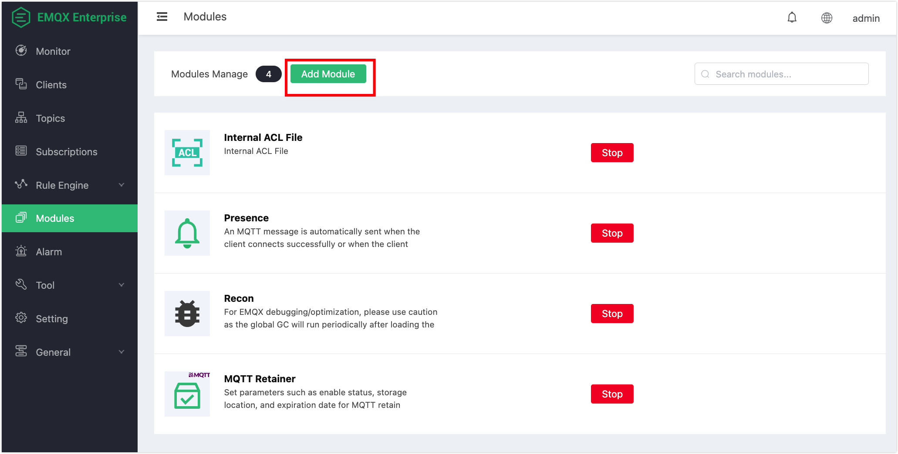
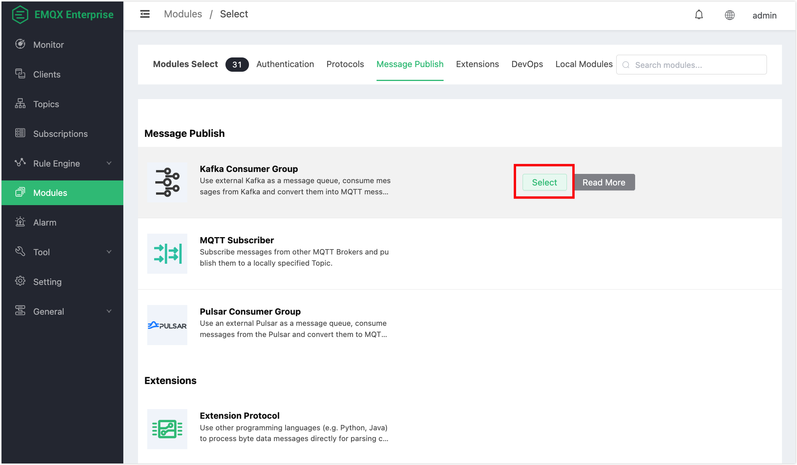
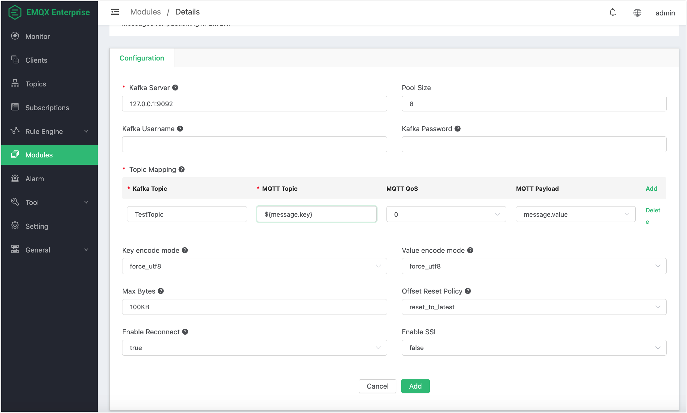
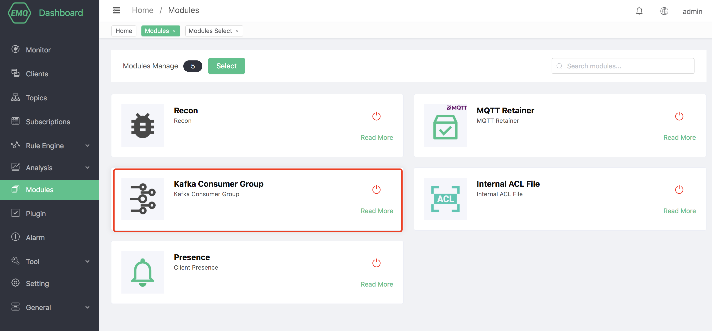
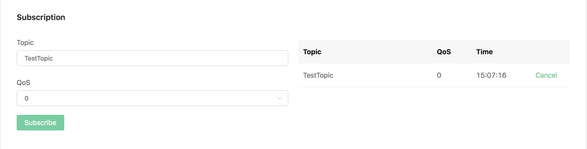
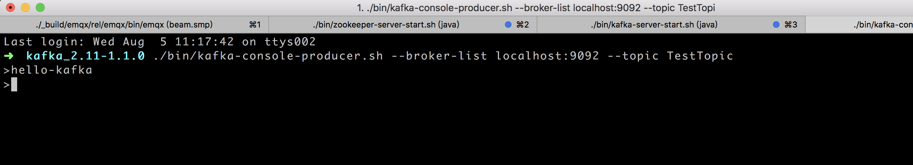
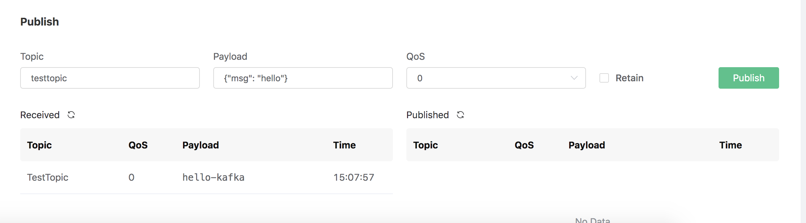

# Kafka Consumer Group

The Kafka consumer group uses external Kafka as a message queue, which can convert consumer messages from Kafka into MQTT messages and publish them in emqx.

Set up the Kafka environment, taking MacOS X as an example:

```bash
$ wget https://archive.apache.org/dist/kafka/2.3.1/kafka_2.12-2.3.1.tgz

$ tar -xzf kafka_2.12-2.3.1.tgz

$ cd kafka_2.12-2.3.1

# Start Zookeeper
$ ./bin/zookeeper-server-start.sh config/zookeeper.properties
# Start Kafka
$ ./bin/kafka-server-start.sh config/server.properties
```

::: danger

Kafka consumer groups do not support Kafka versions below 0.9

Before creating resources, you need to create Kafka topics in advance, otherwise an error will be prompted

:::

Create Kafka topic:

```bash
$ ./bin/kafka-topics.sh --zookeeper localhost:2181 --replication-factor 1 --partitions 1 --topic testTopic --create
```
## Create module

Open [EMQ X Dashboard](http://127.0.0.1:18083/#/modules), click the "Modules" tab on the left, and choose to add:

Select Kafka consumer group module:



Click "Select", and then select "Kafka Consumer Group":



Fill in the relevant parameters:



1). Kafka server address

2). Kafka consumer connection pool size

3). Kafka subscription topic

4). MQTT message subject

5). MQTT theme service quality

6). Kafka Max Bytes (the maximum number of bytes of messages consumed each time from Kafka)

7). Kafka Offset Reset Policy (reset Offset policy, reset_to_latest | reset_by_subdcriber)

7). Is Kafka consumer reconnected?

After clicking Add, the module is added:



The resource has been created, now use Dashboard's websocket tool to subscribe to the MQTT topic "TestTopic":



Use the kafka command line to produce a message:

```bash
./bin/kafka-console-producer.sh --broker-list localhost:9092 --topic TestTopic
```



The websocket tool of Dashboard received the message "hello-kafka" produced by Kafka:

