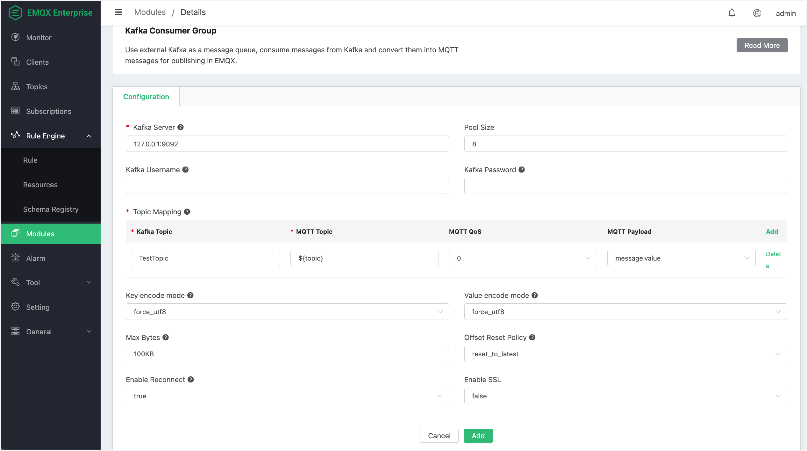

# Kafka Consumer Group

The Kafka consumer group uses external Kafka as a message queue, which can convert consumer messages from Kafka into MQTT messages and publish them in EMQX.

## Set Up Kafka

::: tip

Kafka consumer groups do not support Kafka versions below 0.9.

Before creating resources, you must create Kafka topics in advance, otherwise an error will be prompted.

:::

1. Set up the Kafka environment, taking MacOS X as an example:

```bash
wget https://archive.apache.org/dist/kafka/2.8.0/kafka_2.13-2.8.0.tgz

tar -xzf  kafka_2.13-2.8.0.tgz

cd kafka_2.13-2.8.0

# Start Zookeeper
$ ./bin/zookeeper-server-start.sh config/zookeeper.properties
# Start Kafka
$ ./bin/kafka-server-start.sh config/server.properties
```

2. Create a Kafka topic:

```bash
./bin/kafka-topics.sh --zookeeper localhost:2181 --replication-factor 1 --partitions 1 --topic testTopic --create
```

## Create Module

1. Open [EMQX Dashboard](http://127.0.0.1:18083/#/modules), click **Modules** in the left-navigation menu, and select **Add Module**.


2. Under the **Message Publish** tab, select the **Kafka Consumer Group** module:


3. Fill in the relevant parameters:



- **Kafka Server**: Enter the Kafka server address; the default is `127.0.0.1:9092`.
- **Pool Size**: Kafka consumer connection pool size.
- **Kafka Username and Password**: Username and password to connect to the Kafka server.
- Topic Mapping:
  - **Kafka Topic**: The topic from which Kafka messages will be forwarded; in this example, you can use the Kafka topic created earlier, `TestTopic`.
  - **MQTT Topic**: The topic of the received MQTT message; you can specify a fixed topic, or dynamically construct the topic from Kafka messages using `${field}` template syntax. Currently, the following fields can be used:

  - value: The message content. If the message is in JSON format, 	`${value.field}` can be used to extract the value of the specified field.
  - ts_type: The message operation type. 
  - ts: The message timestamp in milliseconds, indicating when the message was created.
  - topic: The Kafka Topic where the message is from.
  - offset: The message offset in the Partition, used to uniquely identify a message.
  - key: The message Key.
  - headers: The message headers, which may contain additional metadata.
  - **MQTT QoS**: MQTT message quality of service.
  - **MQTT Payload**: Optionally, you can use either Kafka `message.value` or the entire message information.
- **Key encode mode**: Binary key encoding mode, UTF-8, or base64; encoding method for the key in the message. If the key value is non-string or may cause character encoding exceptions, it is recommended to use base64 mode.
- **Value encode mode**: Binary value encoding mode, UTF-8, or base64; encoding method for the value in the message. If the value is non-string or may cause character encoding exceptions, it is recommended to use base64 mode.
- **Max Bytes**: Kafka Max Bytes (maximum number of bytes to consume from Kafka at a time).
- **Offset Reset Policy**: Kafka Offset Reset Policy (Offset reset strategy, reset_to_latest | reset_by_subscriber)
- **Enable Reconnect**: Whether the Kafka consumer should automatically reconnect.
- **Enable SSL**: SSL connection parameters.

After clicking **Add**, the module will be added successfully.

## Test Message Publish

After the resource is created, you can use Dashboard's Websocket tool to subscribe to the MQTT topic "TestTopic":


Use the kafka command line to produce a message:

```bash
./bin/kafka-console-producer.sh --broker-list localhost:9092 --topic TestTopic
```


The Websocket tool of Dashboard will receive the message "hello-kafka" produced by Kafka:


