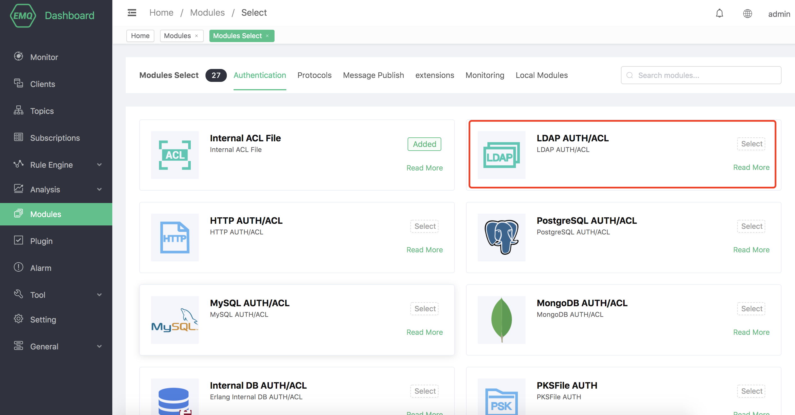
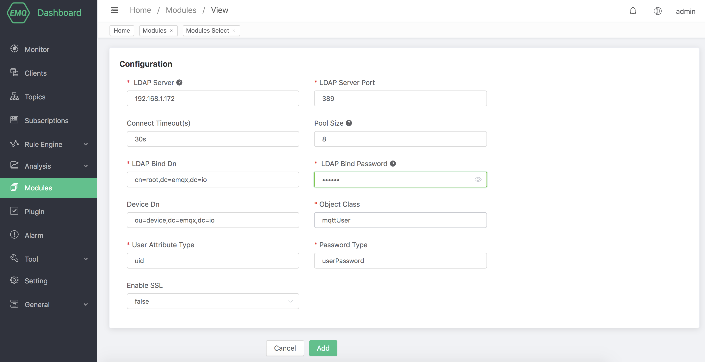

# LDAP Authentication/ACL

LDAP authentication/access control uses an external OpenLDAP server as the authentication data source, which can store large amounts of data and facilitate integration with external device management systems.

## Create module

Open [EMQ X Dashboard](http://127.0.0.1:18083/#/modules), click the "Modules" tab on the left, and choose to add:


Select LDAP authentication/access control module



Configure OpenLDAP related parameters



Finally, click the "Add" button, the module can be added successfully:


## LDAP Schema

The data model needs to be configured in the LDAP schema directory. The data model in the default configuration is as follows:

**/etc/openldap/schema/emqx.schema**

```bash
attributetype (1.3.6.1.4.1.11.2.53.2.2.3.1.2.3.1.3 NAME'isEnabled'
EQUALITY booleanMatch
SYNTAX 1.3.6.1.4.1.1466.115.121.1.7
SINGLE-VALUE
USAGE userApplications)

attributetype (1.3.6.1.4.1.11.2.53.2.2.3.1.2.3.4.1 NAME ('mqttPublishTopic''mpt')
EQUALITY caseIgnoreMatch
SUBSTR caseIgnoreSubstringsMatch
SYNTAX 1.3.6.1.4.1.1466.115.121.1.15
USAGE userApplications)
attributetype (1.3.6.1.4.1.11.2.53.2.2.3.1.2.3.4.2 NAME ('mqttSubscriptionTopic''mst')
EQUALITY caseIgnoreMatch
SUBSTR caseIgnoreSubstringsMatch
SYNTAX 1.3.6.1.4.1.1466.115.121.1.15
USAGE userApplications)
attributetype (1.3.6.1.4.1.11.2.53.2.2.3.1.2.3.4.3 NAME ('mqttPubSubTopic''mpst')
EQUALITY caseIgnoreMatch
SUBSTR caseIgnoreSubstringsMatch
SYNTAX 1.3.6.1.4.1.1466.115.121.1.15
USAGE userApplications)

objectclass (1.3.6.1.4.1.11.2.53.2.2.3.1.2.3.4 NAME'mqttUser'
AUXILIARY
MAY (mqttPublishTopic $ mqttSubscriptionTopic $ mqttPubSubTopic))

objectclass (1.3.6.1.4.1.11.2.53.2.2.3.1.2.3.2 NAME'mqttDevice'
SUP top
STRUCTURAL
MUST (uid)
MAY (isEnabled))

objectclass (1.3.6.1.4.1.11.2.53.2.2.3.1.2.3.3 NAME'mqttSecurity'
SUP top
AUXILIARY
MAY (userPassword $ userPKCS12 $ pwdAttribute $ pwdLockout))
```

Edit the ldap configuration file slapd.conf to reference the Schema:

**/etc/openldap/slapd.conf**

```bash
include /etc/openldap/schema/core.schema
include /etc/openldap/schema/cosine.schema
include /etc/openldap/schema/inetorgperson.schema
include /etc/openldap/schema/ppolicy.schema
include /etc/openldap/schema/emqx.schema

database bdb
suffix "dc=emqx,dc=io"
rootdn "cn=root,dc=emqx,dc=io"
rootpw {SSHA}eoF7NhNrejVYYyGHqnt+MdKNBh4r1w3W

directory /etc/openldap/data
```

The sample data in the default configuration is as follows:
```
## create emqx.io

dn:dc=emqx,dc=io
objectclass: top
objectclass: dcobject
objectclass: organization
dc:emqx
o: emqx, Inc.

# create testdevice.emqx.io
dn:ou=testdevice,dc=emqx,dc=io
objectClass: top
objectclass:organizationalUnit
ou:testdevice

dn:uid=mqttuser0001,ou=testdevice,dc=emqx,dc=io
objectClass: top
objectClass: mqttUser
objectClass: mqttDevice
objectClass: mqttSecurity
uid: mqttuser0001
isEnabled: TRUE
mqttAccountName: user1
mqttPublishTopic: mqttuser0001/pub/1
mqttSubscriptionTopic: mqttuser0001/sub/1
mqttPubSubTopic: mqttuser0001/pubsub/1
userPassword:: e1NIQX1tbGIzZmF0NDBNS0JUWFVWWndDS21MNzNSLzA9
```

After enabling LDAP authentication, you can connect via username: mqttuser0001 and password: public.

## LDAP access control configuration method

`mqttPublishTopic` allowed topics to be published (multiple can be configured)

`mqttSubscriptionTopic` allows to subscribe to the topic (multiple can be configured)

`mqttPubSubTopic` allows to subscribe/publish the topic (multiple can be configured)

::: waring

The current version only supports OpenLDAP, not Microsoft Active Directory.

:::