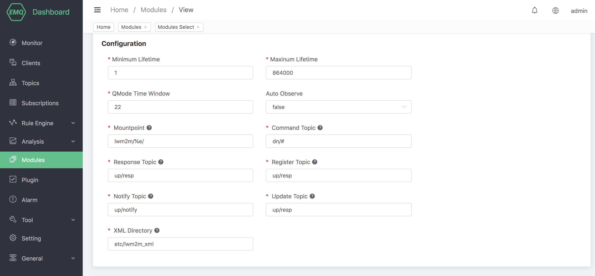
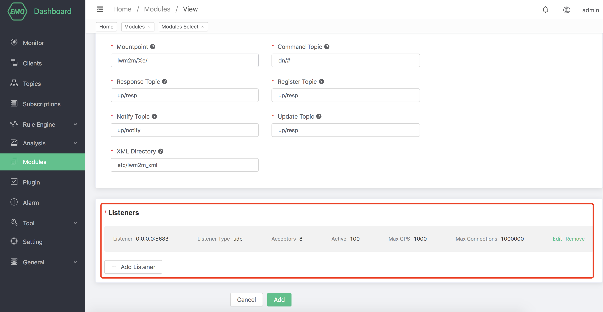
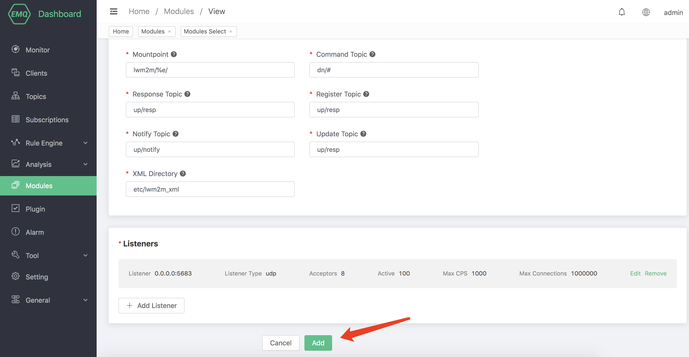

# LwM2M Protocol Gateway

## Protocol Introduction

LwM2M (Lightweight Machine-To-Machine) is a protocol from the Open Mobile Alliance (OMA) for machine to machine (M2M) or Internet of things device (IoT), it provides device management and communication functions, especially suitable for terminal devices with limited resources.

For more information, see [OMA SpecWorks](http://openmobilealliance.org/iot/lightweight-m2m-lwm2m.)

LwM2M is built on [Constrained Application Protocol](https://www.rfc-editor.org/rfc/rfc7252) (CoAP), carried over UDP or SMS, based on REST architecture,
so the message structure is simple and compact to worker better in environments where network resources are limited and the device is always online.

There are two roles in the LwM2M protocol:

- LwM2M Server

  LwM2M has two kind services and deployed at the M2M service providers or network service providers:

  1. LwM2M bootstrap server, emqx-lwm2m plugin does not implement this server.
  2. LwM2M server, emqx-lwm2m plugin implements the function of this server on UDP, while SMS does not.

- LwM2M Client

    LwM2M Client acts as a client and is deployed on each LwM2M device.

Between LwM2M Server and LwM2M Client, the LwM2M protocol defines 4 interfaces.

1. Bootstrap interface

    Provide the LwM2M client with the necessary information to register with the LwM2M server, such as sever access information, resource information supported by the client, etc.

2. Client Registration Interface

    Connect the LwM2M client and the LwM2M server, and stored the information about connection of the LwM2M client. Communication and management between LwM2M client and server is only possible after registration is completed.

3. Device management and service implementation interface

    Allows the server to access and modify LwM2M client object instances and resources.

4. Information reporting interface

    Allows the server to subscribe resource information to the client, and the client reports its resource changes to the server in the agreed mode.

LwM2M abstracts the services on the device into `Object` and `Resource`, and defines the attributes and functions of various objects in XML files. See
[Here](http://www.openmobilealliance.org/wp/OMNA/LwM2M/LwM2MRegistry.html) for details.


The LwM2M protocol predefines 8 kinds of objects, namely:

  - Security object
  - Server object
  - Access Control access control object
  - Device object
  - Connectivity Monitoring Connectivity monitoring object
  - Firmware firmware object
  - Location object
  - Connectivity Statistics Connectivity statistics object

## Quick Start

Open [EMQX Dashboard](http://127.0.0.1:18083/#/modules), click the `Modules` tab on the left, and choose to add:


Select the `LwM2M Gateway`


Configure basic parameters:



Add a listener:


Configure listener parameters:


Click `confirm` to enter the configuration parameter page:



After clicking `Add`, the module is added:


EMQX-LwM2M is a gateway module of EMQX server, it implements most of the functions of LwM2M. MQTT client can access LwM2M-enabled devices through EMQX-LWM2M and devices can also report notifications to EMQX-LwM2M to collect data for EMQX backend services.

### Configuration parameters

| Configuration     | Description                                                  |
| ----------------- | ------------------------------------------------------------ |
| Minimum Lifetime  | Minimum lifetime allowed to be set for registration/update, in seconds |
| Maximum Lifetime  | Maximum lifetime allowed to be set for registration/update, in seconds |
| QMode Time Window | QMode time window, indicating how long the downstream command sent to the client will be cached, in seconds |
| Auto Observe      | After successful registration, whether to automatically observe the objectlist |
| Mountpoint        | topic Prefix                                                 |
| Command Topic     | Downstream command topic, %e means endport name              |
| Response Topic    | Upstream response topic, %e means endport name                |
| Register Topic    | Register message topic, %e means endport name                 |
| Notify Topic      | Uplink notification topic, %e means endport name              |
| Update Topic      | Update message topic, %e means endport name                   |
| XML Directory     | The directory of the XML files, these XMLs are used to define LwM2M objects |

### MQTT and LwM2M conversion

From MQTT client can send command to the LwM2M device, the MQTT to LwM2M command uses the following topic:

```bash
"lwm2m/{?device_end_point_name}/command".
```

The MQTT payload is a json formatted string specifying the command to send, See [emqx-lwm2m](https://github.com/emqx/emqx-lwm2m) for details.

The reply of the LwM2M device is sent with the following topic

```bash
"lwm2m/{?device_end_point_name}/response".
```

MQTT Payload is also a json formatted string, See [emqx-lwm2m](https://github.com/emqx/emqx-lwm2m) for details.
