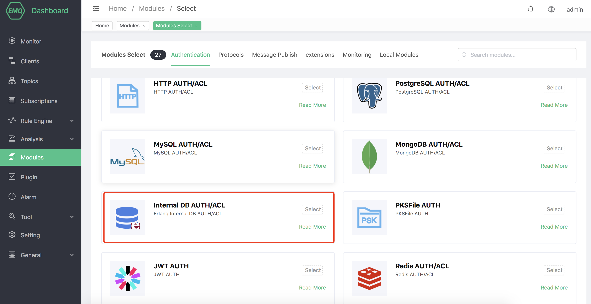
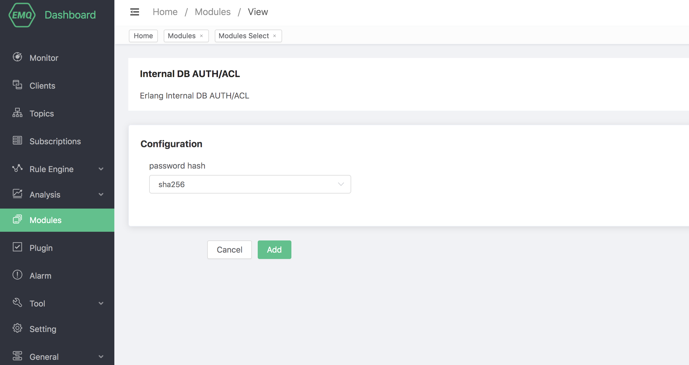
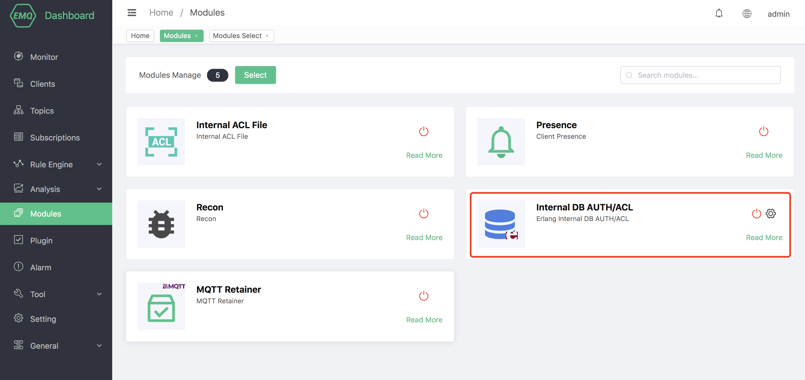
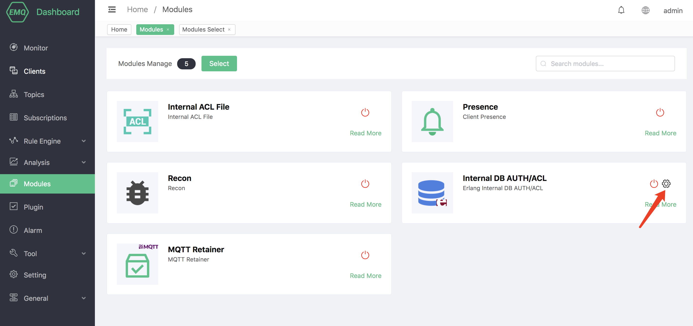
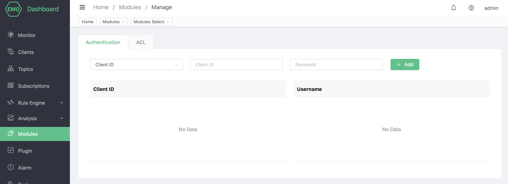

# Builtin database authentication/ACL

Builtin database authentication uses EMQ X builtin Mnesia database to store the client's Clientid/Username and password, and supports management of authentication data through HTTP API.

The builtin database authentication does not rely on external data sources and is simple and lightweight enough to use.

## Create module

Open [EMQ X Dashboard](http://127.0.0.1:18083/#/modules), click the "Modules" tab on the left, and choose to add:

Click "Select", and then select the builtin database authentication module

Configure related parameters

Finally, click the "Add" button to add the module successfully.

## Manage data

The builtin database can manage authentication and access control data through the dashboard

#### Authentication data

The authentication data can be managed through the dashboard

When the client connects to EMQ X, the builtin database authentication will obtain the Clientid and Username in the CONNENT message, and then match the password recorded in the database. Once the match is successful, the authentication is successful.

The builtin database authentication also supports HTTP API operations. For details, please refer to [Mnesia Authentication](https://docs.emqx.io/en/broker/latest/advanced/auth-mnesia.html).

#### Access control data

Access control data can be managed through the dashboard

When the client publishes, subscribes, or unsubscribes to EMQ X, the access control can allow or deny the operation according to the rules set in advance in the builtin database.

The builtin database access control also supports HTTP API operations. For details, please see [Mnesia ACL](https://docs.emqx.io/en/broker/latest/advanced/acl-mnesia.html).