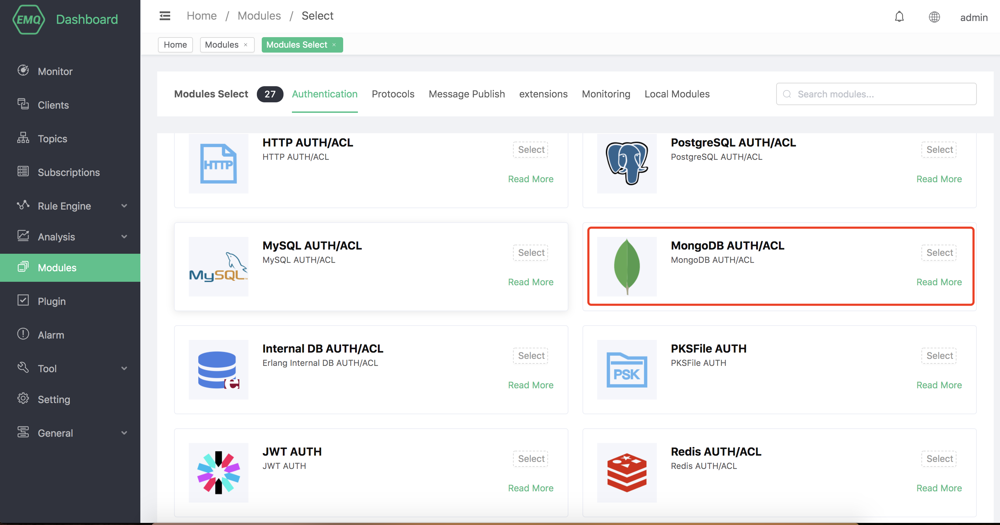
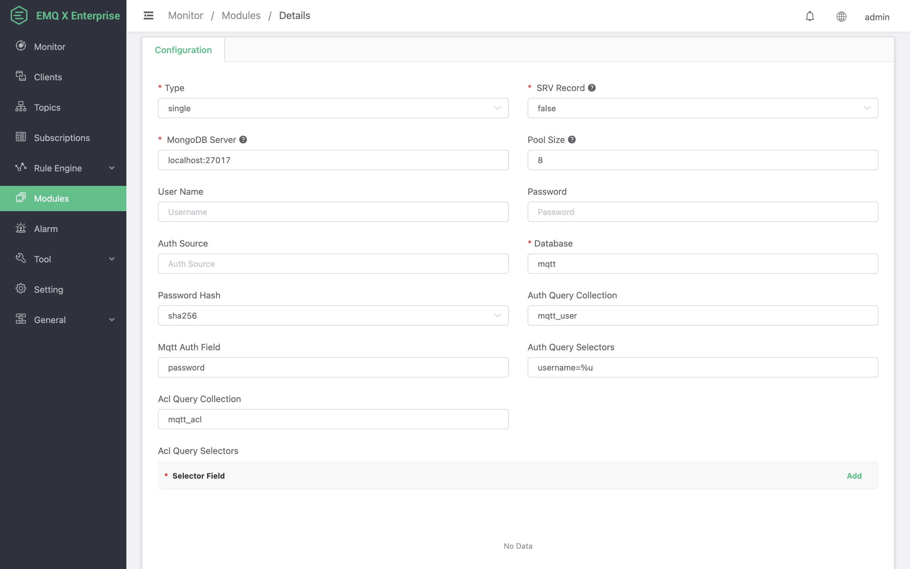
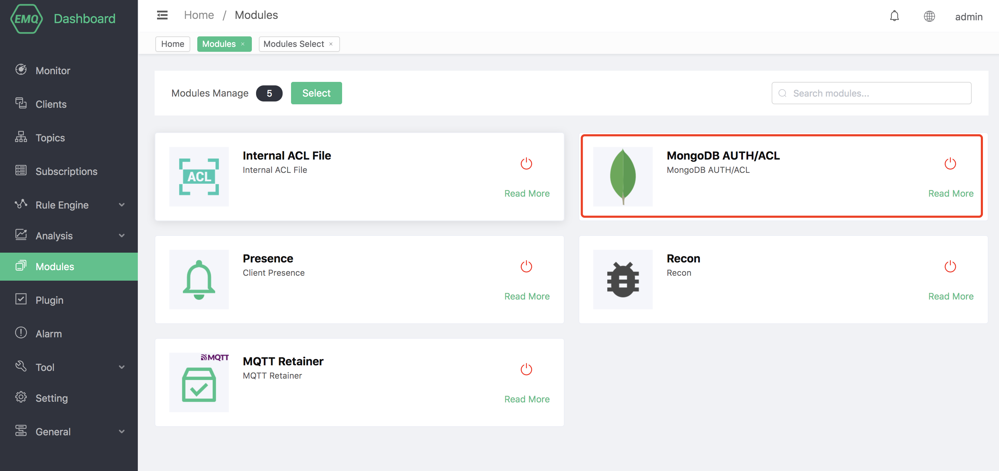

# MongoDB Authentication/ACL

MongoDB Authentication/ACL uses an external MongoBD database as a data source, which can store a large amount of data and at the same time integrate with external device management systems.

## Install MongoDB

Open the MongoDB official website address: https://www.mongodb.com/try/download/communit, select the version you need, here we use the MacOS V4.4.1 version:


Start MongoDB after installation

## Create module

Open [EMQ X Dashboard](http://127.0.0.1:18083/#/modules), click the "Modules" tab on the left, and choose to add:


Select MongoDB Authentication/ACL module



Configure MongoDB related parameters



After clicking Add, the module is added:




## Authentication Collection

```json
{
  username: "user",
  password: "password hash",
  salt: "password salt",
  is_superuser: false,
  created: "2020-02-20 12:12:14"
}
```

When performing identity authentication, EMQ X will use the current client information to fill and execute the authentication Query configured by the user, and query the authentication data of the client in the database.

MongoDB supports the configuration of collection names, authentication fields, authentication placeholders and other parameters.

| Configuration                   | Description                                                  |
| ------------------------------- | ------------------------------------------------------------ |
| Authentication query collection | Authentication query MongoDB collection                      |
| Authentication query field name | Fields that need to be queried from the collection, if you need to query more than one, use commas to separate them. E.g. password, salt |
| Authentication condition field  | Authentication query conditions, if you need to query more than one, use commas to separate them. For example username=%u,clientid=%c |

You can use the following placeholders in the authentication query placeholders, and EMQ X will automatically fill in the client information when executed:

-%u: username
-%c: clientid
-%C: TLS certificate common name (domain name or subdomain name of the certificate), valid only when TLS connection
-%d: TLS certificate subject, valid only when TLS connection

You can adjust the authentication query according to your business needs, such as adding multiple query conditions and using database preprocessing functions to achieve more business-related functions. But in any case, the authentication query needs to meet the following conditions:

1. The query result must contain the password field, which EMQ X uses to compare with the client password
2. If the salting configuration is enabled, the salt field must be included in the query result, and EMQ X uses this field as the salt value
3. MongoDB uses the findOne query command to ensure that the query results you expect can appear in the first data

::: tip

This is the set structure used by the default configuration. After you are familiar with the use of the plug-in, you can use any set that meets the conditions for authentication.

:::

## Access Control Collection

```json
{
    username: "username",
    clientid: "clientid",
    publish: ["topic1", "topic2", ...],
    subscribe: ["subtop1", "subtop2", ...],
    pubsub: ["topic/#", "topic1", ...]
}
```

MongoDB ACL rules define publish, subscribe, and publish/subscribe information, and all the rules in the rules are **allow** lists.

Rule field description:


| Configuration                   | Description                                                  |
| ------------------------------- | ------------------------------------------------------------ |
| Access control query collection | Access control query MongoDB collection                      |
| Access control query field name | Field to be queried from the collection                      |
| Access control condition field  | Access control query conditions, support and and or operations, and operations are separated by commas, for example: username=%u,clientid=%c, or operations need to add multiple data |

## Super User Query

When performing ACL authentication, EMQ X will use the current client information to fill and execute the super user query configured by the user to check whether the client is a super user. When the client is a super user, ACL query will be skipped.
Multiple conditions of the same selector use MongoDB and query in the actual query:

```
db.mqtt_user.find({
  "username": "wivwiv"
  "clientid": "$all"
})
```
You can use the following placeholders in the query conditions, and EMQ X will automatically fill in the client information when executed:

-%u: username

-%c: clientid

You can adjust the super user query according to business needs, such as adding multiple query conditions and using database preprocessing functions to achieve more business-related functions. But in any case, the super user query needs to meet the following conditions:
The query result must include the is_superuser field, and is_superuser should be explicitly true.
MongoDB supports the configuration of collection names, authentication fields, authentication placeholders and other parameters.

| Configuration               | Description                                                  |
| --------------------------- | ------------------------------------------------------------ |
| Super User Query Collection | Super User Query MongoDB Collection                          |
| Super user query field name | Field to be queried from the collection                      |
| Super user condition field  | Super user query conditions, if you need to query more than one, use commas to separate them. For example username=%u,clientid=%c |

::: danger

MongoDB ACL rules must strictly use the above data structure. All the rules added in MongoDB ACL are allowed rules and can be used with ʻacl_nomatch = deny` in ʻetc/emqx.conf`.

:::

## Encryption rules

```shell
## No salt, plain text
plain

## No salt, only hash processing
sha256

## salt prefix: use sha256 to encrypt salt + password concatenated string
salt,sha256

## salt suffix: use sha256 encrypted password + salt spliced ​​string
sha256,salt

## pbkdf2 with macfun iterations dklen
## macfun: md4, md5, ripemd160, sha, sha224, sha256, sha384, sha512
pbkdf2,sha256,1000,20
```

::: tip

Refer to: [Salt rules and hash methods](https://docs.emqx.io/en/broker/latest/advanced/auth.html#password-salting-rules-and-hash-methods).

:::