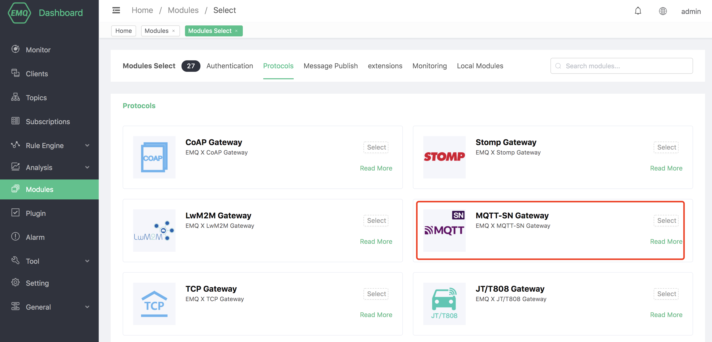
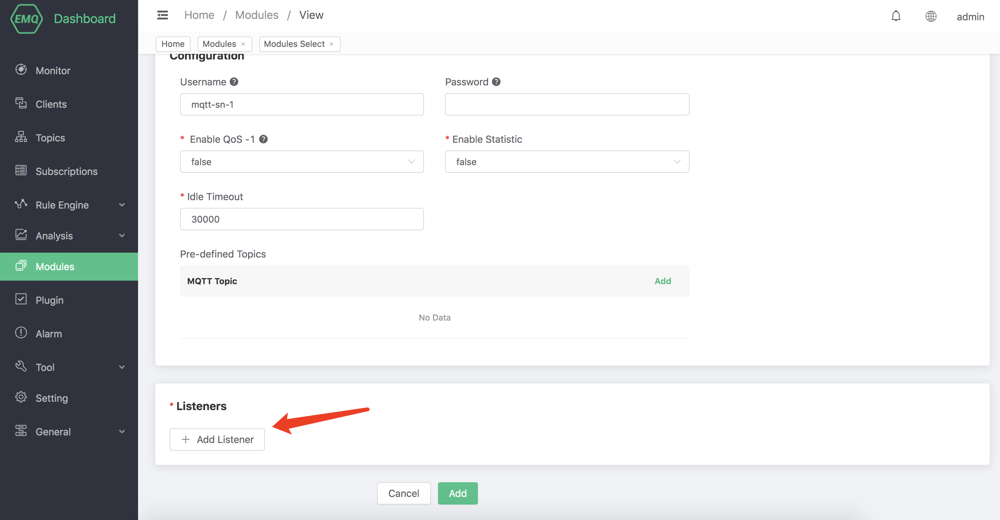
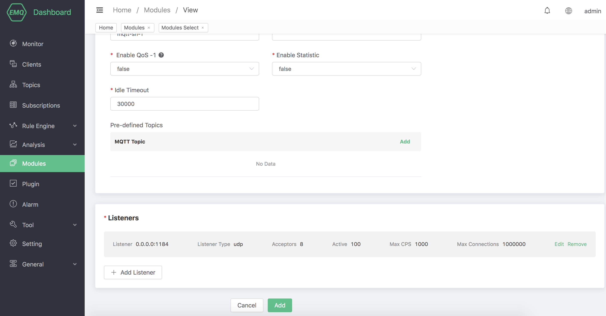

# MQTT-SN protocol gateway

## Protocol Introduction

The signaling of MQTT-SN and MQTT are mostly the same, such as Will and Connect/Subscribe/Publish commands.

The biggest difference of MQTT-SN is that Topic uses TopicId instead, and TopicId is a 16-bit number. Each number corresponds to one
Topic, device and cloud need to use the REGISTER command to map the correspondence between TopicId and Topic.

MQTT-SN can change the content of Will at any time, or even cancel it. MQTT only allows the content of Will to be set during CONNECT.
And no changes are allowed.

There is a gateway device in the MQTT-SN network, which is responsible for converting MQTT-SN into MQTT and communicating with the MQTT Broker in the cloud. MQTT-SN
The protocol supports the function of automatically discovering the gateway.

MQTT-SN also supports the sleep function of the device. If the device enters the sleep state and cannot receive UDP data, the gateway will set the downstream PUBLISH
The message is buffered and sent until the device wakes up.

EMQX-SN is a gateway access module of EMQ X, which implements most of the functions of MQTT-SN. It is equivalent to an MQTT-SN gateway in the cloud, directly interacting with EMQ
X Broker is connected.

## Create module

Open [EMQ X Dashboard](http://127.0.0.1:18083/#/modules), click the "Modules" tab on the left, and choose to add:

Select MQTT-SN to access the gateway module:

Configure related basic parameters:

Add listening port:

Configure monitoring parameters:

Click to confirm to the configuration parameter page:

After clicking Add, the module is added:

### Configuration parameters

| Configuration | Description                                                  |
| ------------- | ------------------------------------------------------------ |
| Username      | Optional parameter, which specifies the username of all MQTT-SN connections, used in the EMQ X authentication module |
| Password      | Optional parameter, used with username in EMQ X authentication module |

### MQTT-SN client library

1. <https://github.com/eclipse/paho.mqtt-sn.embedded-c/>
2. <https://github.com/ty4tw/MQTT-SN>
3. <https://github.com/njh/mqtt-sn-tools>
4. <https://github.com/arobenko/mqtt-sn>