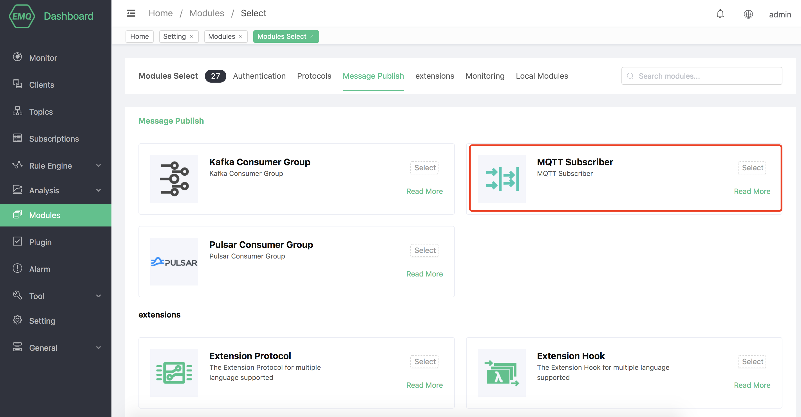
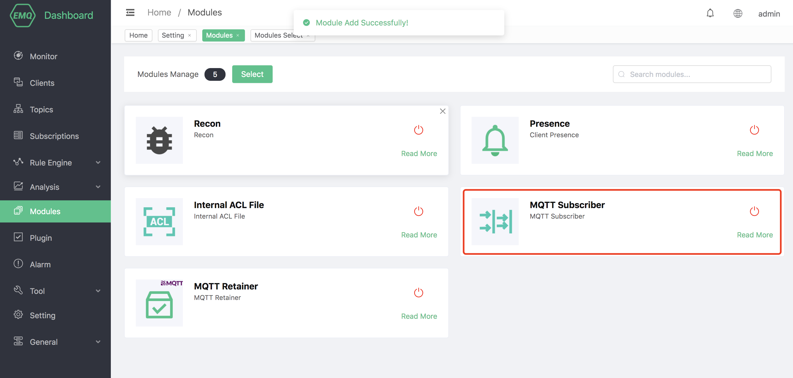

# MQTT subscriber

## Create module

Open [EMQ X Dashboard](http://127.0.0.1:18083/#/modules), click the "Modules" tab on the left, and choose to add:

Select the MQTT subscriber module:

Fill in the relevant parameters:

After clicking Add, the module is added:

