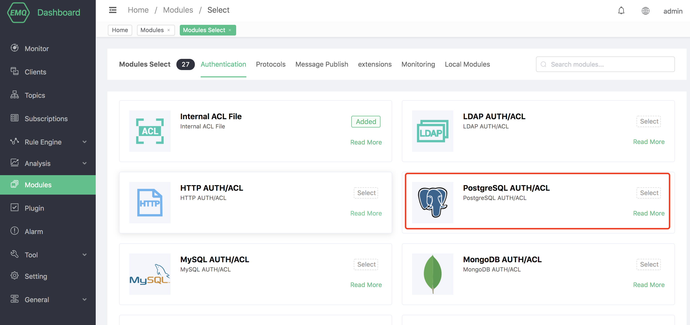
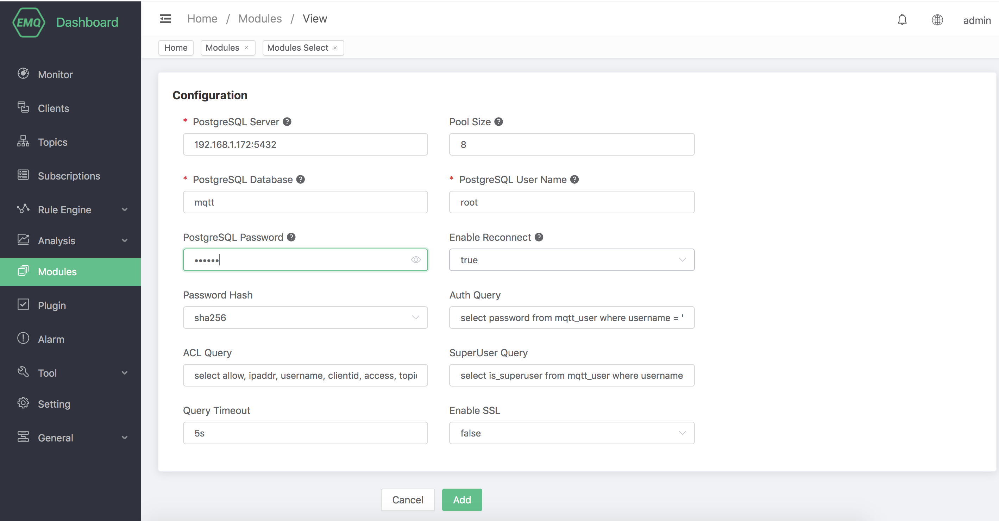

# PostgreSQL Authentication/ACL

PostgreSQL Authentication/ACL uses an external PostgreSQL database as a data source, which can store a large amount of data and at the same time integrate with external device management systems.

## Install PostgreSQL

Open the PostgreSQL official website: https://www.postgresql.org/download/, select the version you need, here we choose the PostgreSQL version as macos-10.13


After the installation is complete, start PostgreSQL.

## Create module

Open [EMQ X Dashboard](http://127.0.0.1:18083/#/modules), click the "Modules" tab on the left, and choose to add:


Select PostgreSQL Authentication/ACL module



Need to configure the PostgreSQL address, user name, password (optional) and other basic connection parameters table



Finally click the "Add" button, the module can be added successfully


### Certification Form:

```sql
CREATE TABLE mqtt_user (
  id SERIAL PRIMARY KEY,
  username CHARACTER VARYING(100),
  password CHARACTER VARYING(100),
  salt CHARACTER VARYING(40),
  is_superuser BOOLEAN,
  UNIQUE (username)
)
```

Field description:

-username: The username for connecting to the client. If the value here is set to `$all`, it means that the rule applies to all users
-password: password parameter for connecting to the client
-salt: password and salt string
-is_superuser: Is it a superuser

When performing identity authentication, EMQ X will use the current client information to fill and execute the authentication SQL configured by the user, and query the authentication data of the client in the database.

```sql
select password from mqtt_user where username ='%u' limit 1
```

Field description

-%u: username
-%c: clientid
-%P: Plain text password
-%C: TLS certificate common name (domain name or subdomain name of the certificate), valid only when TLS connection
-%d: TLS certificate subject, valid only when TLS connection

The authentication SQL can be adjusted according to business needs, such as adding multiple query conditions and using database preprocessing functions to implement more business-related functions. But in any case, the authentication SQL needs to meet the following conditions:

1. The query result must contain the password field, which EMQ X uses to compare with the client password
2. If the salting configuration is enabled, the salt field must be included in the query result, and EMQ X uses this field as the salt value
3. There can only be one query result, if there are multiple results, only the first one will be taken as valid data

The sample data in the default configuration is as follows:

```sql
INSERT INTO `mqtt_user` (ʻusername`, `password`, `salt`)
VALUES
    ('emqx','efa1f375d76194fa51a3556a97e641e61685f914d446979da50a551a4333ffd7', NULL);
```

After enabling PostgreSQL authentication, you can connect via username: emqx and password: public.

::: tip

You can use AS syntax in SQL to specify a password for field renaming, or set the salt value to a fixed value.

:::

#### Advanced

In the default table structure, we set the username field as a unique index (UNIQUE), and use it with the default query statement (`select password from mqtt_user where username ='%u' limit 1`) to get very good query performance.

If the default query conditions do not meet your needs, for example, you need to query the corresponding `Password Hash` and `Salt` based on the `Client ID`, please make sure to set the `Client ID` as an index; Or you want to perform multi-condition queries on `Username`, `Client ID`, or other fields. It is recommended to set the correct single-column index or multiple-column index. In short, set the correct table structure and query statement, and try not to let the index fail and affect the query performance.

### Access Control List

```sql
CREATE TABLE mqtt_acl (
  id SERIAL PRIMARY KEY,
  allow INTEGER,
  ipaddr CHARACTER VARYING(60),
  username CHARACTER VARYING(100),
  clientid CHARACTER VARYING(100),
  access  INTEGER,
  topic CHARACTER VARYING(100)
);
CREATE INDEX ipaddr ON mqtt_acl (ipaddr);
CREATE INDEX username ON mqtt_acl (username);
CREATE INDEX clientid ON mqtt_acl (clientid);
```

Field description:

-allow: prohibit (0), allow (1)
-ipaddr: set IP address
-username: The username for connecting to the client. If the value here is set to `$all`, it means that the rule applies to all users
-clientid: clientid of the connected client
-access: Allowed operations: subscribe (1), publish (2), subscribe to publish (3)
-topic: The controlled topic, wildcards can be used, and placeholders can be added to the topic to match the client information, for example, `t/%c` will replace the topic with the clientid of the current client when matching

The principle of access control is to find entries related to the client from PostgreSQL and then perform authentication. The default query SQL is as follows:

```sql
select allow, ipaddr, username, clientid, access, topic from mqtt_acl where ipaddr ='%a' or username ='%u' or username ='$all' or clientid ='%c'
```

The following placeholders can be used in the authentication SQL, and EMQ X will be automatically filled with client information when executed:

-%u: username
-%c: clientid
-%a: Client IP address
-%P: Plain text password
-%C: TLS certificate common name (domain name or subdomain name of the certificate), valid only when TLS connection
-%d: TLS certificate subject, valid only when TLS connection

Sample data in the default configuration:

```sql
- All users cannot subscribe to system topics
INSERT INTO mqtt_acl (allow, ipaddr, username, clientid, access, topic) VALUES (0, NULL,'$all', NULL, 1,'$SYS/#');

- Allow clients on 10.59.1.100 to subscribe to system topics
INSERT INTO mqtt_acl (allow, ipaddr, username, clientid, access, topic) VALUES (1, '10.59.1.100', NULL, NULL, 1,'$SYS/#');

- Disallow clients from subscribing to the /smarthome/+/temperature topic
INSERT INTO mqtt_acl (allow, ipaddr, username, clientid, access, topic) VALUES (0, NULL, NULL, NULL, 1,'/smarthome/+/temperature');

- Allow clients to subscribe to the topic /smarthome/${clientid}/temperature containing their Client ID
INSERT INTO mqtt_acl (allow, ipaddr, username, clientid, access, topic) VALUES (1, NULL, NULL, NULL, 1,'/smarthome/%c/temperature');
```

## root

Super users can subscribe and publish any topic, the default SQL is as follows:

```sql
select is_superuser from mqtt_user where username ='%u' limit 1
```

You can use the following placeholders in SQL, and EMQ X will be automatically filled with client information during execution:

-%u: username
-%c: clientid
-%C: TLS certificate common name (domain name or subdomain name of the certificate), valid only when TLS connection
-%d: TLS certificate subject, valid only when TLS connection

You can adjust the super user SQL according to business needs, such as adding multiple query conditions and using database preprocessing functions to achieve more business-related functions. But in any case, super user SQL needs to meet the following conditions:

1. The query result must include the is_superuser field, and is_superuser should be explicitly true
2. There can only be one query result, if there are multiple results, only the first one is taken as valid data

::: tip

If the super user function is not needed, commenting and disabling this option can effectively improve efficiency

:::

## Encryption rules

```shell
## No salt, plain text
plain

## No salt, only hash processing
sha256

## salt prefix: use sha256 to encrypt salt + password concatenated string
salt,sha256

## salt suffix: use sha256 encrypted password + salt spliced ​​string
sha256,salt

## pbkdf2 with macfun iterations dklen
## macfun: md4, md5, ripemd160, sha, sha224, sha256, sha384, sha512
pbkdf2,sha256,1000,20
```

::: tip

Refer to: [Salt rules and hash methods](https://docs.emqx.io/en/broker/latest/advanced/auth.html#password-salting-rules-and-hash-methods).

:::