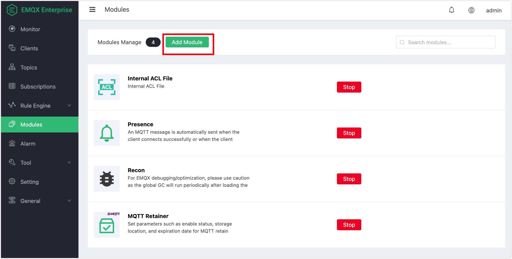

# Online and Offline notification
EMQ X online and offline system message notification function automatically sends a system topic message when the client connection is successful or the client is disconnected, and EMQ X turns on the online and offline notification module by default.

## Create module

The online and offline notification module is started by default and can be started and stopped through the dashboard page.

Open [EMQ X Dashboard](http://127.0.0.1:18083/#/modules), click the "Modules" tab on the left:



Select the online and offline notification module


There is no need to configure any parameters for the online and offline notification. After you click Add directly, the module is added.


## Online and offline message notification format

`$SYS` Subject prefix: `$SYS/brokers/${node}/clients/`

| Topic | Description |
| ------------------------ | ------------------------ ---------------- |
| ${clientid}/connected | Online event. When any client goes online, EMQ X will publish a message on that topic |
| ${clientid}/disconnected | Offline event. When any client goes offline, EMQ X will publish a message on that topic |

The Payload of the `connected` event message is parsed into JSON format as follows:

```bash
{
    "username":"undefined",
    "ts":1582687922392,
    "sockport":1883,
    "proto_ver":5,
    "proto_name":"MQTT",
    "keepalive":300,
    "ipaddress":"127.0.0.1",
    "expiry_interval":0,
    "connected_at":1582687922392,
    "connack":0,
    "clientid":"emqtt-8348fe27a87976ad4db3",
    "clean_start":true
}
```

The Payload of the `disconnected` event message is parsed into JSON format as follows:

```bash
{
    "username":"undefined",
    "ts":1582688032203,
    "reason":"tcp_closed",
    "disconnected_at":1582687922392,
    "clientid":"emqtt-8348fe27a87976ad4db3"
}
```