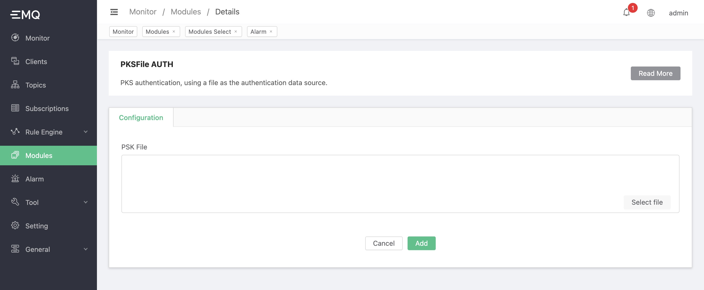

# PSKFile Authentication

## PSK certification

If you want to use PSKFile authentication, you need to comment out `listener.ssl.external.ciphers` in `emqx.conf`, and then configure `listener.ssl.external.psk_ciphers`:

```bash
#listener.ssl.external.ciphers = ECDHE-ECDSA-AES256-GCM-SHA384,...
listener.ssl.external.psk_ciphers = PSK-AES128-CBC-SHA,PSK-AES256-CBC-SHA,PSK-3DES-EDE-CBC-SHA,PSK-RC4-SHA

```

But the PSK Ciphers is not supported by `tlsv1.3`, we should set the `tls_version` as:
```bash
listener.ssl.external.tls_versions = tlsv1.2,tlsv1.1,tlsv1
```

## Create module

Open [EMQX Dashboard](http://127.0.0.1:18083/#/modules), click the "Modules" tab on the left, and choose to add:


Choose PSK certification


Configure related parameters



After clicking add, the module is added


The PSK configuration file is `psk.txt`, use a colon `:` to separate PSK ID and PSK:

```bash
client1:1234
client2:abcd
```

**Notice**:

If the `RSA-PSK` cipher suites are used, the `RSA` certificate is still required, see [RFC4279](https://www.rfc-editor.org/rfc/rfc4279#section-4) for details.