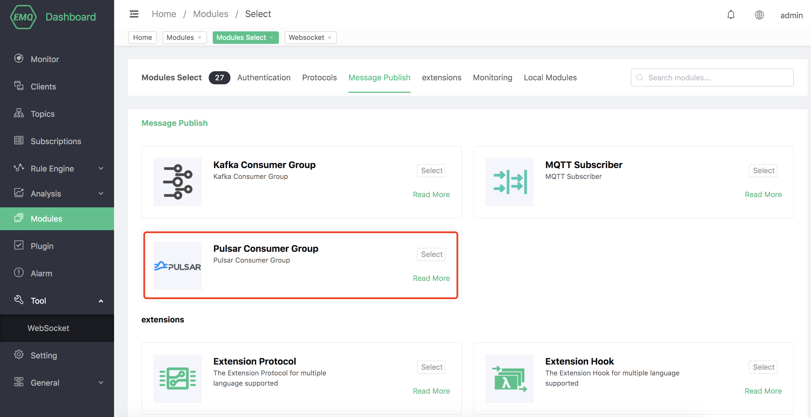
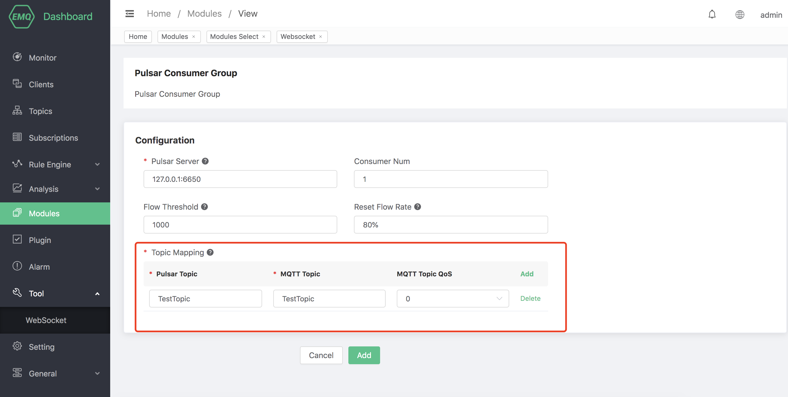
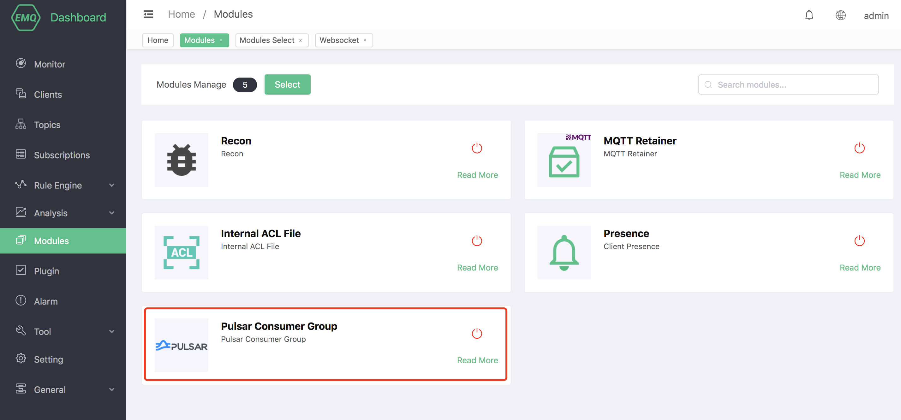
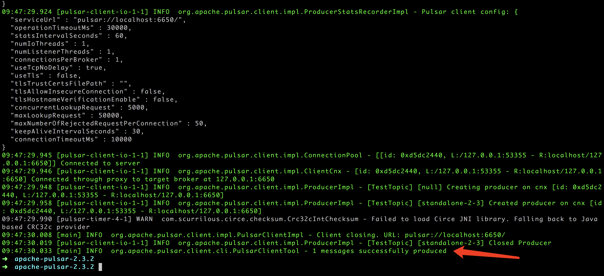
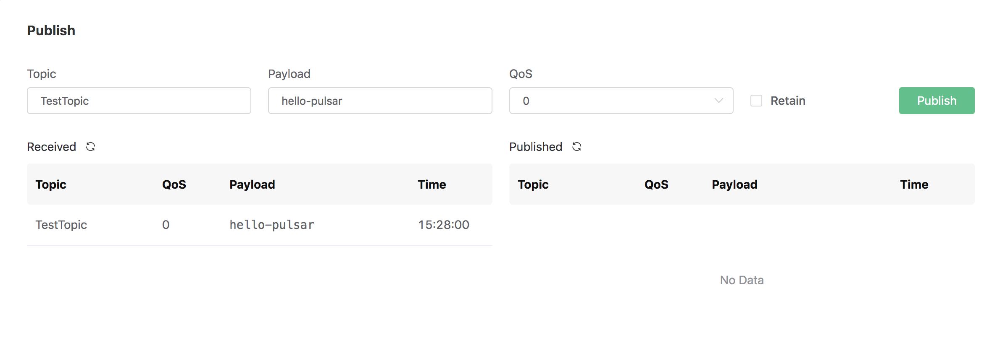

# Pulsar Consumer Group

The Pulsar consumer group uses an external Pulsar as a message queue, which can convert consumer messages from Pulsar into MQTT messages and publish them in emqx.

Set up the Pulsar environment, taking MacOS X as an example:

```bash
$ wget http://apache.mirrors.hoobly.com/pulsar/pulsar-2.3.2/apache-pulsar-2.3.2-bin.tar.gz

$ tar xvfz apache-pulsar-2.3.2-bin.tar.gz

$ cd apache-pulsar-2.3.2

# Start Pulsar
$ ./bin/pulsar standalone
```

Create Pulsar theme:
```bash
$ ./bin/pulsar-admin topics create-partitioned-topic -p 5 testTopic
```

## Create module

Open [EMQ X Dashboard](http://127.0.0.1:18083/#/modules), click the "Modules" tab on the left, and choose to add:


Click "Select", and then select "Pulsar Consumer Group":



Fill in the relevant parameters:



1). Pulsar server address

2). The number of Pulsar consumer processes

3). Pulsar's subscription topic

4). MQTT message subject

5). MQTT theme service quality

6). Pulsar flow control threshold (Pulsar flow control threshold, configure how many messages Pulsar sends to consumers and block Pulsar Consumer)

7). EMQ X reset flow control threshold percentage (Pulsar flow control threshold reset percentage. This configuration allows consumers to reset the `Pulsar flow control threshold` in advance after processing a certain number of messages. For example, `Pulsar flow control threshold `Is 1000, `Threshold reset percentage` is 80%, then reset)


After clicking Add, the module is added:



The resource has been created, now use Dashboard's websocket tool to subscribe to the MQTT topic "TestTopic":


Use pulsar-cli to produce a message:

```bash
./bin/pulsar-client produce TestTopic --messages "hello-pulsar"
```



The websocket tool of Dashboard received the message "hello-pulsar" produced by pulsar:

